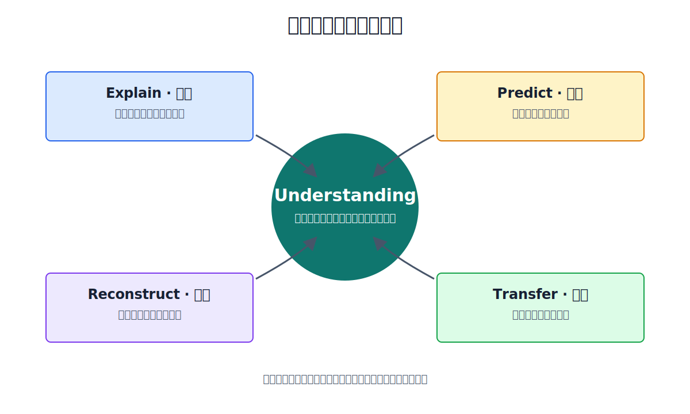
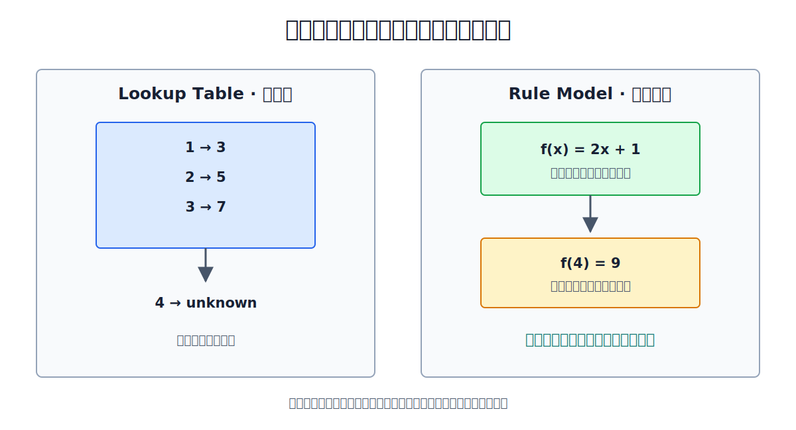

# Chapter 1 · 为什么理解比记忆重要？

**Book:** The AI Mind · Book I · Discovering Intelligence

**Version:** Draft v1.0

**Author:** Codex

**Editorial status:** Awaiting Editor-in-Chief review

---

## Learning Objectives

完成本章后，读者应该能够：

- 区分 Familiarity、Recall、Understanding 与 Transfer；
- 使用 Explain、Predict、Reconstruct、Transfer 四项测试检查理解；
- 解释为什么记忆是理解的必要材料，却不是充分条件；
- 从有限样本提出关系模型，并用新样本和反例检验它；
- 说明为什么相同的历史数据可能支持不同规则；
- 对 AI 训练流程执行 perturbation test，而不是只确认代码能运行；
- 把理解测试迁移到投资研究的 driver tree、情景预测与反证条件；
- 区分关于模型理解的行为证据、因果证据与内部机制证据。

## Opening Story · 地铁停运之后

Prelude 里的两位旅行者仍在东京。

第一天，他们都从酒店到达了目的地，也都记住了路线：坐 A 线，在 B 站换乘 C 线，再走两个街区。

第二天早上，车站广播宣布：C 线临时停运。

第一位旅行者打开昨天的路线截图，一遍遍确认自己没有记错。他确实没有记错。可那份完全正确的记忆，已经不能把他带到目的地。

第二位旅行者也忘了几个站名，但他记得线路之间怎样连接。他找到另一座换乘站，绕了一点路，仍然到达目的地。

两个人昨天的答案都正确。变化出现后，他们拥有的却不是同一种知识。

第一位保存了一条路线；第二位建立了一张关系图。

学习 AI 时，同样的差异常被成功运行的代码掩盖。复制一段训练脚本，模型可能正常下降；记住 `loss.backward()`，面试时也可能答对。可一旦张量形状变化、学习率失控、API 更新或数据分布改变，昨天的路线就不再有效。

真正的学习必须经得起一次“地铁停运”。

> **记忆让答案可以被取回；理解让答案可以在变化中被重新生成。**

## 为什么“看懂了”经常不可靠？

阅读顺畅会制造一种强烈感觉：每句话都认识，每一步都合理，所以自己已经理解。

这种感觉并非虚假。它说明外部解释暂时没有与已有知识冲突。但它没有回答另一个问题：当解释被拿走，学习者还能做什么？

下面四种状态很容易混在一起：

| 状态 | 能做到什么 | 还不能证明什么 |
|---|---|---|
| Familiarity · 熟悉 | 再次看到时觉得眼熟 | 不能证明可以主动取回 |
| Recall · 回忆 | 能复述定义、步骤或公式 | 不能证明知道关系为何成立 |
| Understanding · 理解 | 能解释关系并预测条件变化 | 不能保证能迁移到所有新领域 |
| Transfer · 迁移 | 能把关系用于新问题 | 仍可能遇到超出适用范围的情况 |

这些不是给人贴标签的四个等级。同一个人可能记得公式却不理解假设，也可能理解机制却忘了函数名。我们的目标不是宣布“我处在 Level 3”，而是为每个具体概念寻找证据。

## Feynman Explanation · 答案卡与小机器

想象桌上有两个盒子。

第一个盒子装着答案卡：

```text
问题 A → 答案 7
问题 B → 答案 12
问题 C → 答案 4
```

只要出现相同问题，盒子就能迅速取出正确答案。这是记忆的力量：快速、精确，而且常常必不可少。

第二个盒子里是一台透明的小机器。它没有保存每个答案，而是保存零件之间的关系。放入一个新条件，齿轮转动，机器会产生结果。

小机器不一定永远正确。某个零件装错，它会系统性地产生错误。但正因为关系是可见的，我们可以问：哪一步导致结果？条件变化后会怎样？应该替换哪个零件？

理解更像第二个盒子。

类比也有边界。人的理解不是一台真正的机械装置，事实记忆与关系模型也不会整齐地存放在不同盒子里。这个比喻只强调一件事：

> **理解不是保存更多答案，而是拥有一个能够产生预测、接受检查并根据反例修改的关系模型。**

## First Principles · 为什么关系不可替代？

### 1. 经验永远有限

一门课程不可能展示未来的所有问题。一份数据集不可能包含现实世界的所有输入。一个投资者也不可能提前经历每种政策、竞争和周期组合。

如果学习只保存见过的答案，那么能力的边界就是经验清单的边界。

### 2. 新情况要求重组已有信息

地铁停运并没有抹掉旧知识。真正有用的知识仍在：车站位置、线路连接、目的地方向。学习者需要重新组合这些关系，而不是等待一张新路线截图。

AI 工程也是如此。框架版本变化时，函数名可能不同；“前向计算—比较误差—反向求责—更新参数”的关系仍然存在。

### 3. 理解必须产生可观察后果

“我觉得自己理解”无法被别人检查，也无法帮助自己校准。

一个关系模型至少应该通过四类测试：



| Test | 问题 | 失败时通常暴露什么 |
|---|---|---|
| Explain · 解释 | 为什么会得到这个结果？ | 只有结论，没有关系 |
| Predict · 预测 | 条件改变后会怎样？ | 只能复述历史 |
| Reconstruct · 重建 | 忘记细节后能从原则恢复吗？ | 依赖表面步骤或原文 |
| Transfer · 迁移 | 新场景仍能使用这个关系吗？ | 学到的是任务特有模板 |

四项测试互相补充。流畅解释可能来自背诵；一次正确预测可能来自猜测；重写代码可能只是肌肉记忆；一次迁移成功也可能碰巧遇到相似问题。

证据越多，理解的范围越清楚。

### 4. 理解必须允许被修正

理解不是把一个答案从“可能”升级成“永远正确”。它是一种更有组织、也更容易被反例挑战的知识。

如果一个解释无论发生什么都不会改变，它不是强理解，而是无法证伪的故事。

## Mathematics · 三个点背后有多少条规则？

先看三组观察：

| \(x\) | \(y\) |
|---:|---:|
| 1 | 3 |
| 2 | 5 |
| 3 | 7 |

一种学习方法是记住三对答案。

另一种方法是寻找共同关系：

\[
f(x)=2x+1
\]

这个公式回答了三个问题。

第一，它压缩了历史。一个关系替代三张答案卡。

第二，它产生新预测：

\[
f(4)=2\times4+1=9
\]

第三，它允许反证。如果观察到 \((4,10)\)，我们就知道旧关系、数据质量或问题设定至少有一项需要重新检查。

这似乎已经证明“理解就是发现规则”。但还缺一层。

考虑另一条规则：

\[
g(x)=2x+1+(x-1)(x-2)(x-3)
\]

当 \(x\) 等于 1、2 或 3 时，最后三项的乘积中总有一个因子为零。因此：

\[
g(1)=3,\quad g(2)=5,\quad g(3)=7
\]

两条规则都完美解释已见样本。可是当 \(x=4\)：

\[
f(4)=9,\qquad g(4)=15
\]



有限观察没有自动告诉我们应该选择哪条规则。偏好 \(f(x)=2x+1\)，是因为它更简单，也更符合我们对这类任务的先验判断。

这里第一次露出机器学习的一个根本问题：数据告诉我们发生过什么，却不唯一决定应该学到什么。模型结构、训练方法和对简单性的偏好，都会影响最终关系。

本章暂时不学习多项式插值、Occam's Razor 或 Inductive Bias 的正式理论。现在只需保留三个结论：

1. 关系可以压缩样本并产生预测；
2. Rule Compression 是 Representation 的第一步；
3. 一个目前有效的关系模型，仍必须接受新数据检验。

## Coding Lab · 查表和规则函数有什么不同？

下面的代码只使用 Python 标准库，可以直接运行：

```python
known_answers = {1: 3, 2: 5, 3: 7}


def lookup(x: int):
    return known_answers.get(x, "unknown")


def linear_rule(x: int) -> int:
    return 2 * x + 1


for x in [1, 2, 3, 4]:
    print(x, lookup(x), linear_rule(x))
```

预期输出：

```text
1 3 3
2 5 5
3 7 7
4 unknown 9
```

在已见输入上，两种方法都正确。到了 `x=4`，查找表诚实地回答“不知道”，规则函数则做出可以被检验的预测。

不要把这个实验过度解释为“字典是记忆，人脑是公式”。真实模型可能通过复杂模式匹配产生很强的迁移，规则函数也可能在错误假设下自信地失败。实验只让一种差异可见：重放已存结果与根据关系生成结果，不是同一种操作。

现在加入反例：

```python
new_observation = (4, 10)
predicted = linear_rule(new_observation[0])
error = new_observation[1] - predicted

print("predicted:", predicted)
print("observed:", new_observation[1])
print("error:", error)
```

预期输出：

```text
predicted: 9
observed: 10
error: 1
```

误差没有自动告诉我们该怎么办。可能是测量噪声，可能是旧规则不完整，也可能是数据来自另一种机制。理解的下一步不是立刻改公式，而是提出能够区分这些解释的新证据。

配套 Notebook 将这个实验扩展成可修改的观察任务：

[Chapter 1 · Lookup vs Rule Notebook](../../../notebooks/book1/chapter01_lookup_vs_rule.ipynb)

## Engineering Perspective · 扰动比运行更能暴露理解

许多 AI 教程用“代码成功运行”作为结束。可运行性只能证明当前环境、当前输入和当前顺序没有立即报错。

考虑最小训练流程：

```text
prediction = model(x)
loss = loss_fn(prediction, target)
optimizer.zero_grad()
loss.backward()
optimizer.step()
```

不要先背顺序。先把它翻译成关系：

```text
产生预测
  ↓
比较预测与目标
  ↓
清理旧的责任信号
  ↓
计算本轮责任信号
  ↓
根据责任更新参数
```

然后执行 perturbation test：有意改变一个条件，在运行之前预测后果。

### 删除 `zero_grad()`

PyTorch 默认会累积梯度。如果不清理，下一步更新使用的可能是多轮梯度之和。偶尔这正是有意设计的 gradient accumulation；如果并非有意，它会改变有效更新幅度。

### 把 `step()` 放在 `backward()` 前

优化器将使用尚未计算或残留的梯度。程序有时会报错，有时却会悄悄使用旧状态。逻辑问题不是 API 顺序难记，而是“根据本轮责任更新”发生在“计算本轮责任”之前。

### 改变 `target` 的形状

损失函数可能报 shape error，也可能触发 broadcasting 并产生看似合法但含义错误的结果。理解要求学习者先检查：预测和目标正在比较同一批对象、同一组维度和同一种任务吗？

扰动测试比抄写测试更接近真实工程。调试从来不是把昨天的路线再走一遍，而是在变化后重建因果链。

## Common Illusions · 哪些成功最容易伪装成理解？

### “我看懂了”

更强测试：合上材料，画出关系并解释每条箭头。

### “我会背公式”

更强测试：改变一个假设，预测公式或结果哪里需要修改。

### “Notebook 能运行”

更强测试：先预测一个扰动的结果，再运行并解释差异。

### “我能讲得很流畅”

更强测试：请听众提供一个反例或新情境，现场调整解释。

### “训练集表现很好”

更强测试：检查未见数据、分布变化与刻意设计的反事实输入。

这些 Illusions 不是失败证据。它们只是弱证据，不足以单独支撑“我已经理解”。

## AI × Finance · 从观点记忆到 Driver Tree

假设一家公司的毛利率连续三个季度上升。

记忆型结论可能是：

> 毛利率正在改善，所以公司值得买入。

这个结论可能恰好正确，却没有说明改善来自哪里，也无法回答下个季度条件变化后会怎样。

理解型研究会先建立 driver tree：

```text
毛利率
  ├─ 产品与客户结构
  │    ├─ 高毛利产品占比
  │    ├─ 定价能力
  │    └─ 客户组合
  ├─ 单位经济
  │    ├─ 原材料成本
  │    ├─ 产能利用率
  │    └─ 良率
  └─ 会计与周期
       ├─ 库存影响
       ├─ 补贴 / 一次性项目
       └─ 周期位置
```

然后执行四项测试。

### Explain

哪一个驱动解释历史改善？证据来自财报、管理层表述、产业数据，还是仅来自价格表现？

### Predict

如果高毛利产品占比继续提高，但产能利用率下降，毛利率净影响是什么？哪些公开数据可以在下季度验证预测？

### Reconstruct

合上研报后，能否从业务机制重建投资逻辑、关键变量与反证条件？

### Transfer

同一个 driver tree 能否用于同行？哪些节点是行业共性，哪些只属于这家公司？

金融问题也提醒我们不要神化“理解”。竞争会反应，管理层会改变策略，市场价格会影响融资与行为。Driver tree 不是永久真理，而是可证伪、可更新的因果假设。

优秀研究不以“我有一个故事”结束，而以“什么证据会让我改变故事”继续。

## Failure Modes · 理解也会失败

### 贬低记忆

没有术语、事实、案例和熟练操作，关系模型没有材料。目标是让记忆进入结构，而不是拒绝记忆。

### 把解释能力当作充分条件

人和模型都可能生成流畅、错误的解释。解释必须与预测、干预和反例结合。

### 把简洁当作真实

简单规则通常更容易检验和迁移，但世界没有义务保持简单。异常值可能是噪声，也可能揭示旧模型遗漏的机制。

### 把相同行为当作相同机制

两套系统可以给出相同答案，却通过完全不同的内部过程得到。行为相似是证据，不是机制证明。

### 等待“完全理解”才行动

理解总有范围。工程需要足以支持预测、实现和调试的模型，然后通过行动获得新反馈。

## Research Corner · 模型是在理解，还是在复用模式？

语言模型在未见问题上答对时，我们应该怎样解释？

“训练数据里可能出现过”不是对所有能力的充分解释；“它能回答，所以它理解”同样跳得太快。

至少可以区分三类证据。

### Behavioral Evidence · 行为证据

模型能否处理未见组合、反事实条件和分布变化？行为测试最直接，但相同输出可能来自不同策略，也可能遗漏训练数据中的隐性重复。

### Causal Evidence · 因果证据

当我们系统改变输入、提示或中间表示时，行为是否按假设改变？干预比观察相关性更强，但实验设计仍可能混入其他因素。

### Internal-Mechanism Evidence · 内部机制证据

能否找到执行能力的内部特征或计算过程，并通过干预验证其作用？这类研究希望打开黑箱，但当前方法常依赖简化模型、代理表示或研究者选择的解释单位。

这些证据并不自动解决“意识是什么”。它们提供的是更窄、也更可检验的问题：模型是否学到了能跨输入复用的结构？我们能否找到并干预该结构？

两个阅读路标展示了为什么问题仍未解决：

- [Zhang et al., *Understanding deep learning requires rethinking generalization*](https://arxiv.org/abs/1611.03530)：大型网络甚至可以拟合随机标签，训练集记忆与真实泛化不能只靠模型容量区分；
- [Power et al., *Grokking: Generalization Beyond Overfitting on Small Algorithmic Datasets*](https://arxiv.org/abs/2201.02177)：某些任务中，模型在训练集早已过拟合后，测试泛化仍可能在更晚阶段突然出现。

未来的内部机制研究会继续追问：能力是在什么时候形成的？哪些表示支持迁移？行为证据与内部计算能否互相验证？

## Exercises

### Level 1 · 区分弱证据与强证据

对下面行为分类，并说明还缺哪项测试：

1. 能准确复述 Cross Entropy 的定义；
2. 能预测某个概率接近零时 Loss 会怎样变化；
3. 能不看资料重写 Cross Entropy 的最小实现；
4. 能把同一思想用于评价一个投资预测的置信度。

### Level 2 · Four-Test Audit

选择一个你自认为已经掌握的概念。分别设计 Explain、Predict、Reconstruct、Transfer 测试。不要写“我可以解释”，而要写出具体任务和通过标准。

### Level 3 · Rule and Counterexample

给定 `(1,3), (2,5), (3,7)`：

1. 写出至少两条能匹配三个样本的规则；
2. 找到一个输入，使两条规则给出不同预测；
3. 说明你需要什么新证据来选择规则；
4. 加入 `(4,10)` 后，记录你如何修改模型。

### Level 4 · Engineering Perturbation

针对最小训练流程选择两项扰动。运行前写下预测，运行后记录实际结果，并解释差异来自概念错误、框架行为还是环境状态。

### Level 5 · Finance Transfer

选择一个投资观点，把它重写为：

- driver tree；
- 三个月内可验证的预测；
- 至少两个反证条件；
- 新证据出现后的更新规则。

### Research

设计一个小实验，区分模型是在复现训练模式还是使用可迁移关系。必须写出至少一种替代解释，以及实验无法排除什么。

配套工件：[Chapter 1 Understanding Audit](../../../labs/book1/chapter01-understanding-audit.md)。

## Understanding Audit

完成本章后，不看正文回答：

### Explain

为什么记忆是理解的必要材料，却不是充分条件？

### Predict

如果一个学生能流畅复述训练循环，却无法预测删除 `zero_grad()` 的后果，你会如何判断其理解边界？

### Reconstruct

从空白页重建本章四项测试，并为每项写一个 AI 例子。

### Transfer

选择一个非 AI、非金融问题，用同一套测试区分记忆与理解。

## Teach Back

用三种语言解释本章中心思想：

- 对十二岁孩子：使用答案卡与小机器；
- 对工程师：使用 perturbation test 与 debugging；
- 对投资者：使用 driver tree、scenario test 与 falsification。

每次解释后，请听众改变一个条件。你的回答能否随条件变化而更新，本身就是理解测试。

## Master Insight

> **理解建立答案之间的关系，使人能够解释、预测、重建并迁移；记忆提供材料，反例帮助关系持续更新。**

## Bridge to Chapter 2

本章用一条规则压缩了三个样本。理解之所以强大，部分原因就在于它能用较少关系组织较多经验。

可这带来下一个问题：

> 如果单条规则很简单，许多简单规则怎样组合出语言、市场、神经网络和智能这样的复杂行为？

Chapter 2 将从这里开始：**为什么复杂系统可以来自简单规则？**

---

## Reading Landmarks

- [Zhang et al. (2017), *Understanding deep learning requires rethinking generalization*](https://arxiv.org/abs/1611.03530)
- [Power et al. (2022), *Grokking: Generalization Beyond Overfitting on Small Algorithmic Datasets*](https://arxiv.org/abs/2201.02177)

这些论文是未来阅读路标，不是完成本章练习的先修条件。
