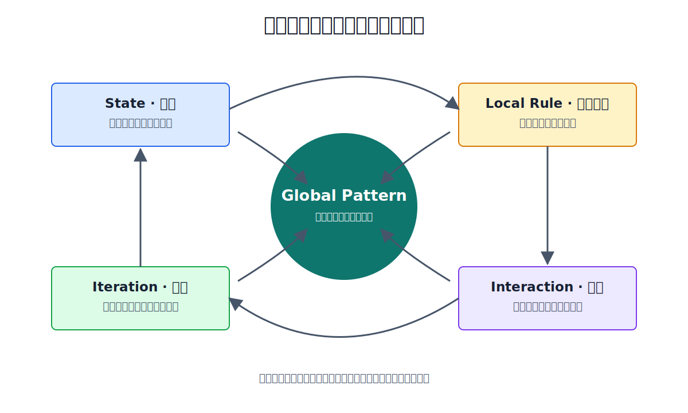
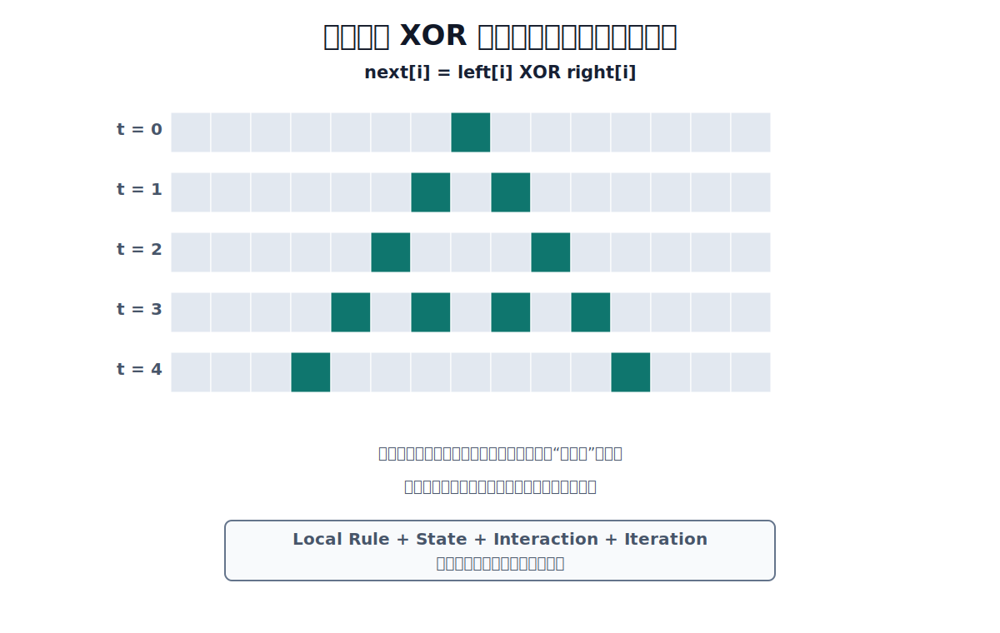

# Chapter 2 · 为什么复杂系统可以来自简单规则？

**Book:** The AI Mind · Book I · Discovering Intelligence

**Version:** Draft v1.0

**Author:** Codex

**Editorial status:** Awaiting Editor-in-Chief review

---

## Knowledge Graph · Dependency Card

```text
Relationship (Chapter 1)
    ↓
Generation (Chapter 2)
    ↓
Abstraction (Chapter 3)
    ↓
Representation (Chapter 4)
    ↓
Learning (Chapter 6 and Chapters 15–19)
```

### Need Before

- Prelude：知识不是孤立名词，而是一张关系地图；
- Chapter 1：理解意味着能够解释、预测、重建并迁移关系；
- 最小数学语言：一个状态可以随时间改变。

### This Chapter

```text
Local Rule + Iteration + Interaction + State
  ↓
Global Pattern and Dynamic Behavior
```

### Need After

- Chapter 3：用抽象隐藏细节、保留可推理结构；
- Chapter 4：用表示选择哪些状态和关系对系统可见；
- Chapters 13–14：简单神经网络层如何组合出复杂表达；
- Part III：用更强证据重新讨论 Scaling 与 Emergence。

## Book I Question

**Book I 的问题：** 关系怎样逐步形成能够学习、推理与行动的智能系统？

**本章的问题：** 简单规则怎样生成复杂行为？

**本章的回答：**

```text
Local Rule + Iteration + Interaction + State
  → Global Pattern and Dynamic Behavior
```

**下一个问题：** 如果不断生成的复杂性超过了逐项追踪的能力，我们怎样保留重要结构、隐藏无关细节？这将把我们带到 Chapter 3 的抽象。

## Learning Objectives

完成本章后，读者应该能够：

- 区分 simple rule、simple behavior 与 predictable behavior；
- 用 Local Rule、Iteration、Interaction、State 四个要素分析系统；
- 从局部更新规则解释全局图案怎样逐步生成；
- 预测改变初始状态、局部规则或更新顺序可能造成的影响；
- 解释函数组合如何自然过渡到神经网络层组合；
- 把同一框架迁移到训练循环与市场反馈；
- 区分能力本身的变化与评价指标制造的“突然涌现”；
- 识别“寻找简单规则”何时会滑向过度简化。

## Opening Story · 没有指挥的人浪

体育场里，每位观众只能看见附近几排人。

没有人看得到完整看台，也没有中央指挥逐排发令。某一区域的人先站起来，邻近观众看到浪靠近时跟着站起，再迅速坐下。几秒后，一道清晰的人浪开始绕场移动。

单个人只完成两个简单动作：观察附近，站起再坐下。

可全局图案会传播、加速、衰减，有时还会分裂。人群密度、反应延迟、注意力和看台结构稍有变化，人浪可能绕场一周，也可能只走几十米就消失。

没有任何一个人执行“画出一道环绕体育场的波”这条复杂指令。全局图案来自许多局部动作的持续连接。

> **复杂行为可以来自简单规则的持续交互。**

这句话中的每个词都重要。

- **可以来自**：不是所有复杂行为都由简单规则解释；
- **简单规则**：单个部分只读取有限信息、完成有限更新；
- **持续**：一次动作通常只产生一次变化；
- **交互**：一个部分的状态会成为另一个部分的输入。

本章的任务不是赞美“简单”，而是打开一条生成路径：从局部规则出发，一步步看见全局结构如何出现。

## Feynman Explanation · 方格世界

想象一排只有黑白两色的方格。

每个方格都不会看整张图。它只看自己左边、自己和右边三个位置，然后按照同一条规则决定下一轮是黑还是白。

所有方格更新一次，得到新的一排。再用新的一排更新，得到下一排。把每一轮留在纸上，许多行叠起来，就形成一幅图案。

```text
当前一排
  ↓  每个方格只看附近
局部更新
  ↓  所有方格共同形成
下一排
  ↓  继续重复
一段可见的历史
```

没有方格知道最终图案，也没有规则直接写着“请画一个三角形”。图案是规则、邻居和历史共同留下的痕迹。

方格世界只是一个透明实验箱。真实神经网络不只有黑白状态，市场参与者会改变策略，社会系统也不一定同步更新。我们暂时缩小世界，是为了把一个关系看清楚：

> **局部规则没有描述全局图案，但局部规则可以生成全局图案。**

## First Principles · 四个生成条件

### Local Rule · 局部规则

局部规则回答：一个部分根据自己能看见的信息，下一步怎样改变？

在人浪中，一位观众读取附近动作；在方格中，一个位置读取邻居颜色；在神经网络中，一个单元读取输入并执行变换。

“局部”不一定表示物理距离。它也可以表示有限接口、有限连接或有限上下文。

### Iteration · 迭代

一次规则应用只把系统从一个状态带到下一个状态。迭代让变化积累，让今天的结果成为明天的输入。

没有迭代，人浪只是零散起立，训练循环也只有一次参数更新。

### Interaction · 交互

如果各部分彼此独立，一个位置的变化不会传播。交互让局部结果进入其他部分的输入，影响才可能扩散、叠加或抵消。

连接方式和规则本身同样重要。相同个体连接成链、网格或密集网络，会产生不同整体行为。

### State · 状态

状态是系统在某一时刻留下、并会影响下一步的信息。

它可能是方格颜色、模型参数、市场仓位、库存水平或一段对话的上下文。状态让历史进入未来，也让相同规则在不同起点产生不同轨迹。



四项可以压缩成一条生成链：

```text
State
  ↓
Local Rule reads nearby information
  ↓
Interaction spreads each update
  ↓
Iteration makes the result new state
  ↺
Global pattern becomes visible over time
```

## Emergence · “出现”到底是什么意思？

本章使用一个克制的操作性定义：

> **当全局可观察结构由局部交互生成，而该结构没有被直接写进任何单个局部规则时，我们称它为 emergent pattern。**

这个定义没有说 Emergence 是超自然现象，也没有说它无法分析。恰恰相反：我们希望找到生成图案的局部过程。

它也没有说所有全局结构都很复杂。每个人同时保持静止，同样是局部规则产生的全局结果，却没有多少值得研究的结构。

所以必须区分：

```text
simple rule
  ≠
simple behavior
  ≠
useful behavior
  ≠
intelligent behavior
```

## From Reality to Mathematics

我们不从公式开始。先把体育场变成一张时间图。

假设 `●` 表示站起，`○` 表示坐下：

```text
t = 0   ○ ○ ○ ● ○ ○ ○
t = 1   ○ ○ ● ○ ● ○ ○
t = 2   ○ ● ○ ○ ○ ● ○
```

这不是对真实人浪的精确模型，只是一张最小图示。它让三个东西可见：

1. 每一行是一个完整状态；
2. 下一行由上一行生成；
3. 局部变化沿位置和时间传播。

### 更新规则

现在规定一条极简规则：

> 如果左邻居和右邻居状态不同，下一轮点亮；如果相同，下一轮熄灭。

中间方格当前是什么颜色，在这条规则里不参与决定。

用 XOR 表示“两个输入不同”：

| 左 | 右 | 下一轮中心 |
|---:|---:|---:|
| 0 | 0 | 0 |
| 0 | 1 | 1 |
| 1 | 0 | 1 |
| 1 | 1 | 0 |

从单个亮点开始，重复这条规则：

```text
.......#.......
......#.#......
.....#...#.....
....#.#.#.#....
...#.......#...
```

这套局部规则通常称为 Rule 90。它可以生成具有自相似结构的三角形图案。



### 状态更新式

现在公式才有必要。

用 \(\mathbf{s}_t\) 表示第 \(t\) 轮整排方格的状态，用 \(F\) 表示对所有位置执行一次更新：

\[
\mathbf{s}_{t+1}=F(\mathbf{s}_t)
\]

这个公式没有解释规则细节，只说下一状态由当前状态产生。

再放大到第 \(i\) 个方格。用 \(s_i^{(t)}\) 表示它在第 \(t\) 轮的状态：

\[
s_i^{(t+1)}=s_{i-1}^{(t)}\oplus s_{i+1}^{(t)}
\]

符号 \(\oplus\) 是 XOR：左右不同得 1，相同得 0。

每个方格只执行这一条局部关系；所有方格共同更新，许多轮历史叠在一起，才让全局图案可见。

公式没有制造直觉。它把已经看见的关系压缩成可以计算、检查和修改的语言。

## Coding Lab · 把一条规则运行很多次

下面是一个可直接运行的 NumPy 实现：

```python
import numpy as np


def rule90_step(state: np.ndarray) -> np.ndarray:
    next_state = np.zeros_like(state)
    next_state[1:-1] = state[:-2] ^ state[2:]
    return next_state


width = 15
state = np.zeros(width, dtype=np.uint8)
state[width // 2] = 1

for _ in range(5):
    print("".join("#" if value else "." for value in state))
    state = rule90_step(state)
```

预期输出：

```text
.......#.......
......#.#......
.....#...#.....
....#.#.#.#....
...#.......#...
```

请先预测，再做下面三项扰动：

1. 初始状态改成两个相邻亮点；
2. 把某一组局部输入的输出从 0 改成 1；
3. 不再同步更新，而是从左到右立刻写回结果。

三个实验分别改变 State、Local Rule 和 update process。代码只是观察工具，真正任务是写下：哪一种关系变了，你预计全局图案怎样变化，实际结果是否支持预测。

配套 Notebook 提供可视化与实验记录：

[Chapter 2 · Rule 90 Notebook](../../../notebooks/book1/chapter02_rule90.ipynb)

## Engineering Perspective · 先有 Function，再有 Layer

工程里的复杂系统也常从组合开始。

假设函数 \(f\) 把原始输入变成中间结果，函数 \(g\) 再处理这个结果：

\[
y=g(f(x))
\]

这里没有任何一个函数负责完整任务。\(f\) 只完成自己的局部变换，\(g\) 只读取 \(f\) 的输出。组合让前一步产生的状态成为后一步的输入。

继续加入函数：

\[
y=f_3(f_2(f_1(x)))
\]

复杂行为可能来自许多结构明确的小变换，而不是一个巨大、不可分割的函数。

神经网络的 Layer 是这种思想的参数化版本。第 \(k\) 层接收上一层表示 \(\mathbf{h}_k\)，完成线性变换和非线性更新：

\[
\mathbf{h}_{k+1}=\phi(W_k\mathbf{h}_k+\mathbf{b}_k)
\]

本章不推导矩阵或激活函数。现在只看结构：每层规则相对简单，上一层输出成为下一层状态，多层组合后形成更丰富的表示。

同样地，一次训练更新通常很小：预测、计算损失、得到梯度、修改参数。重复许多批次后，参数状态和模型行为可能发生巨大变化。

```text
small parameter update
  ↓
new parameter state
  ↓
new prediction and feedback
  ↓
another small update
  ↺
learned behavior
```

这并不证明深度或训练次数越多越好。组合可能放大信号，也可能放大误差；迭代可能收敛，也可能震荡或崩溃。简单步骤的力量来自结构，也受结构约束。

## AI × Finance · 市场不是一条公式

市场价格是许多参与者在不同约束下互动的结果。没有单个参与者负责决定“正确价格”，也没有一条局部规则能够独立解释全部市场行为。

考虑一个简化反馈环：

```text
盈利预期上调
  ↓
部分投资者买入，价格上升
  ↓
趋势资金、风险预算与保证金状态改变
  ↓
新的买卖行为
  ↓
估值、融资条件与公司决策改变
  ↺
新的基本面和预期
```

用四要素分析：

### Local Rule

单个参与者可能依据估值、趋势、风险限额、赎回压力或做市库存行动。不同参与者的规则并不相同。

### Interaction

订单通过价格和流动性影响其他人。价格不仅是结果，也是下一轮决策的输入。

### State

仓位、成本基础、波动率、流动性和历史价格都会留下路径依赖。相同新闻在不同拥挤度下，可能引发相反结果。

### Iteration

预期、价格和行为不断更新。正反馈可能放大趋势，估值约束、获利了结或新增供给则可能形成负反馈。

这个框架比“市场由供需决定”更具体，却仍远非完整模型。市场参与者会观察并改变规则，制度与信息也会改变连接结构。

所以复杂系统分析需要双重纪律：寻找可生成现象的简单关系，同时持续检查这些关系是否因为系统适应而失效。

## Common Illusions · 复杂性最会制造哪些错觉？

### “规则简单，所以结果也简单”

更强测试：实际迭代许多轮，并改变初始状态。

### “规则确定，所以长期一定容易预测”

更强测试：测量微小扰动是否随时间放大，并说明计算资源与信息误差。

### “出现全局图案，所以一定有中央设计者”

更强测试：尝试用局部交互生成同一结构，并寻找中央控制的独立证据。

### “能力突然出现，所以内部机制也突然形成”

更强测试：更换连续指标、观察中间能力，并对内部状态进行干预。

### “能模拟图案，所以已经解释真实系统”

更强测试：列出模型省略的变量，并提出能够区分模拟与现实机制的实验。

## Failure Modes · 简单规则何时不是好解释？

### 规则是事后编出来的

如果规则只解释已经看到的图案，却不能预测扰动结果，它可能只是另一种压缩描述。

### 关键交互被省略

局部规则可能正确，但连接结构错误。市场、神经网络和社会系统的结果常同时依赖节点与连接。

### 规则会学习或改变

元胞自动机规则固定；真实参与者可能观察模型、改变策略。固定规则模型会在适应性系统中失效。

### 计算可行不等于解释充分

能够复现图案是一项证据，但不同机制可能生成相似输出。Chapter 1 的提醒仍然有效：Compression 不等于 Truth。

### “简单”被当成价值判断

简单模型更容易检查，不代表复杂模型不必要。目标是找到足以解释证据的最小结构，而不是把世界强行缩成口号。

## Research Corner · 涌现是真跳变，还是测量方式？

大型语言模型规模增加时，某些任务表现看起来并不是平滑改善，而是在某个规模后突然从接近失败变成明显成功。

[Wei et al. (2022)](https://arxiv.org/abs/2206.07682) 把“在小模型中不存在、在大模型中出现”的能力称为 emergent abilities，并指出这些能力难以仅从较小模型表现外推。

这是一项重要观察，但“曲线看起来突然”不自动证明内部机制发生同样突然的转变。

[Schaeffer et al. (2023)](https://arxiv.org/abs/2304.15004) 展示了另一种可能：非线性或离散评价指标可以把平滑的底层改进显示成跳变；更换连续指标或统计方法后，一些表面涌现会减弱或消失。

两项工作没有简单构成“一个对、一个错”。它们共同提出更好的研究程序：

```text
observe an apparent jump
  ↓
inspect the metric
  ↓
measure intermediate behavior
  ↓
intervene on task and prompt structure
  ↓
look for mechanism-level change
```

研究者需要区分至少两件事：

1. **Behavioral emergence:** 评价结果是否表现为突然跃迁？
2. **Mechanistic emergence:** 系统内部是否形成了新的可复用计算结构？

本章不裁决大型模型的涌现是否“真实”。它训练一种更稳定的判断：看到全局图案时，既不把它当魔法，也不急着用一句局部规则宣布解释完成。

## Exercises

### Level 1 · 找到四要素

选择排队、交通信号或软件重试系统，分别写出 Local Rule、Iteration、Interaction、State。指出至少一个缺失信息。

### Level 2 · 手算 Rule 90

从 `00100` 开始，边界始终为 0，手算接下来四轮。每轮标注一个位置的左右输入和 XOR 结果。

### Level 3 · Predict Before Run

在 Notebook 中选择两项扰动。先保存预测，再运行。比较实际图案，并说明是规则、状态、连接还是更新过程导致差异。

### Level 4 · Function Composition

设计三个简单函数，使它们组合后完成一项有意义任务。解释每个中间状态保留了什么，又丢失了什么。

### Level 5 · Finance Feedback

选择一次拥挤交易、流动性冲击或资本开支周期，画出至少一个正反馈和一个负反馈。说明参与者规则可能怎样适应。

### Research

设计一个玩具实验，展示离散成功率如何把连续能力变化显示成突然跃迁。再设计一个指标，减少这种视觉效果。

配套 Assessment：[Chapter 2 Understanding Audit](../../../labs/book1/chapter02-understanding-audit.md)。

## Mental Model Upgrade

### Before

```text
Complex behavior
  → complicated rules
  → central design
```

### After

```text
State
  + local rules
  + interaction
  + iteration
  → possibly complex global behavior
```

这不是把“复杂”换成一句新的口号。真正的升级，是开始追问生成过程：局部部分能看到什么、怎样更新、怎样相互影响，以及历史如何通过状态进入下一步。能够指出这些机制、预测扰动结果并说明模型边界，才表示这个心智模型真正可用。

## Understanding Audit

### Explain

为什么 Rule 90 的三角形图案没有被直接写进任何单个方格的规则？

### Predict

如果初始亮点从一个变成两个相邻亮点，你预计图案的对称性和传播方式怎样变化？先写理由，再运行。

### Reconstruct

从空白页重建 Local Rule、Iteration、Interaction、State 四要素，并写出状态更新式的含义。

### Transfer

选择神经网络训练或市场反馈，用四要素分析。明确指出方格类比在哪里失效。

## Capability Milestone

完成 Chapter、Notebook、Audit 与 Figures 后，学习者能够：

- **Explain:** 从局部规则解释全局图案的生成路径；
- **Predict:** 在运行前预测规则、初始状态或更新方式改变的后果；
- **Build:** 实现并扰动一个一维元胞自动机；
- **Read:** 阅读基础 emergence claim，并检查评价指标是否制造跳变。

## Teach Back

分别向三类听众解释本章：

- 对十二岁孩子：使用方格世界，不使用 Emergence 一词；
- 对工程师：使用状态更新、函数组合和 perturbation test；
- 对投资者：使用参与者规则、仓位状态与反馈回路。

要求每位听众改变一个条件。你的解释必须随条件变化，而不是重复原故事。

## Master Insight

> **复杂行为可以来自简单规则的持续交互；真正的理解不是惊叹图案，而是追踪规则、状态和反馈怎样把它生成出来。**

## Bridge to Chapter 3

本章只追踪一排方格，已经需要区分规则、状态、交互和时间。如果系统拥有数百万个部分、许多层级和不断变化的连接，人不可能同时保留全部细节。

于是出现一个新问题：

> 我们怎样隐藏暂时不重要的细节，只保留足以继续推理的结构？

这正是抽象要解决的问题。

Chapter 3：**为什么抽象是人类最重要的工具之一？**

---

## Reading Landmarks

- [Wei et al. (2022), *Emergent Abilities of Large Language Models*](https://arxiv.org/abs/2206.07682)
- [Schaeffer et al. (2023), *Are Emergent Abilities of Large Language Models a Mirage?*](https://arxiv.org/abs/2304.15004)

这些论文是未来阅读路标，不是完成本章练习的先修条件。
