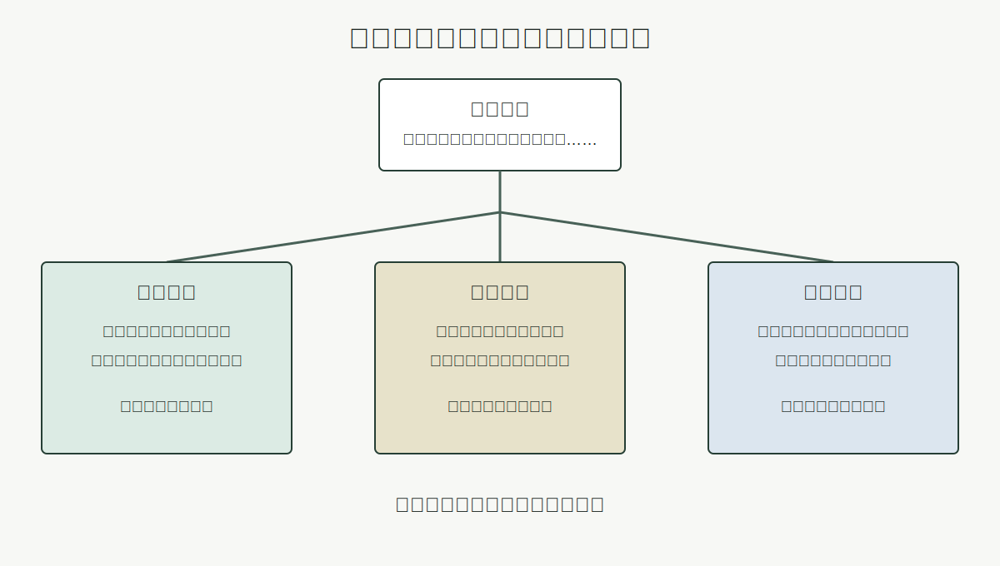
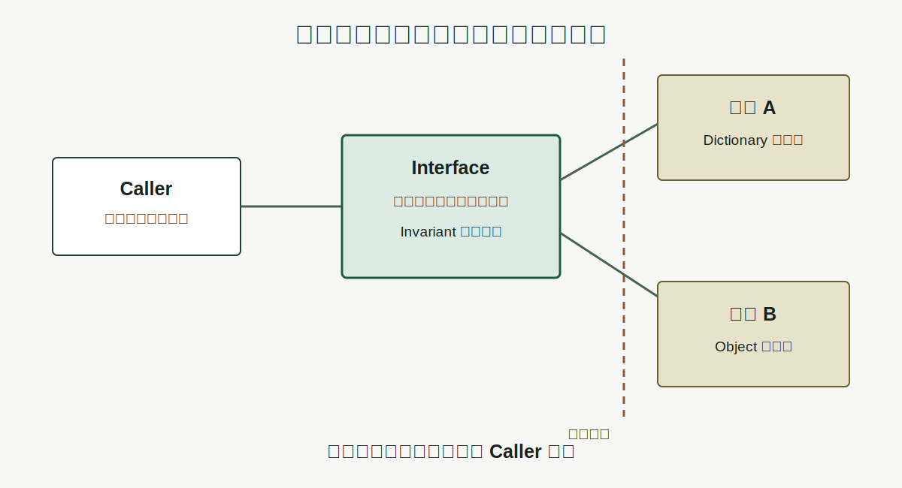

# Chapter 3 · 为什么抽象是人类最重要的工具之一？

**Book:** The AI Mind · Book I · Discovering Intelligence

**Version:** Draft v1.0

**Author:** Codex

**Editorial status:** Awaiting Editor-in-Chief review

---

## Knowledge Graph · Dependency Card

```text
Relationship (Chapter 1)
    ↓
Generation (Chapter 2)
    ↓
Abstraction (Chapter 3)
    ↓
Representation (Chapter 4)
    ↓
Computation and Learning (Chapters 5–6)
```

### Need Before

- 理解是一张可解释、预测、重建和迁移的关系图；
- 局部规则经过交互、迭代并保留状态，可以生成大量全局细节；
- 模型不是现实，而是用来回答某类问题的工具。

### This Chapter

```text
complex reality
  → choose a purpose
  → preserve task-relevant relationships
  → hide replaceable detail
  → reason through a smaller interface
```

### Need After

- Chapter 4：把被保留的结构编码成可存储、比较和变换的 Representation；
- Chapter 5：通过稳定接口对表示执行 Computation；
- Chapters 11–14：把 Vector、Matrix 与 Layer 作为可组合抽象；
- Book III：在模型架构和软件系统中管理抽象边界。

## Book I Question

**Book I 的问题：** 关系怎样逐步形成能够学习、推理与行动的智能系统？

**本章的问题：** 当复杂系统产生的细节超过我们逐项追踪的能力时，怎样继续可靠推理？

**本章的回答：** 围绕一个明确任务，把许多具体状态映射到较小的接口；隐藏可替换细节，同时保留完成任务所需的差异与关系。

**下一个问题：** 被保留下来的关系，怎样变成机器可以存储、比较和变换的形式？

## Learning Objectives

完成本章后，读者应该能够：

1. 区分 abstraction、simplification、summary 与 representation；
2. 用 Purpose、Interface、Invariant、Hidden Detail 四个位置检查一个抽象；
3. 解释为什么同一现实针对不同任务需要不同抽象；
4. 用映射与等价类表达“许多具体状态在当前任务下被视为同一类”；
5. 预测改变抽象边界后，哪些依赖会先失效；
6. 通过替换实现与破坏契约，检验软件接口是否真正隔离细节；
7. 为同一家公司建立不同任务下的 Driver Model，并识别被隐藏的风险；
8. 说明何时必须离开高层接口，重新检查原始信息。

## One Sentence

> **抽象不是把细节删掉，而是为一个目的保留足够重要的关系。**

## Opening Story · 急诊室里的一分钟交接

凌晨两点，一位急诊医生准备下班。接班医生已经站在门口，走廊里还有新的病人等待处理。

上一班发生过太多事情：每次体温和血压测量、每句对话、每个鼠标点击、每滴输液、每次家属来电。接班医生不可能把这些过程全部重新经历一遍。交接只有一分钟。

如果交接只是把内容缩短，它几乎没有价值。

最短版本可以只有一句：

> “病人不舒服。”

它确实很短，却不能帮助下一位医生行动。

另一个极端，是把整份原始记录从头读到尾。信息更加完整，但真正需要处理的风险会淹没在时间戳、重复描述和无关细节中。等到全部读完，行动时机可能已经过去。

有效交接不是在“短”和“长”之间随便取中间值。它围绕下一步决策重新组织信息：

- 生命体征正在改善还是恶化？
- 哪些高风险原因已经排除？
- 当前用了什么药，出现过什么反应？
- 哪个异常仍然没有解释？
- 出现什么变化时必须立即升级处理？

这份交接隐藏了大量细节，却不能随意隐藏。它必须为一个任务保留正确关系：让接班医生安全地继续判断与行动。

这里出现了本章的第一条原则：

> **抽象首先由任务定义，而不是由篇幅定义。**

医学交接只是一个帮助理解的场景。本章不教授医疗决策。我们关心的是更普遍的问题：有限接口怎样支持行动，错误接口又怎样制造盲区。

## Why Before What · 为什么不能一直保留全部细节？

Chapter 2 的方格世界只有一排状态，我们已经需要区分规则、交互、迭代和历史。把系统扩大到百万个部件、几十层关系和不断变化的连接，逐项追踪就会失败。

失败不只来自记忆不够。即使一台计算机能保存全部日志，使用者仍然需要决定：

- 当前问题读哪部分？
- 哪些变化值得比较？
- 哪些组件可以替换？
- 哪些异常要求下钻？

没有抽象，每一次推理都要从原始世界重新开始；每一次实现变化都可能迫使所有依赖者一起修改。

> **好的抽象降低推理成本，不降低真实世界的复杂度。**

世界没有因为界面简洁而变简单。复杂性只是被放到边界另一侧，由接口、契约和失效条件管理。

## Feynman Explanation · 遥控器为什么只有几个按钮？

想象一台电视的遥控器。

按下音量加号时，不需要知道：

- 按键怎样闭合电路；
- 红外信号如何编码；
- 电视如何接收命令；
- 功放怎样改变扬声器输出。

使用者只需要一个很小的关系：

```text
想让声音更大
  → 按下音量加号
  → 电视提高音量
```

这就是接口。内部可以从红外换成蓝牙，可以更换芯片，甚至可以完全改变音频实现。只要“按下音量加号会在允许范围内提高音量”这份承诺仍然成立，使用者就不需要跟着改。

但想象另一只遥控器。它只有一个按钮，标签写着“让电视更好”。

它更简单吗？按钮确实更少。可它没有保留使用者需要区分的意图：调大音量、调低音量、静音和切换输入源被混成同一件事。

所以，判断一个抽象不能只数它隐藏了多少细节，而要问：

> 使用者要完成什么判断？接口保留了那些判断依赖的差异吗？

### 类比的边界

遥控器的功能通常由设计者提前规定，现实中的科学模型和机器学习表示却可能从不完整数据中形成。它们隐藏了什么，未必总是清楚。遥控器帮助我们理解 Contract，不证明学习系统内部已经形成同样清晰的模块。

## A Short History · 抽象比计算机更早

抽象不是程序员发明的词汇游戏。

“三”已经是一种抽象。三只苹果、三笔交易和三个神经元在材料、位置和用途上完全不同，却共享数量关系。数字隐藏对象身份，保留可计数结构。

地图也是抽象。地铁图保留站点连接与换乘，隐藏街道弯曲和真实距离；地形图保留海拔，行政图保留辖区。它们描述同一座城市，却不能互相替代。

现代软件把这种思想变成工程契约：调用者依赖接口，不依赖可替换实现。数学把它写成映射与等价关系。机器学习进一步提出困难问题：哪些抽象不由人手工规定，而是由数据和任务塑造？

本章只走到这条历史链的中间：先理解抽象怎样保留任务相关结构，再在 Chapter 4 讨论这些结构怎样被表示。

## First Principles · 抽象是一份怎样的契约？

检查一个抽象，需要看四个位置。

| Element | 核心问题 | 缺失时会怎样 |
|---|---|---|
| Purpose · 目的 | 它帮助谁完成什么任务？ | 无法判断哪些细节重要 |
| Interface · 接口 | 使用者能够观察和操作什么？ | 内部细节不断向外泄漏 |
| Invariant · 保留关系 | 内部变化时，什么承诺必须不变？ | 替换实现后外部推理失效 |
| Hidden Detail · 隐藏细节 | 哪些差异当前可以被视为等价？ | 信息过载，无法复用与组合 |

### Purpose · 先问任务

一张地图没有脱离任务的“最好版本”。

- 乘地铁需要站点与换乘；
- 防洪需要海拔与河道；
- 划分学区需要行政边界；
- 骑自行车还需要坡度和道路类型。

同一个细节，在一个任务里是噪声，在另一个任务里可能是真相。

### Interface · 只暴露必要操作

接口不是一份内部结构说明书，而是使用者与系统发生关系的位置。

银行账户接口可能暴露余额、存款和取款，不应该要求客户知道数据库表怎样组织。神经网络层接收 Tensor 并返回 Tensor，调用者通常不需要逐行读取底层内核。

### Invariant · 什么必须保持？

抽象允许内部改变，但不允许所有关系都改变。

如果余额接口今天返回“元”，明天无提示地改成“分”，函数仍然能运行，契约却已经破裂。Invariant 是变化中必须保持的关系，而不是“永远不准改代码”。

### Hidden Detail · 哪些状态暂时等价？

地铁图把许多真实轨道曲线视为同一条连接；遥控器把许多电路状态隐藏在“音量增加”之后。

“暂时等价”很重要。对于维修工程师，两块不同电路板不能被视为相同；对于普通观众，只要按钮行为相同，它们可以位于同一抽象类别。



## From Picture to Mathematics · 把许多状态放进同一类

先看一个没有公式的分组。

假设桌面上有六个对象：

```text
红色圆形   蓝色圆形   绿色圆形
红色方形   蓝色方形   绿色方形
```

如果任务是“选择能穿过圆孔的物体”，颜色可以被隐藏：

```text
红色圆形 ─┐
蓝色圆形 ─┼→ 圆形
绿色圆形 ─┘

红色方形 ─┐
蓝色方形 ─┼→ 方形
绿色方形 ─┘
```

如果任务改成“按颜色装箱”，形状反而可以被隐藏。没有一个分组天然优于另一个；任务决定必须保留的差异。

### 映射

现在才把分组写成数学。

设所有具体对象属于集合 (X)，抽象后的类别属于较小集合 (Z)。抽象映射记作：

\[
A:X\rightarrow Z
\]

这里：

- (x\in X) 是一个具体状态；
- (A) 是选择与压缩关系的规则；
- (z=A(x)) 是抽象后的类别或接口状态。

### 等价类

如果两个具体对象经过抽象后得到相同结果，就写成：

\[
x_1\sim_A x_2
\quad\text{when}\quad
A(x_1)=A(x_2)
\]

符号 (sim_A) 不表示两个对象在现实里完全相同。它只表示：在抽象 (A) 选择保留的关系上，它们被当成同一类。

红色圆形与蓝色圆形对“穿圆孔”任务等价，对“按颜色装箱”任务不等价。

### 任务保持

设原始任务是根据具体状态 (x) 得到答案 (g(x))。如果只看抽象结果 (A(x))，希望存在一个更简单的决策 (h)，满足：

\[
g(x)\approx h(A(x))
\]

这不是要求每个现实任务都能被完美压缩。近似号提醒我们：抽象可能产生误差。

如果 (A) 把答案不同的两个状态压进同一类，(h) 无法只凭抽象恢复区别。抽象降低了推理成本，也支付了信息损失的价格。

```text
good for the task
  → hidden differences do not change the required answer

too coarse for the task
  → hidden differences change the required answer
```

因此，Compression 不等于 Truth；更短的描述也不自动成为更好的抽象。

## Visualization · 抽象契约隔离了什么？



图中调用者只依赖接口与 Invariant。实现 A 和实现 B 可以不同，只要它们兑现相同承诺。

但边界不是墙。错误、延迟、单位、缺失值与权限问题仍可能穿过接口。好的抽象不是假装内部不存在，而是规定什么时候可以不看，什么时候必须下钻。

## Coding Lab · 替换实现，而不是背诵 Class

先定义一份很小的 Contract：输入一个数据源，返回公司的毛利率；缺少必要字段时明确报错。

```python
from collections.abc import Mapping


def gross_margin_from_mapping(source: Mapping[str, float]) -> float:
    revenue = source["revenue"]
    gross_profit = source["gross_profit"]
    if revenue <= 0:
        raise ValueError("revenue must be positive")
    return gross_profit / revenue
```

再换一个内部实现。对象字段不同，但外部 Contract 相同：

```python
class Filing:
    def __init__(self, sales: float, cost_of_sales: float) -> None:
        self.sales = sales
        self.cost_of_sales = cost_of_sales


def gross_margin_from_filing(source: Filing) -> float:
    if source.sales <= 0:
        raise ValueError("revenue must be positive")
    return (source.sales - source.cost_of_sales) / source.sales
```

调用者可以只依赖一件事：结果是从 0 到 1 附近的 ratio，而不是百分数文本。

```python
def label_margin(margin: float) -> str:
    return "high" if margin >= 0.60 else "normal"


mapping_margin = gross_margin_from_mapping(
    {"revenue": 100.0, "gross_profit": 65.0}
)
filing_margin = gross_margin_from_filing(Filing(100.0, 35.0))

assert label_margin(mapping_margin) == "high"
assert label_margin(filing_margin) == "high"
```

### Perturbation Test 1 · 偷换单位

把第二个实现改成返回 `65.0`，而不是 `0.65`。

函数仍会运行，类型仍是 `float`，但调用者判断全部失真。这说明类型相同不等于 Contract 完整；单位也是 Invariant。

### Perturbation Test 2 · 隐藏错误状态

把收入为零时的异常改成返回 `0.0`。

接口看起来更“稳定”，却把数据无效与真实零毛利压进同一类别。抽象丢失了任务需要区分的状态。

### Perturbation Test 3 · 让内部泄漏

让 `label_margin` 直接读取 `Filing.cost_of_sales`。此时替换数据源会迫使调用者修改。接口没有真正隔离实现，这叫 abstraction leakage。

配套 Notebook 将把三个扰动变成可运行实验，并要求每次先预测再执行：

[Chapter 3 · Abstraction Boundary Notebook](../../../notebooks/book1/chapter03_abstraction_boundary.ipynb)

## Engineering Perspective · Contract 不等于 Class

工程里的抽象常通过函数、模块、协议、数据格式、服务端点或硬件指令出现。Class 只是其中一种实现工具。

判断抽象质量，不应先问“用了哪个设计模式”，而应问：

1. 调用者依赖哪些可观察行为？
2. 内部实现是否可以独立替换？
3. 错误与边界状态怎样传递？
4. 哪些隐含假设尚未写进 Contract？

### 抽象层不是越高越好

高级框架可以让十行代码完成训练，但出现数值溢出、维度错误或性能瓶颈时，工程师必须下钻到 Tensor、Kernel、Memory 与 Device。

成熟能力不是永远停留在高层，而是知道何时信任抽象、何时穿透抽象。

### AI 里的预览

后续会反复遇到：

```text
raw text
  → token interface
  → embedding interface
  → layer interface
  → model interface
  → API interface
```

每一层降低一类推理成本，也隐藏一类失败原因。Tokenizer 的选择会影响模型看见的单位；Layer API 会隐藏内核布局；Model API 会隐藏训练数据与目标函数。

本章不提前展开这些机制，只留下检查习惯：Purpose、Interface、Invariant、Hidden Detail。

## AI × Finance · Driver Model 不是公司本身

一家真实公司包含合同、员工、客户、产品、渠道、库存、会计政策、竞争行为和监管约束。任何财务模型都只能选择其中一部分关系。

### 任务一 · 预测下一季度利润

一个 operating model 可能保留：

```text
Revenue
  = Active Users
  × Usage
  × Monetization

Operating Profit
  = Revenue
  - Variable Cost
  - Fixed Cost
```

它隐藏单个客户故事，却保留短期量价与成本关系。

### 任务二 · 判断五年竞争优势

一个 strategic model 可能保留：

```text
switching cost
  + network effect
  + distribution
  + reinvestment capability
  → durability of advantage
```

它可能不适合精确预测下一季度 EPS，却更接近长期竞争问题。

两份模型面对同一家公司，却不能互换。季度模型可能把一次性促销误认成长期增长；战略模型可能忽略库存与费用确认造成的短期风险。

### 抽象审计

对任何投资模型，问四遍：

- **Purpose:** 它支持盈利预测、估值、风险控制还是仓位决策？
- **Interface:** 决策者实际看见哪些指标和情景？
- **Invariant:** 哪些驱动关系被假设为稳定？
- **Hidden Detail:** 哪些会计、渠道或制度变化被压在模型之外？

真正的风险常不在模型算错，而在任务已经改变、抽象却没有更新。

## Research Corner · 模型学到的是哪一种抽象？

神经网络可以在隐藏层形成对任务有用的内部状态。但一个方向与某个概念相关，不足以证明模型以人类想象的方式使用了那个概念。

本章使用三层证据。

### Transfer · 能否跨情境复用？

如果内部表示保留了稳定关系，它应当在新样本、新任务或分布变化中提供帮助。只在训练环境有效的特征，可能是 Shortcut，而不是可迁移抽象。

### Intervention · 改变它会怎样？

相关性只说明两个量一起变化。更强问题是：主动替换或修改某个内部状态，目标行为是否按预测改变？

[Geiger et al. (2021)](https://arxiv.org/abs/2106.02997) 把神经表示与可解释因果模型中的变量对齐，再用 interchange intervention 检查这些表示是否具有相应的因果作用。这里不学习方法细节，只保留研究原则：如果声称某个内部变量承担一种功能，应尝试干预它。

### Boundary · 在哪里分裂？

任何抽象都会把多个具体状态放进同一类。边界案例要寻找：哪些看似等价的输入，会因为任务改变而需要不同答案？

深度模型可能利用训练数据里的捷径，在常规测试上表现良好，却在相关性改变时失败。研究抽象不能只给内部单元命名，还要主动寻找让该命名失效的反例。

```text
correlation
  < transfer
  < intervention
  + boundary testing
```

三类证据不是互相替代，而是互相加强。它们共同追问：模型只是压缩了训练模式，还是形成了能够支持新判断的结构？

## Common Illusions · 抽象最容易制造哪些错觉？

### “内容更短，所以抽象更好”

更强测试：改变任务，检查被删掉的信息是否会改变答案。

### “名字更专业，所以关系更清楚”

更强测试：要求用输入、输出、Invariant 与失败条件重建术语。

### “接口能运行，所以契约完整”

更强测试：偷换单位、制造缺失值、替换内部实现，并预测调用者后果。

### “高层模型更优雅，所以底层细节不重要”

更强测试：列出三个必须下钻的触发信号，例如异常、漂移与性能瓶颈。

### “一个表示与概念相关，所以模型使用了该概念”

更强测试：迁移到新情境、干预内部状态并寻找边界反例。

### “财务模型解释了历史，所以保留了未来驱动”

更强测试：改变竞争、会计或监管条件，检查模型关系是否仍成立。

## Failure Modes · 什么时候抽象会伤害推理？

### Wrong Purpose · 用错任务

地铁图不能回答洪水风险。为季度盈利设计的模型，也不能自动回答十年竞争优势。

### Lost Distinction · 丢掉关键差异

把“数据缺失”与“真实为零”映射到同一状态，会让下游无法恢复区别。

### Leaky Abstraction · 实现细节泄漏

调用者必须知道内部字段、数据库结构或内存布局才能正确工作，替换实现会造成连锁修改。

### Frozen Abstraction · 把旧分类当成自然事实

现实关系已经变化，旧行业分类、用户标签或风险模型仍被机械沿用。

### Abstraction as Authority · 简洁制造虚假确定感

整齐的 Dashboard 和单一分数会隐藏假设、测量误差与不确定性。界面越简洁，越需要明确下钻路径。

## Mental Model Upgrade

### Before

```text
Abstraction
  = fewer details
  = easier explanation
```

### After

```text
Abstraction
  = task-specific contract
  = preserved relationships
  + hidden implementation
  + known boundary
```

这个升级只有在能够回答下面四个问题时才算完成：

1. 它服务什么任务？
2. 它保留什么关系？
3. 它隐藏什么差异？
4. 什么变化会迫使我们重新打开细节？

## Exercises

### Level 1 · 识别抽象

为下列对象分别写出 Purpose、Interface、Invariant 与 Hidden Detail：

1. 天气 App 的“降雨概率”；
2. 银行账户余额；
3. 神经网络的 `forward(x)`；
4. 公司财报里的“收入”。

### Level 2 · 一物多图

选择你的工作城市，为下面三个任务各设计一张只包含五种信息的图：

- 每日通勤；
- 极端天气避险；
- 寻找适合开店的位置。

解释同一个细节为什么会在一张图中保留、在另一张图中隐藏。

### Level 3 · 手算映射

给定八个对象，它们各有颜色、形状、重量三个属性。分别为“通过圆孔”和“搬运成本”任务设计映射 (A_1) 与 (A_2)。列出每个映射产生的等价类，并找出一个对任务过粗的分组。

### Level 4 · Contract Perturbation

运行配套 Notebook。每次修改前写预测：

1. ratio 改成 percent；
2. 缺失收入改成默认零；
3. 调用者直接读取内部字段；
4. 数据源从字典替换为对象。

解释哪次变化修改了实现，哪次变化破坏了 Contract。

### Level 5 · AI × Finance Transfer

为一家你熟悉的公司分别建立季度盈利抽象和五年竞争抽象。每份模型最多保留五个变量。然后写出：

- 两份模型各自服务什么决策；
- 哪个变量不能跨模型直接复用；
- 哪个现实变化会使模型失效；
- 什么时候必须回到原始披露。

### Research Exercise

设计一个最小实验，区分“某内部表示与概念相关”和“系统因果地使用该概念”。实验必须包含 Transfer、Intervention 或 Boundary Test 中至少两类证据。

## Understanding Audit

### Explain

不用“简化”“概括”两个词，向高中生解释为什么抽象是一份带目的的契约。

### Predict

一个 API 把错误、缺失和真实零值全部返回为 `0`。预测两个下游系统可能出现的不同错误，并说明原因。

### Reconstruct

关闭本章，从空白页重建：

- Purpose / Interface / Invariant / Hidden Detail；
- (A:X\rightarrow Z)；
- (x_1\sim_A x_2) 的含义；
- (g(x)\approx h(A(x))) 想检查什么。

### Transfer

选择一个本章没有使用的领域，为它设计一个抽象。必须列出一个可替换实现、一个必须保持的 Invariant，以及一个要求下钻的边界案例。

配套 Assessment：[Chapter 3 Understanding Audit](../../../labs/book1/chapter03-understanding-audit.md)。

## Capability Milestone

完成 Chapter、Notebook、Audit 与 Figures 后，学习者能够：

- **Explain:** 区分任务相关抽象与模糊简化；
- **Predict:** 判断任务或 Contract 改变时哪个依赖会先失效；
- **Build:** 定义并检验一个支持可替换实现的小接口；
- **Read:** 检查模型或研究主张隐藏了哪些假设与关键差异。

## Teach Back

分别向三类听众讲解“抽象是一份带目的的契约”：

- 对十二岁孩子：使用遥控器，不使用“等价类”；
- 对工程师：使用 Interface、Invariant 与替换实现；
- 对投资者：使用季度模型、长期模型与下钻触发条件。

每位听众会改变一次任务。你的解释必须随任务改变，不能只重复同一个定义。

## Master Insight

> **抽象不会让现实变简单。它通过隐藏可替换细节、保留任务所需关系，降低我们继续推理和行动的成本。**

## Bridge to Chapter 4

抽象决定了什么值得保留，却没有规定机器怎样保存它。

“圆形”“高毛利”“风险上升”和“句子含义”都只是人类语言里的名字。计算机需要更具体的形式：数字、类别、符号、像素、Token、向量或其他结构。

这里还藏着一个更难的问题：

> **如果一个抽象必然隐藏信息，我们怎样知道被隐藏的是噪声，还是真相？**

要回答它，先要看见机器实际接收了什么。于是下一个问题自然出现：

> **如果抽象决定保留什么，那么机器究竟用什么形式保存这些关系？**

这就是 Representation 要解决的问题。

Chapter 4：**为什么世界需要表示（Representation）？**

---

## Reading Landmarks

- [Geiger et al. (2021), *Causal Abstractions of Neural Networks*](https://arxiv.org/abs/2106.02997)
- [Geiger et al. (2023), *Causal Abstraction: A Theoretical Foundation for Mechanistic Interpretability*](https://arxiv.org/abs/2301.04709)

这些论文是未来研究路线的路标，不是完成本章练习的前置条件。
