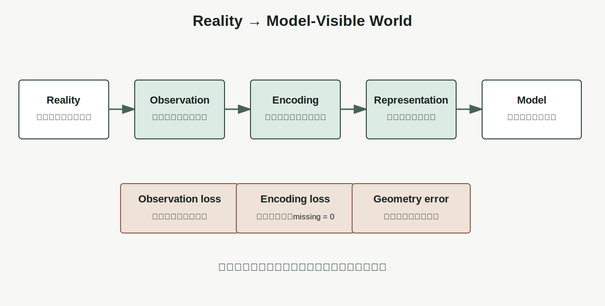
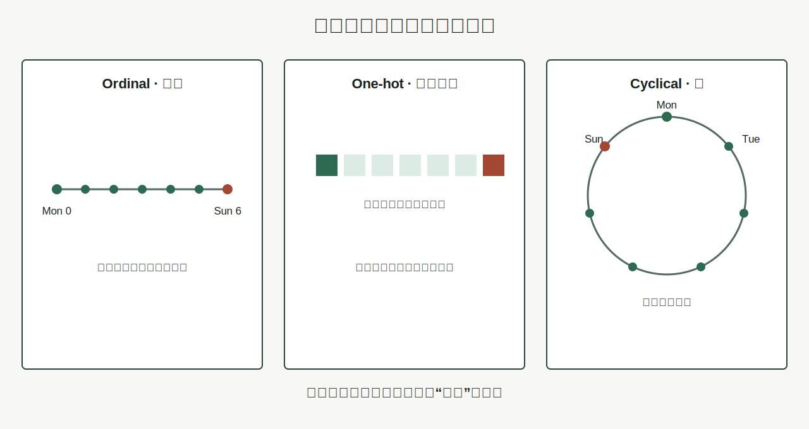

# Chapter 4 · 为什么世界需要表示（Representation）？

**Book:** The AI Mind · Book I · Discovering Intelligence

**Version:** Draft v1.0

**Author:** Codex

**Editorial status:** Awaiting Editor-in-Chief review

---

## Knowledge Graph · Dependency Card

```text
Relationship (Chapter 1)
    ↓
Generation (Chapter 2)
    ↓
Abstraction as Contract (Chapter 3)
    ↓
Representation as Computable Form (Chapter 4)
    ↓
Computation (Chapter 5)
    ↓
Learning (Chapter 6)
```

### Need Before

- 理解依赖可重建、可迁移的关系；
- 局部关系经过状态、交互和迭代可以生成复杂行为；
- 抽象围绕任务保留重要关系，并隐藏可替换细节。

### This Chapter

```text
world
  → observation
  → encoding choice
  → representation
  → available comparisons and operations
  → model-visible world
```

### Need After

- Chapter 5：通过有限步骤把一种表示变成另一种表示；
- Chapter 6：从数据和反馈中形成更有用的表示与规则；
- Chapters 11–12：用向量和矩阵建立表示空间；
- Part III：Embedding、Hidden State、Attention 与 learned representation；
- Book III：Tokenizer 与架构怎样定义 LLM 可处理的单位。

## Book I Question

**Book I 的问题：** 关系怎样逐步形成能够学习、推理与行动的智能系统？

**本章的问题：** 抽象决定保留什么以后，机器怎样保存这些关系，并据此区分、比较和变换世界？

**本章的回答：** 把观察编码成可计算状态。编码不仅保存信息，还定义哪些差异可见、哪些对象相近、哪些操作自然，以及哪些信息已经无法恢复。

**下一个问题：** 一旦关系进入可操作形式，机械步骤怎样把输入表示可靠地变成新的表示和结果？

## Learning Objectives

完成本章后，读者应该能够：

1. 区分 Reality、Observation、Representation 与 Model；
2. 解释为什么数据不是现实，也不自动是适合任务的表示；
3. 用 Observation、Encoding、Distinction、Geometry、Operation 五个位置审计表示；
4. 比较 ordinal、one-hot 与 cyclical encoding 的结构后果；
5. 用 (R:O\rightarrow Z) 表达从观察到表示的转换；
6. 识别 representation collision，并解释为什么更多模型参数无法补回未编码信息；
7. 预测编码、单位、缺失值或时间边界改变对下游模型的影响；
8. 解释公司特征向量怎样定义“可比公司”；
9. 区分可预测表示与符合人类语义的表示。

## One Sentence

> **表示不是现实的副本，而是让某些关系变得可计算、同时让另一些关系变得不可见的选择。**

## Opening Story · 火星探测器看到的不是火星

一台探测器落在火星表面。

它周围有岩石、尘埃、温度、辐射和风。天空颜色随时间变化，地下可能保存着遥远年代留下的痕迹。

地球上的科学家却没有直接站在火星上。他们面对的是屏幕上的遥测包：传感器读数、时间戳、压缩图像、位置坐标、状态码和缺失标记。

两者之间隔着一条很长的链：

```text
火星的物理过程
  → 传感器能够响应的信号
  → 采样时刻
  → 数字化精度
  → 压缩与传输
  → 地球端解码
  → 科学家和模型看到的数据
```

每一步都可能保留一些关系，也可能丢掉一些关系。

如果温度每小时才记录一次，持续五分钟的峰值可能完全消失。如果相机为了节省带宽压掉细纹，岩层结构可能无法恢复。如果时间戳错位，本来同时发生的事件会被当成无关。

还有一种更安静的错误：传感器没有返回读数，系统却把 missing value 写成 `0`。此时“没有观测到温度”与“温度正好是零”变成同一个数字。

火星没有改变。改变的是抵达模型的世界。

> **模型永远不直接面对现实；它面对的是现实经过观察与编码后留下的表示。**

本章不教授航天工程。火星探测器只是把一个事实放大：智能系统能够推理什么，首先受它能够观察和表示什么限制。

## Why Before What · 为什么“有数据”还不够？

人们常说模型“从数据中学习”。这句话容易让数据听起来像现实的透明副本。

但数据已经经过选择：

- 传感器测了什么，没有测什么；
- 表格定义了哪些字段；
- 文本如何切成字符或 Token；
- 图片保留多少像素和颜色；
- 缺失值怎样记录；
- 时间窗口在哪里开始和结束。

模型只能在这些选择之后学习。

如果两种任务相关状态进入系统时已经被写成同一个值，后面的模型再大也无法重新分开。把 missing value 与真实零都写成 `0`，不是一个清洗小细节，而是在定义模型眼中哪些世界彼此相同。

Without representation, a system cannot **store distinctions, compare
states, apply computation, or receive a learnable signal**.

## Feynman Explanation · 同一个星期，三种摆法

给十二岁孩子七张卡片，分别写上 Monday 到 Sunday。

### 摆成一条线

```text
Mon Tue Wed Thu Fri Sat Sun
 0   1   2   3   4   5   6
```

这保留了一个顺序，减法也很方便。但 Sunday 的编号是 6，Monday 是 0，它们看起来相距最远，尽管日历上彼此相邻。

### 放进七个独立盒子

```text
Mon → [1, 0, 0, 0, 0, 0, 0]
Tue → [0, 1, 0, 0, 0, 0, 0]
...
Sun → [0, 0, 0, 0, 0, 0, 1]
```

这种 one-hot 表示不再暗示 Friday 比 Tuesday “更大”，但所有不同日期之间看起来同样不同。它没有表达周末或周期邻近。

### 围成一个圆

```text
        Mon
   Sun       Tue
  Sat         Wed
      Fri Thu
```

圆形让 Sunday 与 Monday 恢复邻近，却不方便直接表达“第几个工作日”。

这里第一次使用 **Geometry（几何）**。它不只是画图形，而是一个表示赋予对象的关系：哪些对象接近、哪些方向有意义、移动一步代表什么变化。

同一个星期没有改变。表示改变后，距离、邻近和自然操作改变了。

> **表示不是给对象换一个外壳，而是在为计算选择关系。**

## First Principles · 表示审计的五个位置

| Element | 核心问题 | 缺失时会怎样 |
|---|---|---|
| Observation · 观察 | 世界的哪部分进入系统？ | 把未观测事实误当成模型已知 |
| Encoding · 编码 | 状态怎样写成符号或数字？ | 单位、语义与缺失规则含混 |
| Distinction · 区分 | 哪些不同状态仍能分开？ | 任务相关状态发生碰撞 |
| Geometry · 几何 | 哪些对象接近，哪些方向有意义？ | 模型学习错误相似性 |
| Operation · 操作 | 哪些比较与变换在该形式上自然？ | 任务关系难以计算或学习 |

### Observation · 先问系统收到什么

相机收到光，不收到“猫”；麦克风收到波形，不收到“讽刺”；财报收到会计制度下的记录，不收到“公司真实价值”。

观察是现实通过接口留下的部分。没有进入观察的因素，不能被诚实地说成模型已经知道。

### Encoding · 怎样写下来？

同一观察可以写成类别 ID、文本、位图、向量或图。编码必须同时说明语义、单位、范围与缺失规则。

`0` 可以表示真实零、类别编号、关闭状态，也可能表示缺失。只看数字本身无法知道是哪一种。

### Distinction · 哪些差异仍可见？

如果两种现实状态得到同一编码，下游系统无法仅凭表示重新区分。压缩可以有意合并无关差异；错误编码则会合并任务关键差异。

### Geometry · 表示创造怎样的邻近？

向量距离不是从现实中自动掉下来的。它由字段、尺度、编码和归一化共同定义。

邮政编码 `10001` 与 `10002` 数值接近，不证明地区在经济结构上相似。公司增长率从 10% 到 20% 与市值从 10 亿到 20 亿都增加“10”，却不是同一种变化。

### Operation · 什么变得容易？

ordinal encoding 方便排序；one-hot 方便区分类别；cyclical encoding 方便表达周期邻近。一个表示使某些运算自然，也让另一些运算失去意义。



## From Cards to Mathematics · 映射、碰撞与距离

### 从摆卡片到坐标

先把星期圆上的每一天放到二维坐标：

```text
Monday    → a point near the top
Tuesday   → rotate one seventh of a circle
...
Sunday    → the point next to Monday
```

现在“周期邻近”不再只是图上的印象，而可以通过坐标距离检查。

### 表示映射

设系统能够获得的观察属于集合 (O)，表示空间为 (Z)。编码映射写成：

\[
R:O\rightarrow Z
\]

给定观察 (o\in O)，模型实际接收：

\[
z=R(o)
\]

预测过程因此可以拆成：

\[
\hat{y}=f(z)=f(R(o))
\]

这个拆分很重要。预测失败可能来自模型 (f)，也可能在表示 (R) 处已经丢失必要差异。

### Representation Collision

若两个不同观察得到同一表示：

\[
o_1\neq o_2,
\qquad
R(o_1)=R(o_2)
\]

它们在模型眼中已经不可区分。

贯穿本章的例子正是：

```text
o₁ = missing value
o₂ = genuine zero

R(o₁) = 0
R(o₂) = 0
```

只看输入 `0` 的模型，无法判断该补数据、报错，还是把它当成真实业务状态。

### Geometry and Distance

若表示是向量，可以定义距离：

\[
d(z_i,z_j)
\]

但公式能算，不等于距离有语义。解释距离之前，必须回答：每个方向代表什么，尺度怎样确定，哪些变化应该被视为相近？

星期的周期表示可以写成：

\[
R(d)=\left(
\cos\frac{2\pi d}{7},
\sin\frac{2\pi d}{7}
\right)
\]

其中 (d\in\{0,1,\ldots,6\})。这个映射把星期放到单位圆上，使 Sunday 与 Monday 的欧氏距离小于 Sunday 与 Thursday。

数学目的不是要求读者记住三角函数技巧，而是展示：**改变表示空间，可以改变模型可直接利用的关系。**



## Coding Lab · 编码会改变什么？

下面实现三种星期编码：

```python
import numpy as np


def ordinal(day: int) -> np.ndarray:
    return np.array([day], dtype=float)


def one_hot(day: int) -> np.ndarray:
    result = np.zeros(7, dtype=float)
    result[day] = 1.0
    return result


def cyclical(day: int) -> np.ndarray:
    angle = 2 * np.pi * day / 7
    return np.array([np.cos(angle), np.sin(angle)])


def distance(a: np.ndarray, b: np.ndarray) -> float:
    return float(np.linalg.norm(a - b))
```

在运行前预测：Monday 记为 0，Sunday 记为 6，哪种表示会让它们最近？

```python
for encode in (ordinal, one_hot, cyclical):
    print(encode.__name__, distance(encode(0), encode(6)))
```

### Perturbation 1 · 打乱类别 ID

如果把 Monday 的 ID 从 0 改成 4、Friday 改成 0：

- ordinal 距离会怎样？
- one-hot 的两两距离会怎样？
- 类别名字改变，语义是否应该改变？

这检查模型是否错误依赖任意编号。

### Perturbation 2 · missing = 0

把缺失日期与 Monday 都编码为 `0`。模型会把“日期未知”和“确定是 Monday”视为同一状态。

更诚实的选择可以是独立 missing indicator、专用类别或显式异常。具体方案取决于任务，但必须保留所需区别。

### Perturbation 3 · 新类别

固定七维 one-hot 遇到 `holiday` 时没有位置。表示 Contract 必须决定：扩展维度、映射到 unknown，还是用额外属性描述。

配套 Notebook 会绘制三种几何，并比较公司表示标准化前后的近邻：

[Chapter 4 · Representation Geometry Notebook](../../../notebooks/book1/chapter04_representation_geometry.ipynb)

## Engineering Perspective · 先测试表示，再比较模型

工程团队容易直接训练多个模型并比较 Accuracy，却跳过输入空间检查。

本章建立 Representation Test：

```text
semantic claim
  → encode examples
  → inspect distinctions and geometry
  → perturb labels, units, and missing values
  → test downstream invariance
```

### Schema 也是表示 Contract

字段名、类型、单位、时区、缺失规则和版本共同定义 Schema。`revenue: float` 并不足够；它还可能需要币种、报告期、合并范围与是否重述。

### Embedding 不是魔法数字化

未来会写：

```python
embedding = model(token_ids)
```

Embedding 可以让训练过程学习几何，但目标函数、数据和架构共同决定学出哪种几何。可学习不等于中立，也不保证符合人类概念。

### 模型无法补回表示之前的信息

如果相机从未记录颜色，黑白图像模型无法可靠恢复每个对象的真实颜色；如果时间序列把事件顺序丢掉，顺序模型也没有原始顺序可用。

容量可以重组、外推或猜测，却不能把猜测诚实地变成已经观测到的事实。

## AI × Finance · 公司向量怎样制造“可比公司”？

市场里没有一条天然坐标轴叫“公司相似度”。分析者先选择表示：

```text
[growth, gross margin, capital intensity, leverage, valuation]
```

然后才计算距离、聚类或可比公司。

### Raw Scale · 规模主导世界

若直接使用收入、市值、员工数和资本开支，量级最大的字段会主导欧氏距离。两家规模相近、商业模式不同的公司可能被判为邻居。

### Standardized Ratios · 重新定义邻近

标准化增长、利润率、资本强度后，小公司和大公司可能因为经营结构相近而靠近。但标准化也隐含选择：使用哪个历史窗口？异常值怎样处理？

### Task-Specific Representation · 任务再次出现

估值任务可能强调增长、利润率与资本成本；信用风险任务更重视杠杆、现金流覆盖与到期结构。相同公司在两种空间中的邻居可以完全不同。

> **表示没有发现唯一的可比公司；表示先定义了什么叫可比。**

### missing = 0 的金融后果

数据库里缺失的净债务若被填成 `0`，模型会把“未知杠杆”与“没有净债务”碰撞。对信用风险，这是关键区别。

同样，未披露用户数不等于零用户，未披露资本开支也不等于没有投资。缺失处理是在表达对现实的判断，不是纯技术清洁。

### 时间边界

财务表示还必须是 point-in-time 的。若使用后来重述的数据、未来才发布的分类或幸存公司列表，模型会看到当时决策者不可能看到的世界。

这叫 leakage。它常发生在模型训练之前，却会让模型看起来异常聪明。

## Research Corner · 好表示能否从数据中自动出现？

深度学习的重要希望之一，是让模型从数据中学习适合任务的内部表示，而不是完全依赖人工 Feature Engineering。

[Bengio, Courville, and Vincent (2013)](https://arxiv.org/abs/1206.5538) 综述了表示学习，并讨论不同表示如何让数据背后的解释因素更容易或更难被下游任务利用。

但从观察中自动恢复“真正因素”并不简单。[Locatello et al. (2019)](https://proceedings.mlr.press/v97/locatello19a.html) 证明：在没有模型与数据归纳偏置时，完全无监督地识别 disentangled factors 在一般情形下是不可能的；他们的大规模实验也表明，单靠无监督评价难以选择人类期望的分解。

本章只保留结论的研究纪律：

```text
learned representation
  ≠ neutral discovery of reality

data + objective + architecture + supervision
  → one selected representation
```

判断一个 learned representation，至少需要：

- **Transfer:** 新任务或新分布仍然有用吗？
- **Intervention:** 修改表示会按预测改变行为吗？
- **Boundary:** 哪些反例暴露碰撞或 Shortcut？
- **Identifiability:** 是否存在多个同样解释数据、语义却不同的表示？

高准确率说明表示与模型共同完成了某项任务，不自动证明内部坐标等于人类理解的真实因素。

## Common Illusions · 表示最容易制造哪些错觉？

### “已经数字化，所以已经有好表示”

更强测试：说明数字的语义、单位、缺失规则和允许操作。

### “维度更多，所以信息更有用”

更强测试：测量新增维度是否改善迁移、区分或任务性能，而不是只增加存储。

### “距离更近，所以现实更相似”

更强测试：解释每个方向的语义，并更换尺度或任务观察邻居是否稳定。

### “模型准确率高，所以表示捕获正确因素”

更强测试：进行跨分布迁移、干预与边界反例测试。

### “Embedding 可视化成团，所以概念被理解”

更强测试：改变投影方法、检查高维距离，并验证聚类是否支持新判断。

### “原始数据没有人为选择”

更强测试：追踪 Observation、采样、Schema、过滤和标注流程。

### “同一字段名跨时期语义一致”

更强测试：核对会计口径、时间点、币种、重述和制度变化。

## Failure Modes · 表示怎样在模型之前失败？

### Observation Blind Spot

现实关键因素从未采集，模型无法通过更复杂架构补回。

### Representation Collision

任务相关的不同状态得到同一编码，例如 missing 与真实零。

### False Geometry

类别 ID、量纲或标准化方式制造没有语义依据的邻近。

### Leakage

未来信息、标签代理或结果变量进入输入表示，使离线表现虚高。

### Distribution Shift

训练时稳定的字段语义，在新地区、制度或时期改变。

### Human Projection

研究者给可视化方向命名，却没有迁移、干预与边界证据。

## Mental Model Upgrade

### Before

```text
Representation
  = reality converted into numbers
```

### After

```text
Representation
  = observation boundary
  + encoding choice
  + geometry
  + available operations
  + declared information loss
```

升级完成的证据是：面对一个模型，读者不只问“输入数据是什么”，还会问：

1. 哪部分现实被观察？
2. 哪些状态仍可区分？
3. 距离与方向代表什么？
4. 哪些操作因编码变得自然？
5. 哪些信息已无法恢复？

## Exercises

### Level 1 · 四层分离

分别写出语音助手、信用评分和卫星图像任务中的 Reality、Observation、Representation 与 Model。

### Level 2 · 星期几何

不运行代码，比较 ordinal、one-hot 与 cyclical encoding 中：

- Monday 到 Sunday 的距离；
- Monday 到 Thursday 的距离；
- 哪种表示保留顺序、类别独立与周期邻近。

### Level 3 · Collision Audit

为下列编码找出至少两个发生碰撞的现实状态：

1. missing 与 zero 都写成 `0`；
2. 所有未知词都写成同一个 `<UNK>`；
3. 每日价格只保留收盘价；
4. 彩色图像转换为灰度图。

说明碰撞在哪个任务中无害，在哪个任务中危险。

### Level 4 · Representation Perturbation

运行 Notebook，并在每次运行前预测：

1. 打乱 weekday ID；
2. 替换 one-hot 与 cyclical encoding；
3. 改变公司特征单位；
4. 标准化公司特征；
5. 把 missing 写成真实零。

### Level 5 · AI × Finance

为同一组公司分别设计估值表示和信用风险表示。每个表示最多五维。解释：

- 哪些字段被保留；
- 怎样标准化；
- 缺失值怎样处理；
- 最近邻为什么不同；
- 哪种未来信息可能造成 leakage。

### Research Exercise

设计一个最小实验，检验一个 learned representation 是否捕获了稳定结构而非训练 Shortcut。实验必须包含 Transfer、Intervention、Boundary 或 Identifiability 中至少两项。

## Understanding Audit

### Explain

不用“数据就是输入”这句话，向高中生解释为什么模型只面对世界的表示。

### Predict

一个需求模型把 weekday 编成 `0` 到 `6`，且只使用线性函数。预测它可能怎样错误处理 Sunday 与 Monday 的关系。

### Reconstruct

关闭本章，从空白页重建：

- Reality → Observation → Encoding → Representation → Model；
- (R:O\rightarrow Z)；
- (\hat{y}=f(R(o)))；
- representation collision 的条件；
- Observation / Encoding / Distinction / Geometry / Operation。

### Transfer

选择一个本章没有使用的领域，为同一对象设计两种任务不同、不可互换的表示。指出一种 collision、一个错误距离和一个必须保留的操作。

配套 Assessment：[Chapter 4 Understanding Audit](../../../labs/book1/chapter04-understanding-audit.md)。

## Capability Milestone

完成 Chapter、Notebook、Audit 与 Figures 后，学习者能够：

- **Explain:** 分离 Reality、Observation、Representation 与 Model；
- **Predict:** 说明编码改变怎样影响几何、区分与操作；
- **Build:** 为同一语义对象实现并比较多种编码；
- **Read:** 审计 AI 或金融 Pipeline 中的碰撞、Leakage 与错误几何。

## Teach Back

分别向三类听众解释“表示是一种有后果的选择”：

- 对十二岁孩子：使用星期卡片，不使用 latent space；
- 对工程师：使用 Schema、Collision、Geometry 与 Operation；
- 对投资者：使用公司向量、可比公司与 point-in-time 数据。

每位听众会改变一次任务。你的表示必须随任务改变，不能只重复同一组字段。

## Master Insight

> **模型能学到什么，首先取决于表示让它看见什么、区分什么，以及把什么关系变成了可计算的几何。**

## Bridge to Chapter 5

表示规定了模型可见的世界，却仍然是静态结构。

像素不会自己识别物体，Token 不会自己形成句义，公司向量也不会自己产生预测。系统需要一组明确步骤，把输入表示变成新的中间状态和输出。

计算不会创造进入表示之前不存在的信息。它只能选择、组合和重新组织已经进入系统的内容，并在这些内容与规则允许的范围内产生新结果。

于是下一个问题出现：

> **如果表示规定机器能够看见什么，那么有限的机械步骤怎样把一种表示可靠地变成另一种表示？**

这就是 Computation 要解决的问题。

Chapter 5：**为什么计算能够产生智能？**

---

## Reading Landmarks

- [Bengio, Courville, and Vincent (2013), *Representation Learning: A Review and New Perspectives*](https://arxiv.org/abs/1206.5538)
- [Locatello et al. (2019), *Challenging Common Assumptions in the Unsupervised Learning of Disentangled Representations*](https://proceedings.mlr.press/v97/locatello19a.html)

这些论文是未来研究路线的路标，不是完成本章练习的前置条件。
