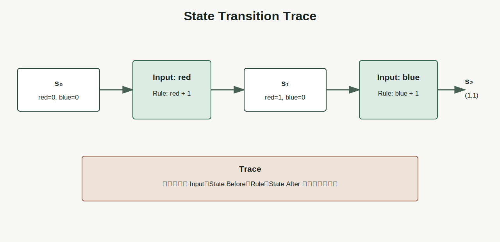
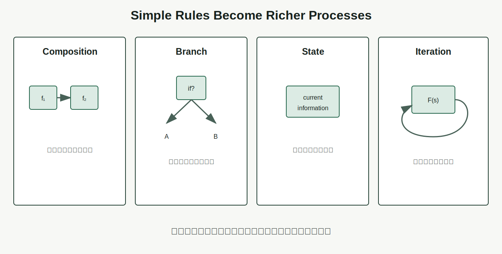

# Chapter 5 · 为什么计算能够产生智能？

**Book:** The AI Mind · Book I · Discovering Intelligence

**Version:** Draft v1.0

**Author:** Codex

**Editorial status:** Awaiting Editor-in-Chief review

---

## Knowledge Graph · Dependency Card

```text
Relationship (Chapter 1)
    ↓
Generation (Chapter 2)
    ↓
Abstraction (Chapter 3)
    ↓
Representation (Chapter 4)
    ↓
Computation (Chapter 5)
    ↓
Learning through Feedback (Chapter 6)
```

### Need Before

- 重复局部更新可以生成全局行为；
- 抽象通过 Contract 管理复杂性；
- 表示决定机器能够看见、区分和操作什么；
- 计算无法恢复在表示之前已经丢失的信息。

### This Chapter

```text
input representation
  + current state
  + transformation rule
  + execution order
  + finite resources
  → trace of intermediate states
  → output representation
```

### Need After

- Chapter 6：用反馈修改未来计算；
- Chapters 13–14：组合线性与非线性计算；
- Chapters 18–19：计算图与反向传播；
- Part III：Attention、Residual Stream 与 Autoregressive Generation；
- Book III：硬件、并行、内存与推理系统。

## Book I Question

**Book I 的问题：** 关系怎样逐步形成能够学习、推理与行动的智能系统？

**本章的问题：** 表示已经让关系进入机器以后，有限、机械的步骤怎样产生新的状态、结果与复杂行为？

**本章的回答：** 通过可执行规则逐步改变状态，让每一步结果成为后续输入；分支、记忆、迭代与组合把简单变换组织成复杂过程，而 Trace 让过程可以验证。

**下一个问题：** 如果规则只会忠实重复，错误结果怎样反过来改变未来计算？

## Learning Objectives

完成本章后，读者应该能够：

1. 区分 arithmetic、algorithm、program、execution 与 computation；
2. 用 Input、State、Rule、Order、Resource、Trace 六个位置审计计算；
3. 解释 State 为什么是影响未来计算的信息，而不只是存储设备；
4. 从状态表建立 (s_{t+1}=F(s_t,x_t))；
5. 说明组合、分支、迭代和状态怎样增加过程能力；
6. 预测改变顺序、初始化、精度或资源预算的后果；
7. 区分算法定义、一次执行、输出正确、过程可审计与资源可行；
8. 构建一个返回 Trace 的小型交易状态机；
9. 审计 point-in-time 投研 Pipeline 的数据血缘与错误目标；
10. 区分复杂计算与会根据反馈改进的智能系统。

## One Sentence

> **计算把静态表示变成可追踪的新状态；它的力量来自规则、顺序、状态与组合，而智能还需要这些计算被目标、反馈和学习组织起来。**

## Opening Story · 一张谁都不知道答案的纸带

一个房间里坐着几位工作人员。桌上有一条很长的纸带，纸带被分成许多格，每格写着一个符号。

每个人只收到一张操作卡：

- 读取当前格；
- 根据符号改写这一格；
- 把读头向左或向右移动；
- 把当前工作状态交给下一位。

没有人知道最终答案，也没有人理解整个问题。每个人只忠实执行局部规则。

开始时，纸带上写的是问题的表示。第一步改写一个符号，第二步读取改写后的结果，后面的步骤继续分支、移动与重复。许多轮以后，系统停在一组可以读出的符号上。

这不是关于机器怎样“理解”问题，而是关于状态怎样在规则作用下移动。

```text
initial state
  → read
  → transform
  → write new state
  → next step reads that state
  → ...
  → output
```

答案并没有完整藏在任何一张操作卡里。它来自初始表示、当前状态、局部规则、执行顺序，以及中间结果不断进入后续步骤。

这说明一件容易被低估的事：

> **不理解全局任务的局部执行者，也能通过精确组合完成超出任何单步规则的过程。**

但它没有证明房间拥有智能。一个计算系统可以非常复杂，却仍然只是忠实执行固定目标。复杂过程与智能判断不是同一个概念。

真实 CPU、GPU 和神经网络不靠人工传纸带，并行执行、有限精度与内存层级也更复杂。纸带房间只用来隔离 State Transition 与 Trace。

## Why Before What · 静态表示为什么不能自己产生结果？

Chapter 4 把 Monday 放到圆上，把公司放进特征空间，把火星信号编码成遥测数据。这些表示让关系可以被计算，却不会自己行动。

- 像素不会自己识别对象；
- Token 不会自己形成句义；
- 公司向量不会自己输出估值；
- 数据库记录不会自己检查风险。

系统需要执行步骤：读取、比较、选择、组合、更新和输出。

若步骤不可复现，错误难以定位；若中间状态不可观察，机制无法审计；若规则固定，系统又不会仅因为结果不好而改变未来行为。

Without computation, a represented relationship cannot **change state,
propagate influence, produce an output, or participate in a learning loop**.

## Feynman Explanation · 积木工厂的六个问题

想象一座积木工厂。传送带送来红色和蓝色积木。

机器可以读取下一块积木，根据颜色选择轨道，把积木放进盒子，记录盒子中已有多少块，重复直到传送带结束，最后输出装好的盒子。

不用先理解芯片，只需问六个问题。

### Input · 什么进入机器？

输入是机器当前读取的表示。若颜色传感器把红色与蓝色都编码成 `0`，后面的规则无法重新区分。

### State · 什么会影响下一步？

State 不是“硬盘”或“内存条”的同义词。

> **State 是当前时刻保留、并可能影响未来计算的信息。**

盒子里已有多少块、当前读头位置、账户余额、对话上下文，都可以是 State。它可能存放在寄存器、内存、文件、Tensor 或外部服务中；存储介质与逻辑角色是两件事。

### Rule · 当前怎样变化？

规则规定读取当前 Input 与 State 后，下一状态怎样产生。

### Order · 哪一步先发生？

如果先封箱再放入最后一块积木，结果会错。相同规则换顺序，可能形成不同过程。

### Resource · 能用多少时间与空间？

盒子容量、传送带速度、计数器精度与处理时限都会限制执行。

### Trace · 中间发生了什么？

若最终数量不对，Trace 可以显示第几步开始偏离。没有 Trace，只有一个错误答案。

这六项构成 Computation Audit Framework：

```text
Input / State / Rule / Order / Resource / Trace
```

## First Principles · 从状态表开始

先不用公式。假设传送带依次进入三块积木：红、蓝、红。机器状态记录红色数量与蓝色数量。

| Step | Input | State Before | Rule | State After |
|---:|---|---|---|---|
| 0 | — | `(red=0, blue=0)` | initialize | `(0, 0)` |
| 1 | red | `(0, 0)` | red count + 1 | `(1, 0)` |
| 2 | blue | `(1, 0)` | blue count + 1 | `(1, 1)` |
| 3 | red | `(1, 1)` | red count + 1 | `(2, 1)` |

表中每一行都是 Trace Entry。它让我们看到：

1. 当前 Input；
2. 更新前 State；
3. 使用的 Rule；
4. 更新后 State；
5. 第一次分歧出现在哪里。



## From Trace to Mathematics · 状态更新、组合与分支

### 状态更新

现在公式才有必要。

设第 (t) 步状态为 (s_t)，当前输入为 (x_t)，一步更新规则为 (F)：

\[
s_{t+1}=F(s_t,x_t)
\]

公式没有说 State 存在哪里，也没有规定 Rule 是加法、条件判断还是神经网络。它只表达：未来状态由当前状态与当前输入经过规则产生。

执行 (T) 步后，通过读取规则 (G) 得到输出：

\[
y=G(s_T)
\]

### Composition · 组合

若输入依次经过三个函数：

\[
y=f_3(f_2(f_1(x)))
\]

每个函数只完成局部变换。组合让前一步产生的表示成为后一步输入。

顺序通常不可交换：

\[
f_2(f_1(x))\neq f_1(f_2(x))
\]

先把金额从美元换成人民币再计算税，与先按人民币税率处理美元金额，不是同一过程。

### Branch · 分支

条件允许系统根据当前状态选择不同规则：

\[
F(s,x)=
\begin{cases}
F_{\text{red}}(s,x), & x\text{ is red},\\
F_{\text{blue}}(s,x), & x\text{ is blue}.
\end{cases}
\]

### Iteration · 迭代

重复让一次局部更新沿时间积累。没有迭代，系统只完成一次变换；有了迭代，输出可以持续成为新输入。

### Memory · 状态跨步保留

记忆不是第五种神秘操作，而是 State 的某些部分在步骤之间保留。若所有历史都被丢掉，系统只能对当前 Input 做无状态映射。



## Resource · “能算”不等于“算得出来”

一个过程在理论上有定义，不代表它能在现实预算中完成。

本章只建立三种最小资源：

```text
T = time steps
M = memory or retained state
P = numerical precision
```

### Time

需要 (10^{20}) 步的算法，对一秒响应任务没有实际可行性。

### Memory

无法保存必要 State，就必须重算、压缩或丢失上下文。

### Precision

计算机使用有限位数。反复累加很小数值会产生舍入误差；极大或极小数值可能溢出或下溢。

本章不教授复杂性理论或数值分析，只建立一个习惯：看到“可计算”时继续问资源条件。

## Coding Lab · 一个留下 Trace 的交易状态机

输入事件只有三类：

```text
deposit(amount)
withdraw(amount)
fee(amount)
```

State 包含余额、已处理事件数量和是否透支。

```python
from dataclasses import dataclass, replace


@dataclass(frozen=True)
class AccountState:
    balance: float = 0.0
    processed: int = 0
    overdrawn: bool = False


def step(state: AccountState, event: tuple[str, float]):
    kind, amount = event
    if amount < 0:
        raise ValueError("amount must be non-negative")

    if kind == "deposit":
        new_balance = state.balance + amount
    elif kind in {"withdraw", "fee"}:
        new_balance = state.balance - amount
    else:
        raise ValueError(f"unknown event: {kind}")

    new_state = replace(
        state,
        balance=new_balance,
        processed=state.processed + 1,
        overdrawn=new_balance < 0,
    )
    trace = {
        "event": event,
        "before": state,
        "after": new_state,
    }
    return new_state, trace
```

执行器把每一步 Trace 保存下来：

```python
def run(events, max_steps=None):
    state = AccountState()
    trace = []

    for index, event in enumerate(events):
        if max_steps is not None and index >= max_steps:
            break
        state, entry = step(state, event)
        trace.append(entry)

    return state, trace
```

### Perturbation 1 · 改变顺序

比较：

```text
deposit 100 → withdraw 80 → fee 30
withdraw 80 → fee 30 → deposit 100
```

最终余额都可能是 `-10`，但第二条 Trace 更早进入透支。若规则在透支时拒绝后续交易，最终结果也会改变。

这说明相同最终算术和相同过程不是一回事。

### Perturbation 2 · 忘记初始化 State

用上一位客户的 State 开始下一次执行。算法定义没变，隐藏 State 却破坏可复现性。

### Perturbation 3 · 限制 Resource

设置 `max_steps=2`，观察系统只处理部分事件。输出不是算法完整结果，而是预算截断结果。

### Perturbation 4 · 删除 Trace

只保留最终余额。当结果错误时，无法判断是输入、顺序还是 Rule 首先偏离。

### Perturbation 5 · 有限精度

用二进制浮点反复累加 `0.1`，结果可能不精确等于十进制期望。数学规则正确，数字表示与有限精度仍会影响执行。

配套 Notebook 会要求在运行前预测最终状态与第一个分歧步骤：

[Chapter 5 · State Transition and Trace Notebook](../../../notebooks/book1/chapter05_state_transition_trace.ipynb)

## Engineering Perspective · 算法、执行与结果不是同一层

### Algorithm Definition

描述一般规则：对任意合法输入应该怎样处理。

### Concrete Execution

算法在某次输入、环境、版本、随机种子与资源预算下的一条实际 Trace。

### Output Correctness

最终输出是否满足规格。一次正确不证明所有输入正确。

### Process Auditability

能否从输出回溯输入版本、中间状态与规则选择。

### Resource Feasibility

能否在时间、内存、精度和成本预算下完成。

一个 deterministic algorithm 也不保证整个系统可复现。外部 API、并发顺序、硬件内核、随机数、环境版本和隐藏缓存都可能改变具体执行。

### AI Preview

- Forward Pass 是函数组合；
- Hidden State 让过去影响下一步；
- Attention 根据当前表示选择信息；
- Autoregressive Generation 把输出 Token 放回下一步输入；
- Computation Graph 记录依赖顺序，后续用于 Backpropagation。

这些只是结构预告，不提前教授 Transformer。

## AI × Finance · 投研 Pipeline 是可审计计算

一份投资结论通常经过：

```text
filing and market data
  → point-in-time normalization
  → driver calculation
  → scenario update
  → valuation
  → risk and position constraints
  → decision artifact
```

### Input

使用决策时真正可获得的数据，而不是后来重述或补齐的数据。

### State

上一版预测、当前仓位、风险预算和未解决假设会影响下一轮计算。State 是影响未来过程的信息，不等于把所有历史文件都加载进内存。

### Rule

收入、利润率、估值与风险指标怎样计算？规则是否有版本？

### Order

必须先统一币种和报告期，再比较公司；必须先生成 point-in-time 特征，再做回测。顺序错误会产生未来信息泄漏。

### Resource

研究时限、数据延迟、算力、人工审核和交易容量都是现实约束。

### Trace

目标价能否追溯到财报版本、假设、公式和审批记录？若两次结果不同，能否定位第一个分歧？

### 错误目标

一个 Pipeline 可以完美执行错误投资目标。例如系统极其高效地最大化短期回测收益，却忽略容量、尾部风险和交易成本。

> **完美执行错误投资目标的系统，仍然只是一个高效错误系统。**

计算负责忠实执行关系，不负责目标是否值得追求。这条边界会在 Loss、Optimization 与 Alignment 中反复出现。

## Research Corner · 更多计算是否自动带来更强智能？

“增加算力”至少可能表示：更大模型、更多训练 Token、更长推理、更高精度或更多搜索。它们不是同一个变量。

[Hoffmann et al. (2022)](https://arxiv.org/abs/2203.15556) 在固定训练计算预算下比较模型规模与训练数据量，展示了资源分配的重要性：更大的参数量不自动代表更有效地使用计算预算。

理论表达能力也不能直接替代实践证据。[Pérez, Marinković, and Barceló (2019)](https://arxiv.org/abs/1901.03429) 在特定假设下研究现代神经架构的 Turing completeness。这样的结果回答“原则上可以表达什么”，不回答有限上下文、有限精度、有限时间下能否学习并可靠执行任务。

必须区分：

```text
computable in principle
  ≠ feasible under resources
  ≠ learned from available data
  ≠ reliable intelligent behavior
```

一个计算系统可以非常复杂，却仍然忠实执行固定目标。复杂性可能产生令人惊讶的行为，但智能还涉及目标、反馈、适应、泛化与环境约束。

## Common Illusions · 计算最容易制造哪些错觉？

### “步骤很多，所以推理很深”

更强测试：检查每一步是否增加任务相关状态，而不是重复无效操作。

### “运行更快，所以答案更好”

更强测试：在相同输入、表示与评价目标下比较正确性，而不只比较延迟。

### “确定性程序，所以系统结果可复现”

更强测试：固定环境、版本、外部依赖、随机性与隐藏 State 后重复执行。

### “输出正确，所以过程可靠”

更强测试：改变输入边界，检查 Trace 与中间 Invariant。

### “理论上可计算，所以资源上可行”

更强测试：给出时间、内存、精度和带宽预算。

### “模型更大，所以计算预算使用更好”

更强测试：在固定预算下比较模型、数据、算法与推理策略的分配。

### “计算产生复杂行为，所以计算本身会选择目标”

更强测试：写出目标由谁定义、失败反馈怎样进入，以及规则是否会因此改变。

## Failure Modes · 计算怎样忠实地产生错误？

### Wrong Input Representation

系统精确处理错误编码，得到精确但无意义的输出。

### Hidden State

缓存、随机种子、环境版本或外部服务没有记录，相同显式输入产生不同结果。

### Order Violation

后一步读取未准备、已覆盖或来自未来的数据。

### Numerical Error

有限精度、溢出与累计误差使数学规则在执行中偏离。

### Resource Exhaustion

时间、内存或带宽不足，理论算法不能完成。

### No Trace

只有最终答案，无法定位错误、验证机制或满足审计。

### Fixed Wrong Objective

系统高效执行一个不代表真实意图的目标。更快只会更快到达错误方向。

## Mental Model Upgrade

### Before

```text
Computation
  = arithmetic
  = faster hardware doing more calculations
```

### After

```text
Computation
  = representation transformation
  + state
  + control flow
  + composition
  + resource limits
  + observable trace
```

升级完成的证据是：读者能重建一次执行轨迹，预测顺序、State 或资源变化的后果，并区分计算能力与学习能力。

## Exercises

### Level 1 · 六项计算审计

分别为自动售货机、导航 App 和聊天模型的一次回答写出 Input、State、Rule、Order、Resource、Trace。

### Level 2 · 手算状态表

给定事件：

```text
deposit 100
fee 5
withdraw 60
fee 10
```

从零余额开始，手算每一步 State。然后交换两个事件，找出第一处分歧。

### Level 3 · 组合顺序

构造两个函数 (f) 与 (g)，使 (g(f(x))\neq f(g(x)))。用现实任务解释为什么顺序代表依赖，而不是排版。

### Level 4 · Trace Perturbation

运行 Notebook 前预测：

1. 改变事件顺序；
2. 复用旧 State；
3. 设置 `max_steps`；
4. 删除 Trace；
5. 重复累加小数。

### Level 5 · AI × Finance

选择一份回测或财务模型，画出 point-in-time Pipeline。标记输入发布日期、State、规则版本、依赖顺序、资源限制和 Trace。设计一个“结果相同但过程不可信”的反例。

### Research Exercise

在固定计算预算下，设计实验比较“更大模型”“更多数据”与“更长推理”。说明如何避免把参数量直接当成智能。

## Understanding Audit

### Explain

不用“CPU”和“算术”，向高中生解释计算为什么是可追踪的状态变换，以及为什么计算不自动等于智能。

### Predict

一个系统使用固定算法，却依赖未记录的外部缓存。预测两次相同请求为何可能不同，并指出应加入 Trace 的字段。

### Reconstruct

关闭本章，从空白页重建：

- Input / State / Rule / Order / Resource / Trace；
- (s_{t+1}=F(s_t,x_t))；
- (y=G(s_T))；
- Composition / Branch / Iteration / Memory；
- computable / feasible / learnable / reliable 四层区别。

### Transfer

选择制造、医疗、教育或供应链中的一个 Pipeline。写出一次执行 Trace，指出一个隐藏 State、一个 Order 风险和一个错误目标。

配套 Assessment：[Chapter 5 Understanding Audit](../../../labs/book1/chapter05-understanding-audit.md)。

## Capability Milestone

完成 Chapter、Notebook、Audit 与 Figures 后，学习者能够：

- **Explain:** 把计算描述为有状态的表示变换；
- **Predict:** 定位顺序、State 或资源变化造成的第一处分歧；
- **Build:** 实现一个留下 Trace 的小型状态机；
- **Read:** 审计 AI 或金融计算的隐藏 State、Lineage 与可行性。

## Teach Back

分别向三类听众解释“计算让智能成为可能，但计算本身还不是智能”：

- 对十二岁孩子：使用积木工厂；
- 对工程师：使用状态更新、Trace 与 Resource；
- 对投资者：使用 point-in-time Pipeline 与错误目标。

每位听众会改变一个条件。你的解释必须预测执行轨迹怎样变化。

## Master Insight

> **计算让表示中的关系沿状态、顺序与组合产生新结果；它可以极其复杂，却只有在目标、反馈与学习加入后，才开始形成能够改进的智能闭环。**

## Bridge to Chapter 6

本章的状态机可以精确处理一百万次交易。只要规则不变，第百万次与第一次遵循同一套逻辑。

如果它错误地拒绝了合法交易，执行更多次不会让它反思；如果目标函数鼓励错误行为，更快硬件只会更快执行错误。

于是出现下一道必要问题：

> **如果计算只会忠实执行已有规则，那么结果怎样反过来改变未来的计算？**

反馈必须进入系统，规则或参数必须发生变化，过去错误才可能影响下一次行为。

这就是 Learning 要解决的问题。

Chapter 6：**为什么机器能够学习？**

---

## Reading Landmarks

- [Hoffmann et al. (2022), *Training Compute-Optimal Large Language Models*](https://arxiv.org/abs/2203.15556)
- [Pérez, Marinković, and Barceló (2019), *On the Turing Completeness of Modern Neural Network Architectures*](https://arxiv.org/abs/1901.03429)

这些论文是未来研究路线的路标，不是完成本章练习的前置条件。
