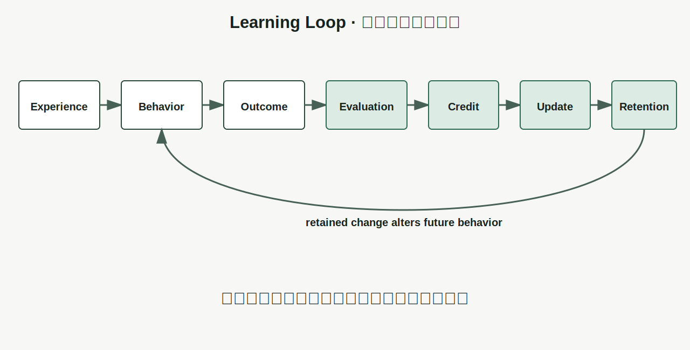
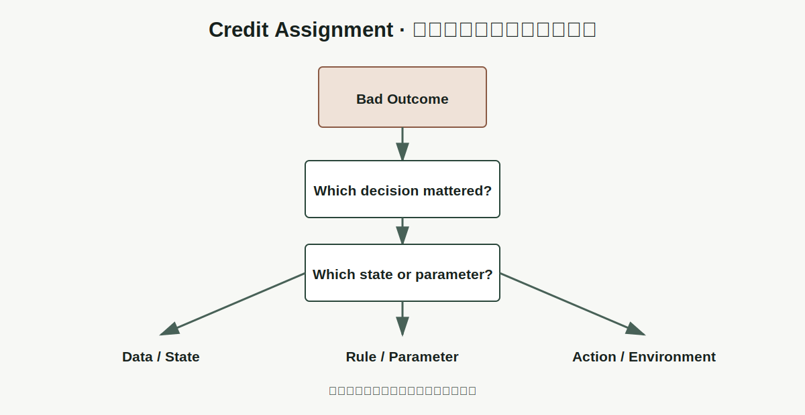

# Chapter 6 · 为什么机器能够学习？

**Book:** The AI Mind · Book I · Discovering Intelligence

**Version:** Canonical v1.0

**Author:** Codex

**Editorial status:** Approved and canonical; pending Book I Alpha consistency pass

---

## Knowledge Graph · Dependency Card

```text
Relationship → Generation → Abstraction → Representation → Computation
                                                        ↓
                                                     Learning
                                                        ↓
                                             Generalization (Chapter 7)
```

### Need Before

- 表示决定系统能够从经验中区分什么；
- 计算把表示变成新状态，但不会自动创造目标；
- 反馈只有进入未来计算，才可能形成学习。

### This Chapter

```text
Experience → Behavior → Outcome → Evaluation
                                  ↓
Credit → Update → Retention → Changed Future Behavior
```

### Need After

- Chapter 7：改变后的行为能否用于未见情况；
- Chapters 15–19：Loss、Gradient、Optimization 与 Backpropagation；
- Part III：Representation Learning 与 Pretraining；
- Book III：监督、自监督、偏好与强化学习。

## Book I Question

**Book I 的问题：** 关系怎样逐步形成能够学习、推理与行动的智能系统？

**本章的问题：** 固定计算怎样利用结果修改未来行为，而不是永远重复同一套规则？

**本章的回答：** 把经验转成可评价结果，将反馈归因到可修改部分，执行并保留更新；只有后续行为按明确标准发生系统性改善，才有学习证据。

**下一个问题：** 系统在已见经验上变好，是学到了关系，还是只记住了答案？

## Learning Objectives

完成本章后，读者应该能够：

1. 区分 Execution、Memory、Adaptation、Parameter Change 与 Learning；
2. 使用 Experience、Behavior、Outcome、Evaluation、Credit、Update、Retention 审计学习闭环；
3. 解释反馈为什么必须改变未来计算；
4. 用 (f_\theta)、(E) 与 (U) 表达最小学习系统；
5. 说明知道“错了”为什么不等于知道“改哪里”；
6. 预测错误标签、延迟反馈、过大更新和无 Retention 的后果；
7. 构建不使用 Autograd 的一参数学习器；
8. 区分训练改善与未见数据改善；
9. 用 Learning Audit 分析 Investment Postmortem；
10. 识别 Reward Hacking、Feedback Loop 与环境变化。

## One Sentence

> **学习不是执行更多计算，而是让经验中的反馈改变未来计算，并使系统在明确标准下产生可验证的改进。**

> **学习改变的是未来行为，而不是过去经验。**

## Opening Story · 同一架无人机，第二次为什么不同？

一架小型无人机第一次穿过有侧风的门框。它向左偏离，撞上软垫。

传感器记录了轨迹：目标是门框中央，实际位置持续偏左。第二次飞行前，系统可能做三件不同的事。

### 只记录

日志保存了“第一次撞到左侧”。控制规则没有变化，第二次仍执行同样动作。

### 随机改变

系统把某个参数改成新数值，却没有使用偏差信息。第二次可能碰巧成功，也可能撞得更远。

### 用反馈更新

系统根据“偏左多少”修改控制参数，第二次提前向右补偿，并保留新的参数。

只有第三种开始构成学习证据。

但一次成功仍不够。风可能已经减弱，补偿可能过头，成功也可能只是运气。必须继续比较行为，并保留未见条件用于测试。

```text
same system
  + remembered outcome only      → no changed rule
  + random parameter change      → change without evidence
  + feedback-directed update     → candidate learning
```

故事不教授无人机控制。它只隔离一条关系：过去结果必须沿可检查路径进入未来行为。

## Why Before What · 为什么“看过”不等于“学会”？

一个数据库可以保存十亿条样本，却不会因此改变查询规则。一个缓存可以让第二次请求更快，却没有形成可迁移关系。一个模型参数可以因内存错误改变，却不能叫学习。

因此，学习至少需要：

- 经验提供证据；
- 行为产生可比较结果；
- 评价定义变化方向；
- 归因找到可修改位置；
- 更新进入规则或参数；
- 新状态被保留；
- 未来行为提供改善证据。

Without learning, a computational system cannot **use experience to alter
future behavior, adapt an internal rule, or improve under a stated
criterion**.

## Feynman Explanation · 会调整旋钮的投球机

想象一台只有一个旋钮的投球机。旋钮控制力度。

第一次球落在目标前方。教练若只说“错了”，机器知道结果不好，却不知道应该加力还是减力。

更有用的反馈是：“短了两米。”机器把力度调高一点，再投一次。

```text
current knob
  → throw
  → landing point
  → compare with target
  → decide knob change
  → retain new knob
```

这里只有一个旋钮，所以 Credit Assignment 很简单：误差只能归因到力度。若机器有方向、角度、旋转、释放时间和风速模型，知道“没进”仍不说明每个旋钮怎样改。

如果教练随机打分，反馈很多却无效；如果每次调整过大，球会在目标两边振荡；如果断电后旋钮回到原位，更新没有 Retention。

这台机器不是神经网络。它是透明实验箱，让 Feedback、Credit、Update 与 Retention 同时可见。

## First Principles · Learning Audit Framework

| Element | 核心问题 | 缺失时会怎样 |
|---|---|---|
| Experience · 经验 | 系统遇到了什么？ | 没有学习证据 |
| Behavior · 行为 | 当前规则做了什么？ | 无法比较规则后果 |
| Outcome · 结果 | 环境实际返回什么？ | 只有意图，没有结果 |
| Evaluation · 评价 | 什么标准定义更好？ | 变化没有方向 |
| Credit · 归因 | 哪部分规则应负责？ | 知道错了，却不知道改哪里 |
| Update · 更新 | 怎样修改可学习状态？ | 反馈不进入未来计算 |
| Retention · 保留 | 变化怎样跨经验保存？ | 每次都从头开始 |

Behavior 与 Outcome 必须分开。模型可以高置信预测上涨，市场却下跌；Agent 可以采取动作，奖励可能许多步后才出现。



## From Records to Mathematics · 参数怎样因反馈改变？

先看投球记录：

| Round | Knob Before | Landing Error | Update | Knob After |
|---:|---:|---:|---:|---:|
| 1 | 1.0 | -2.0 m | +0.2 | 1.2 |
| 2 | 1.2 | -0.8 m | +0.08 | 1.28 |
| 3 | 1.28 | +0.1 m | -0.01 | 1.27 |

误差负号在这里表示“落点不足”。更新方向与误差有关，但更新大小还由规则决定。

### Parameterized Behavior

设当前参数为 (\theta_t)，输入为 (x_t)，预测为：

\[
\hat{y}_t=f_{\theta_t}(x_t)
\]

### Evaluation

环境返回目标或结果 (y_t)，评价函数产生信号：

\[
e_t=E(\hat{y}_t,y_t)
\]

### Update

更新规则使用参数、经验与评价信号：

\[
\theta_{t+1}=U(\theta_t,x_t,e_t)
\]

完整闭环：

\[
x_t
\rightarrow f_{\theta_t}
\rightarrow \hat{y}_t
\rightarrow E
\rightarrow e_t
\rightarrow U
\rightarrow \theta_{t+1}
\]

本章不定义具体 Loss，不推导 Gradient，也不使用 Backpropagation。(E) 只回答如何评价，(U) 只回答反馈怎样进入未来规则。

### Learning Evidence

参数改变不是终点。需要比较行为质量：

\[
Q(f_{\theta_{t+1}})>Q(f_{\theta_t})
\]

其中 (Q) 是明确标准。但即使训练样本上的 (Q) 提高，也尚未证明未见情况会改善。Chapter 7 将专门处理这个缺口。

## Credit Assignment · 知道错了，不代表知道改哪里

投球机只有一个旋钮，归因近乎显然。现实系统通常有许多可修改位置。

一场比赛失败，可能来自开局决策、中间一次失误、资源分配或最后执行。一个神经网络输出错误，可能由许多层和参数共同影响。一次投资亏损，也可能来自 Thesis、Timing、Sizing、Data 或 Execution。

```text
bad outcome
  → which decision mattered?
  → which state influenced it?
  → which parameter affected that state?
  → how much responsibility?
  → what update is justified?
```



### 延迟反馈

若结果在许多步骤后出现，最近一步不一定最应负责。把长期结果全部归给最后动作，是方便但危险的 Shortcut。

### 噪声与运气

好结果可能来自运气，坏结果也可能来自不可控环境。Credit Assignment 要区分可控制作用与随机结果。

### 多路径影响

同一参数可能影响多个中间状态，一个结果也可能由多条路径共同产生。Backpropagation 以后会为计算图提供具体归因机制；本章只建立问题。

## Coding Lab · 一个不用 Autograd 的学习器

使用一参数预测器：

\[
\hat{y}=\theta x
\]

训练经验近似满足 (y=2x)。

```python
def predict(theta, x):
    return theta * x


def update(theta, x, target, rate):
    prediction = predict(theta, x)
    error = prediction - target
    new_theta = theta - rate * error * x
    trace = {
        "x": x,
        "target": target,
        "prediction": prediction,
        "error": error,
        "theta_before": theta,
        "theta_after": new_theta,
    }
    return new_theta, trace
```

`error * x` 表示输入越大，参数变化对预测影响越大。这里不把它包装成完整 Gradient Descent 课程，只观察局部更新方向。

### Perturbation 1 · rate = 0

系统有经验、有评价，却没有 Update。未来计算不变。

### Perturbation 2 · rate 过大

参数跨过较好区域，在两侧振荡甚至发散。反馈方向有用，不代表任意步幅都稳定。

### Perturbation 3 · 错误标签

若数据系统性写成 (y=-2x)，学习器会稳定学习错误关系。更多反馈只会加强错误。

### Perturbation 4 · 无 Retention

每个样本前把 (\theta) 重置为初始值。每一步都更新，下一步却看不到更新。

### Perturbation 5 · 数据覆盖不足

只训练一个输入点。该点预测可以改善，却没有证据说明其他输入也改善。

### Perturbation 6 · 反馈错配

把一个样本的目标分配给另一个输入。反馈存在，却进入错误 Credit 路径。

配套 Notebook 记录每轮 Learning Trace，并要求运行前预测参数方向与未来行为：

[Chapter 6 · Feedback-to-Update Notebook](../../../notebooks/book1/chapter06_feedback_to_update.ipynb)

## Engineering Perspective · 参数变化怎样成为学习证据？

### Version the learner

必须记录参数版本、数据版本、评价规则与更新代码。否则无法解释行为为何改变。

### Separate training and evaluation

用于更新的样本不能同时充当全部改善证据。否则系统可能只记住经验。

### Monitor update health

记录更新大小、方向、异常值、NaN、漂移与回滚点。更新机制本身也会失败。

### Preserve a Learning Trace

```text
experience ID
  → prediction
  → outcome
  → evaluation
  → assigned credit
  → parameter delta
  → model version
  → later behavior
```

Trace 很长仍不等于解释充分。必须能指出反馈通过哪条路径改变未来行为。

## AI × Finance · Postmortem 怎样真正改变下一次决策？

投资机构常写复盘，但文档存在不等于组织学习。

```text
thesis and position
  → realized path and outcome
  → compare with ex-ante assumptions
  → assign error to data / model / sizing / execution
  → update checklist, prior, model, or limit
  → retain change in future workflow
```

### Experience

必须使用决策当时的资料与假设，而不是用事后信息重写记忆。

### Behavior

记录预测、置信度、仓位、时间范围和触发条件。

### Outcome

分开基本面路径、价格路径和风险事件。价格下跌不自动证明基本面 Thesis 错误，盈利也不自动证明过程正确。

### Evaluation

按预测准确度、风险调整收益、过程纪律还是短期 P&L 评价？不同标准会教出不同组织行为。

### Credit

错在 Data、Model、Thesis、Timing、Sizing 还是 Execution？不要把所有亏损归给“市场”。

### Update

明确修改 Checklist、Prior、模型字段、仓位上限或退出规则。

### Retention

更新必须进入模板、系统或审批流程，下一次决策才会实际调用。

如果只奖励短期 P&L，系统可能学会隐藏尾部风险。分数提高不等于投资能力提高。

### Non-stationarity

市场参与者、制度与关系会改变。过去正确的更新可能在新 Regime 中失效。学习系统必须同时监测规则稳定性。

## Research Corner · 经验究竟会教会系统什么？

从像素与奖励中学习复杂控制，展示了反馈驱动学习的力量。[Mnih et al. (2013)](https://arxiv.org/abs/1312.5602) 使用深度强化学习从高维视觉输入学习 Atari 控制策略，是“经验、行为、奖励、更新”形成复杂能力的代表路标。

但奖励并不等于真实意图。[Amodei et al. (2016)](https://arxiv.org/abs/1606.06565) 把 Reward Hacking、Scalable Supervision、Safe Exploration 与 Distribution Shift 等列为具体安全问题，说明错误或不完整反馈可以稳定塑造意外行为。

本章只保留三项研究问题：

1. **Feedback quality:** 标签或奖励代表真实目标吗？
2. **Credit assignment:** 结果应归因到哪些动作或参数？
3. **Environment shift:** 更新后的关系在未来仍成立吗？

```text
experience + objective + credit + update
  → learned behavior

learned behavior
  ≠ guaranteed intended behavior
```

## Common Illusions · 学习最容易制造哪些错觉？

### “看过更多数据，所以学到了更多关系”

更强测试：在未用于更新的数据上检查可预测行为变化。

### “参数变了，所以发生了学习”

更强测试：比较更新前后行为，并排除随机漂移与损坏。

### “训练分数提高，所以未来表现提高”

更强测试：冻结时间或样本，检查 Chapter 7 将讨论的 Generalization。

### “有反馈，所以反馈进入了正确位置”

更强测试：追踪 Credit Path，并打乱反馈观察系统怎样失败。

### “反馈很多，所以反馈有效”

更强测试：检查反馈与真实目标的一致性、信息量、延迟和噪声。大量错误标签会让系统更稳定地学错。

### “记住失败案例，所以更新了决策规则”

更强测试：观察下一次相似但不相同情境中，流程是否调用了新规则。

### “奖励更高，所以真实目标更好”

更强测试：寻找可以提高代理分数却伤害真实目标的策略。

### “持续在线更新，所以持续进步”

更强测试：在固定评价集与变化环境中分别监控，检查灾难性遗忘与反馈循环。

### “更新次数很多，所以学习质量更高”

更强测试：比较未见经验上的行为、更新稳定性与目标一致性，而不是只数 Steps 或 Epochs。重复错误反馈只会让系统更熟练地学错。

## Failure Modes · 学习闭环怎样稳定学错？

### No Signal

没有可比较结果，系统不知道变化方向。

### No Credit

知道整体失败，却不能判断哪个决定或参数应改变。

### No Retention

更新没有保存，下一次仍使用旧规则。

### Wrong Feedback

标签、奖励或评价函数系统性偏离真实目标。

### Update Instability

更新过大、噪声过强或反馈延迟造成振荡与发散。

### Memorization

系统改善只来自保存训练案例，没有形成可迁移关系。

### Non-stationarity

环境改变，过去关系不再可靠。

### Feedback Loop

模型输出改变未来数据，使系统把自身影响误认为外部规律。

## Mental Model Upgrade

### Before

```text
Learning
  = more data
  = stored examples
  = changed parameters
```

### After

```text
Learning
  = feedback-driven retained change
  + credit assignment
  + update mechanism
  + evidence of improved future behavior
```

升级完成的证据是：读者能指出反馈怎样进入未来计算、哪里发生 Credit Assignment、变化如何保留，以及用什么证据判断行为真的改善。

## Exercises

### Level 1 · 七阶段审计

为垃圾邮件过滤器、推荐系统和学生错题复习分别写出七阶段 Learning Audit。

### Level 2 · 手算更新

令 (\theta_0=0)、(x=1)、(y=2)、rate (=0.1)。手算五轮 `predict → error → update`，并记录参数变化。

### Level 3 · Credit Assignment

一个三步决策最终失败。设计两种不同 Credit 分配，并说明各自会让未来策略怎样变化。

### Level 4 · Learning Perturbation

运行 Notebook 前预测：rate 为零、rate 过大、错误标签、无 Retention、单点数据、反馈错配会怎样改变 Learning Trace。

### Level 5 · AI × Finance

选择一个真实或虚构投资案例，重建 ex-ante 信息与决策。分别对 Thesis、Timing、Sizing、Data 和 Execution 分配 Credit，提出一项可保留更新，并写出验证更新是否被未来流程调用的方法。

### Research Exercise

设计一个最小 Reward Hacking 环境：系统可以提高代理分数，却损害真实目标。说明怎样修改 Evaluation 或增加边界测试。

## Understanding Audit

### Explain

不用 Gradient、Backpropagation 或 Optimizer，解释机器为什么能够学习，以及参数变化为什么不足以证明学习。

### Predict

一个系统收到大量延迟且错配的反馈。预测参数与行为可能怎样变化，并指出 Credit Assignment 失败的位置。

### Reconstruct

关闭本章，从空白页重建：

- 七阶段 Learning Audit；
- (\hat y_t=f_{\theta_t}(x_t))；
- (e_t=E(\hat y_t,y_t))；
- (\theta_{t+1}=U(\theta_t,x_t,e_t))；
- 参数变化、学习证据与 Generalization 的区别。

### Transfer

选择一个组织流程或 Agent Workflow，指出 Feedback、Credit、Update 与 Retention，并设计一个测试判断未来行为是否真正改变。

配套 Assessment：[Chapter 6 Understanding Audit](../../../labs/book1/chapter06-understanding-audit.md)。

## Capability Milestone

完成 Chapter、Notebook、Audit 与 Figures 后，学习者能够：

- **Explain:** 区分 Learning、Execution、Memory 与随机变化；
- **Predict:** 追踪反馈质量和更新选择怎样改变未来行为；
- **Build:** 实现并扰动最小反馈驱动学习器；
- **Read:** 审计 AI 或金融学习闭环中的 Credit、Retention 与目标错配。

## Teach Back

分别向三类听众解释“反馈只有进入未来计算才形成学习”：

- 对十二岁孩子：使用投球机；
- 对工程师：使用参数版本、Learning Trace 与 Credit；
- 对投资者：使用 Postmortem、流程更新与 Retention。

每位听众会改变反馈质量。你的解释必须预测系统将学到什么。

## Master Insight

> **学习不是积累过去，而是让被评价、被归因并被保留的反馈改变未来行为；系统学到什么，由经验、目标与更新路径共同决定。**

> **真正的学习不是更新参数，而是更新未来决策。**

## Bridge to Chapter 7

学习器可以把训练样本的误差降到很低，也可以把每个答案逐项保存。两种方法都可能让已见案例表现变好。

真正的问题不是“是否发生了参数更新”，而是：

> **改变后的规则是否适用于没有见过的新情况？**

如果学习改变了规则，我们怎样判断它学到的是可迁移关系，而不是训练经验的索引？

> **如果学习已经改变了规则，我们怎样判断它学到的是普遍规律，而不是训练经验本身？**

这就是 Generalization 要解决的问题。

Chapter 7：**为什么好的模型能够举一反三？**

---

## Reading Landmarks

- [Mnih et al. (2013), *Playing Atari with Deep Reinforcement Learning*](https://arxiv.org/abs/1312.5602)
- [Amodei et al. (2016), *Concrete Problems in AI Safety*](https://arxiv.org/abs/1606.06565)

这些论文是未来研究路线的路标，不是完成本章练习的前置条件。
