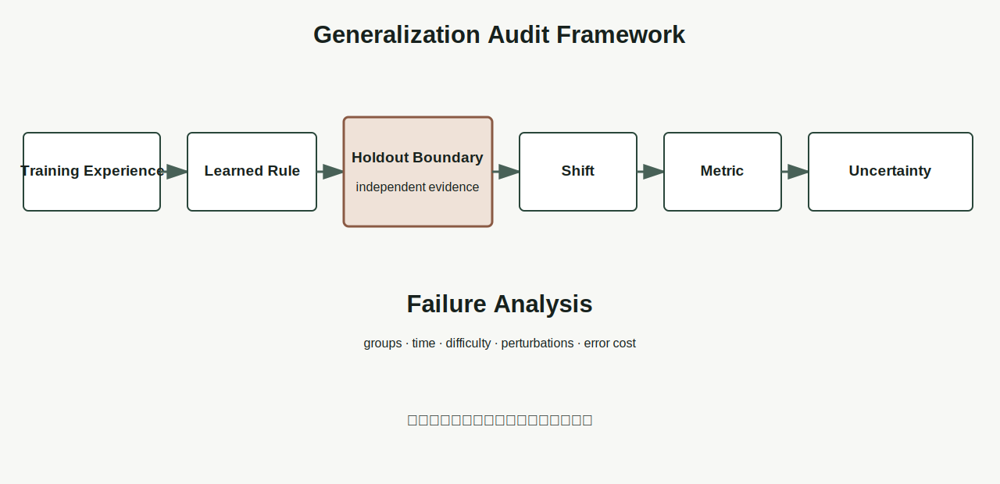

# Chapter 7 · 为什么好的模型能够举一反三？

**Book:** The AI Mind · Book I · Discovering Intelligence

**Version:** Canonical v1.0

**Author:** Codex

**Editorial status:** Approved and canonical; pending Book I Alpha consistency pass

---

## Knowledge Graph · Dependency Card

```text
Representation → Computation → Learning → Generalization → Research Evidence
```

### Need Before

- 理解需要 Transfer，而不只是识别；
- 表示定义模型可以使用的相似性；
- 参数更新与训练改善尚不足以证明有用学习。

### This Chapter

```text
training experience
  → learned rule
  → independent holdout boundary
  → unseen experience under stated shift
  → metric + uncertainty + failure analysis
```

### Need After

- Chapter 8：设计证据区分同一失败的多种解释；
- 后续 ML：Overfitting、Validation、Regularization 与 Model Selection；
- Part III：Transfer、Robustness、Scaling 与 In-context Learning。

## Book I Question

**本章的问题：** 学习改变规则后，怎样判断它学到的是可迁移关系，而不是训练经验的索引？

**本章的回答：** 在更新和选择流程之外建立独立边界，用未见经验与明确 Shift 检查行为，同时报告 Metric、不确定性与失败分组。

**下一个问题：** 同一个失败可能由表示、覆盖、Shortcut、Metric 或环境变化造成，怎样设计证据区分它们？

## Learning Objectives

完成本章后，读者应该能够：

1. 区分 Memorization、Interpolation、Shortcut、Transfer 与 Generalization；
2. 使用 Training Experience、Learned Rule、Holdout Boundary、Shift、Metric、Uncertainty 审计主张；
3. 解释测试边界为何必须独立于更新和模型选择；
4. 计算 Train Risk、Test Risk 与 Generalization Gap；
5. 区分 in-distribution、temporal、group 与 extrapolation shift；
6. 预测复杂度、覆盖与 Leakage 的后果；
7. 运行多项式 Fit/Holdout/Shift 实验；
8. 设计 Point-in-time Walk-forward Backtest；
9. 识别 Benchmark 与部署风险的差异；
10. 把泛化失败改写成可研究问题。

## One Sentence

> **泛化不是在过去经验上得高分，而是在明确的新情境边界内，让学到的关系继续产生可靠结果。**

> **泛化不是模型拥有的属性，而是研究者在明确边界下提出的一项证据主张。**

## Opening Story · 老师为什么要换一道题？

老师提前发给学生一百道练习。学生 A 把答案顺序全部背下；学生 B 尝试理解题目之间的关系。

如果考试原样重复一百道题，两人都可能满分。分数无法区分记忆与理解。

老师于是改变数字、交换条件，再加入一个未见组合。新题不是为了刁难，而是建立证据：学生能否把关系用于没有练过的情境？

但“新”也需要边界。若练习只教加法，考试突然要求微积分，失败不能证明学生没学会加法。测试必须独立，又必须与目标能力相关。

```text
same questions    → memory can pass
related new cases → relation must transfer
unrelated task    → invalid test of the original claim
```

所以考试设计本身就是一项研究设计：看过什么、没看过什么、改变什么、保持什么，都决定分数能够支持哪种结论。

## Feynman Explanation · 学会骑车，还是记住一条路？

孩子在平坦直路上学骑车。第二天可能遇到：

- 同一路线再骑一次；
- 同类道路换一条路线；
- 略有坡度或侧风；
- 湿滑路面与强风；
- 改骑摩托车。

这些变化强度不同。能在另一条平路骑行，不能证明强风下安全；不会驾驶摩托车，也不能否定已经学会自行车。

> **泛化主张必须说明什么发生变化，以及仍假设什么保持不变。**

人类运动学习与机器模型机制不同。自行车只是用于解释 Holdout Boundary 与 Shift。

## First Principles · Generalization Audit Framework

| Element | 核心问题 | 缺失时会怎样 |
|---|---|---|
| Training Experience | 更新过程看过什么？ | 无法定义“未见” |
| Learned Rule | 系统可能依赖什么关系？ | 只看分数，不检查 Shortcut |
| Holdout Boundary | 哪些信息未进入更新与选择？ | Test Leakage |
| Shift | 测试与训练哪里不同？ | “新数据”含义模糊 |
| Metric | 什么表现代表任务成功？ | 平均分隐藏关键失败 |
| Uncertainty | 结果有多稳定？ | 把偶然波动当能力 |

Failure Analysis 横跨六项：按时期、群组、难度、扰动和错误成本寻找系统性模式。



## Memorization、Interpolation 与 Generalization

### Memorization

系统保存训练输入与答案的对应关系。相同输入再次出现时可以正确，轻微变化可能失败。

### Interpolation

新输入位于训练覆盖区域内部，模型在已知样本之间建立关系。Interpolation 可以是有用泛化，但仍依赖覆盖。

### Extrapolation

新输入超出训练范围。此时模型必须延伸关系，风险通常更大。

### Shortcut

模型利用训练和测试中共同存在、但部署时不稳定的代理关系。例如背景颜色与类别偶然相关。

### Transfer

学到的关系被用于新任务或新域。Transfer 比普通随机 Holdout 提出更强边界。

这些词不是能力等级排行榜，而是不同证据问题。

## From Exam Records to Mathematics · Gap 是证据，不是答案

设训练集为 (D_{\text{train}})，测试集为 (D_{\text{test}})，单样本误差为 (\ell)。

\[
\hat{R}_{\text{train}}(f)
=\frac{1}{|D_{\text{train}}|}
\sum_{(x,y)\in D_{\text{train}}}\ell(f(x),y)
\]

\[
\hat{R}_{\text{test}}(f)
=\frac{1}{|D_{\text{test}}|}
\sum_{(x,y)\in D_{\text{test}}}\ell(f(x),y)
\]

经验 Gap：

\[
\widehat{\mathrm{gap}}
=\hat{R}_{\text{test}}(f)-\hat{R}_{\text{train}}(f)
\]

Gap 大可能表示 Overfitting，也可能表示测试更难；Gap 小可能表示稳定关系，也可能因为训练与测试共享同一 Shortcut。

### Distribution Boundary

\[
(x,y)\sim P_{\text{train}},
\qquad
(x,y)\sim P_{\text{test}}
\]

若二者近似相同，检查 in-distribution generalization；若不同，必须说明 Shift 与部署目标的关系。

本章不推导 PAC、VC 或理论 Bound。数学只让经验主张可计算、可质疑。

## Coding Lab · 多项式不是“复杂必过拟合”的寓言

从带噪声的一维关系采样训练点，并保留独立测试点。比较多个 Degree：

```python
coefficients = np.polyfit(x_train, y_train, degree)
prediction = np.polyval(coefficients, x)
```

实验先预测，再运行：

1. 低 Degree 是否 Underfit？
2. 高 Degree 能否穿过训练点？
3. 测试点位于训练范围内时怎样？
4. 测试点移到范围外时怎样？
5. 增加训练覆盖后结果怎样？
6. 多次重采样，不确定性怎样？

很高 Degree 可能在小样本下振荡，但这不证明复杂模型必然泛化差。数据规模、优化、表示、归纳偏置和模型结构共同作用。

### Validation Leakage

若反复查看 Test Error 来选择 Degree，Test Set 已参与模型选择，不再是独立证据。需要训练、验证与最终测试的职责分离。

### Shortcut Feature

人为加入训练中与标签相关、测试 Shift 后失效的特征。模型在随机切分中可能得高分，却在目标环境失败。

配套 Notebook：[Chapter 7 · Fit, Hold Out, Shift](../../../notebooks/book1/chapter07_generalization.ipynb)

## Engineering Perspective · Split 是产品假设

随机切分隐含“未来与历史可交换”的假设。用户、医院、地区、设备与时间存在相关结构时，随机切分会泄漏相似样本。

工程上线前必须回答：

- 新用户还是同一用户的新记录？
- 新时间还是历史随机行？
- 新设备、地区、语言或机构？
- Label 在预测时是否真实可得？
- Threshold 是否用 Test Set 调整？

Benchmark 是测量仪器，不是能力本身。

## AI × Finance · Walk-forward 才接近真实未知

金融数据具有时间方向。随机打乱历史会让未来 Regime、重述数据与标签结构间接进入训练。

```text
train through time t
  → choose model and threshold
  → test on t+1 ... t+k
  → advance window
  → repeat without rewriting history
```

### Training Experience

只使用当时已经发布且可获得的数据。

### Learned Rule

因子、模型或决策规则依赖估值回归、趋势、质量还是流动性？

### Holdout Boundary

未来时期不参与参数、特征和阈值选择。

### Shift

利率、政策、市场结构、参与者和交易成本怎样改变？

### Metric

同时看收益、Drawdown、Turnover、Capacity、成本与尾部暴露。

### Uncertainty

独立事件数量、样本长度与多重试验有多大？

常见失败包括 Survivorship Bias、Look-ahead Leakage、反复试验后只报告最好策略，以及忽略执行成本。漂亮 Backtest 可能只是历史索引。

## Research Corner · 同一高分可能有不同解释

[Zhang et al. (2016)](https://arxiv.org/abs/1611.03530) 展示大型神经网络能够拟合随机标签，同时在真实标签任务上良好泛化，挑战“容量大必然泛化差”的简单叙事。

[Geirhos et al. (2020)](https://www.nature.com/articles/s42256-020-00257-z) 将许多失败概括为 Shortcut Learning：标准测试有效的规则，在更具挑战条件下不再可靠。

[Koh et al. (2020)](https://arxiv.org/abs/2012.07421) 的 WILDS 汇集现实 Distribution Shift，并展示标准训练在多种真实 Shift 下的性能下降。

同一个 Test Score 可能由不同机制产生：稳定关系、记忆、共享 Shortcut 或 Leakage。仅看结果不能区分。

> **研究真正开始于：同一个现象可能有多种解释。**

## Common Illusions · 泛化最容易制造哪些错觉？

### “训练误差低，所以学到稳定关系”

更强测试：独立 Holdout 与 Shift Test。

### “Test Score 高，所以所有新情境可靠”

更强测试：声明目标分布与边界外条件。

### “Gap 小，所以没有 Shortcut”

更强测试：改变 Shortcut、背景、群组或环境关系。

### “数据没见过，所以独立于模型选择”

更强测试：追踪 Test 是否用于 Feature、Threshold、Prompt 或 Degree 选择。

### “随机切分适合所有问题”

更强测试：按时间、用户、机构或群组重新切分。

### “平均准确率高，所以关键群组安全”

更强测试：报告群组、尾部与高成本错误。

### “Benchmark 排名高，所以部署风险低”

更强测试：比较 Benchmark 与部署的输入生成、Shift、Metric 和反馈回路。

### “一次新样本成功，所以可以泛化”

更强测试：重复采样并报告不确定性。

### “更多测试集，所以证据更强”

更强测试：检查这些测试是否真正独立于模型、Prompt、阈值和特征选择。反复查看许多测试集并据此修改系统，会把它们逐渐变成隐性训练反馈。

## Failure Modes

- **Memorization:** 轻微变化即失败；
- **Shortcut:** 利用不稳定代理关系；
- **Leakage:** Test 信息进入训练或选择；
- **Coverage Gap:** 训练未覆盖部署区域；
- **Metric Blind Spot:** 平均分隐藏关键错误；
- **Distribution Shift:** 数据生成过程改变；
- **Selection Bias:** 反复试验把 Test 变成训练集。

## Mental Model Upgrade

### Before

```text
Generalization = high test score = works on new data
```

### After

```text
Generalization claim
  = independent boundary
  + specified shift
  + relevant metric
  + uncertainty
  + failure analysis
```

升级完成的证据是：读者能说明什么真正未见、测试与部署怎样相关、可能存在什么 Shortcut，以及结论在哪个边界外不成立。

## Exercises

1. 为三个模型主张写出六项 Generalization Audit。
2. 给定 Train/Test Prediction，手算 Risk 与 Gap。
3. 运行 Notebook 前预测 Degree、Coverage、Leakage 与 Extrapolation 后果。
4. 为图像或文本任务构造一个 Shortcut Feature。
5. 设计 Point-in-time Walk-forward Backtest，标记所有选择边界。
6. 把一个部署失败写成至少三种竞争解释。

## Understanding Audit

### Explain

为什么泛化不是模型固有属性，而是带边界的证据主张？

### Predict

一个随机切分 Benchmark 很高的模型，部署到新医院。预测哪些关系可能变化，哪些证据仍缺失。

### Reconstruct

重建六项 Audit、Train/Test Risk、Gap 与 (P_{train}/P_{test}) 边界。

### Transfer

为医疗、教育、供应链或 Agent 设计独立 Holdout 与 Shift Test，并说明部署范围。

配套 Assessment：[Chapter 7 Understanding Audit](../../../labs/book1/chapter07-understanding-audit.md)。

## Capability Milestone

- **Explain:** 区分 Memorization、Shortcut 与有边界的 Generalization；
- **Predict:** Split 与 Shift 怎样改变证据；
- **Build:** 运行 Train/Holdout/Shift 实验；
- **Read:** 审计 AI 或金融主张中的 Leakage、Coverage 与 Metric Blind Spot。

## Teach Back

分别向学生、工程师和投资者解释为什么“新数据高分”仍不足够；每位听众会改变部署边界，你必须改变测试设计。

## Master Insight

> **泛化不是一句“模型会举一反三”的赞美，而是一项必须说明未见边界、环境变化、评价标准与不确定性的证据主张。**

> **泛化的边界不是限制模型，而是限制我们对模型能力的过度解释。**

## Bridge to Chapter 8

一个模型在新环境失败，可能因为表示丢失信息、训练覆盖不足、模型利用 Shortcut、Metric 错误或环境改变。

同一个现象支持多种解释。增加更多分数不一定能区分它们。

> **面对同一个失败，我们怎样提出“为什么”，并设计证据区分这些解释？**

研究真正开始于：同一个现象可能有多种解释。

> **研究的第一步不是寻找答案，而是设计能够区分解释的证据。**

Chapter 8：**为什么研究总是从“为什么”开始？**

---

## Reading Landmarks

- [Zhang et al. (2016), *Understanding Deep Learning Requires Rethinking Generalization*](https://arxiv.org/abs/1611.03530)
- [Geirhos et al. (2020), *Shortcut Learning in Deep Neural Networks*](https://www.nature.com/articles/s42256-020-00257-z)
- [Koh et al. (2020), *WILDS: A Benchmark of In-the-Wild Distribution Shifts*](https://arxiv.org/abs/2012.07421)
