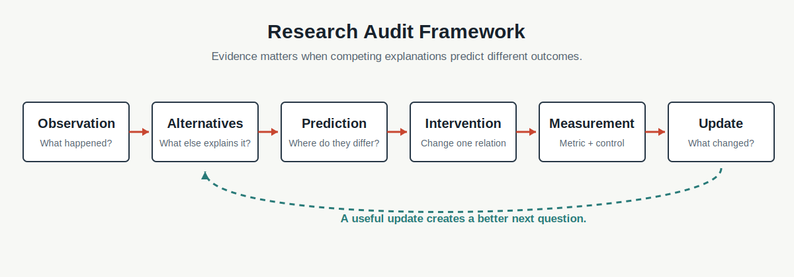

# Chapter 8 · 为什么研究总是从“为什么”开始？

**Book:** The AI Mind · Book I · Discovering Intelligence

**Version:** Canonical v1.0

**Author:** Codex

**Editorial status:** Approved and canonical; pending Book I Alpha consistency pass

---

## Knowledge Graph · Dependency Card

```text
Learning → Generalization Evidence → Competing Explanations
                                      ↓
                                  Research Loop
                                      ↓
                              Book I Map Reconstruction
```

### Need Before

- Chapter 1：理解需要解释、预测、重建和迁移；
- Chapters 4–6：同一结果可能来自表示、计算或反馈；
- Chapter 7：分数是在边界内的证据，不是机制说明。

### This Chapter

```text
Observation
  → Alternatives
  → Discriminating Predictions
  → Intervention
  → Measurement
  → Evidence Update
```

### Need After

- Chapter 9：从空白页重建 Book I 的关系地图；
- Chapter 10：用数学语言精确表达主张和检验；
- 后续 Books：论文阅读、Ablation、Replication 与原创研究。

## Book I Question

**本章的问题：** 同一个现象可能由多种机制产生，我们怎样让证据而不是偏好决定下一步？

**本章的回答：** 提出竞争解释，找出它们预测不同结果的条件，设计干预并记录什么结果会改变判断。

**下一个问题：** 前八章能否从记忆中的标题，变成一张可以独立重建和质疑的关系地图？

## Learning Objectives

完成本章后，读者应该能够：

1. 区分 Observation、Question、Hypothesis、Claim 与 Evidence；
2. 使用六项 Research Audit 审计研究；
3. 为同一现象提出至少两个竞争解释；
4. 找到使解释产生不同预测的条件；
5. 区分 Demo、Control、Ablation、Replication 与 Falsification Attempt；
6. 用预测表、差值和条件证据表达结果；
7. 运行 Shape/Background Shortcut 干预实验；
8. 将 Earnings Miss 拆成可区分的投资假设；
9. 识别 Confirmation Bias、HARKing 与 Cherry-picking；
10. 把 Negative Result 变成下一轮更精确的问题。

## One Sentence

> **研究不是为现象寻找一个听起来合理的答案，而是设计能够区分多种解释的证据。**

> **研究的目标不是尽快找到唯一答案，而是提高不同解释之间的区分能力。**

## Opening Story · 两个都能解释 98% 的故事

一个图像模型在测试集上得到 98% Accuracy。团队很兴奋，并提出解释：模型学会了识别动物的形状。

但另一位研究者打开数据，发现猫几乎总在绿色背景，狗几乎总在蓝色背景。于是出现第二个解释：模型只学会了背景颜色。

```text
H1: model uses shape      → original test: high
H2: model uses background → original test: high
```

原测试集无法区分 H1 与 H2。继续收集相同结构的图片，即使 Accuracy 升到 99%，两个解释仍然一起得分。

真正有信息的测试，是交换背景：绿色的狗、蓝色的猫。

```text
                       Original background   Swapped background
H1: shape                     high                  high
H2: background                high                  low
```

研究不是先挑一个听起来更合理的故事，而是寻找一个条件，让故事承担不同后果。

真实视觉模型可能同时利用形状、纹理和背景。这里的二元模型是透明实验箱，不是对现实机制的完整描述。

## Feynman Explanation · 两位侦探与一把湿伞

门口有一把湿伞。

- 侦探 A 说：外面下雨；
- 侦探 B 说：有人刚洗过伞。

湿伞与两种解释都相容。继续盯着伞，只会得到更多相同观察。

窗外是否下雨？走廊是否有水迹？清洁记录写了什么？这些问题有价值，因为两个解释对答案的预测不同。

> **证据最重要的功能，不是让一个故事显得更动听，而是改变故事之间的相对解释力。**

侦探类比有边界：研究不保证存在一个简单、唯一的原因。多个机制可以同时成立，证据也可能只缩小范围。

## First Principles · Research Audit Framework

| Element | 核心问题 | 缺失时的失败 |
|---|---|---|
| Observation | 实际测到什么，边界是什么？ | 把解释伪装成事实 |
| Alternatives | 还有什么机制产生同一现象？ | 只验证首选故事 |
| Prediction | 每个解释在新条件下预测什么？ | 假设不可区分 |
| Intervention | 怎样主动改变关键条件？ | 只有相关观察 |
| Measurement | 用什么 Metric、Control 与重复？ | 结果不可比较 |
| Update | 哪种结果会改变判断？ | 主张免疫于证据 |



Reproducibility 横跨六项：别人能否获得相同数据版本、条件、代码、随机种子和分析规则？

### Observation 不是 Interpretation

“Swap 后 Accuracy 从 98% 降到 61%”是观察。

“模型只看背景”是解释。它仍需面对其他可能：交换操作引入伪影、两类图片难度不同，或形状与背景共同作用。

### Hypothesis 必须承担风险

如果无论出现什么结果，都能修改故事让它继续正确，那么它没有被检验。

在运行实验前写下：

- H1 和 H2 各自预测什么；
- 使用哪个 Metric；
- 什么结果会削弱首选解释；
- 哪些条件保持不变。

## From Prediction Table to Mathematics

先写预测表，再写公式：

| Condition | H1 Shape | H2 Background |
|---|---:|---:|
| Original | high | high |
| Background swap | high | low |
| Shape corruption | low | high |

原条件没有区分力；两个干预让预测分叉。

设同一个评价指标为 $M$，最小干预差值为：

\[
\Delta=M_{\text{intervention}}-M_{\text{control}}
\]

若 Swap 后 $\Delta$ 显著为负，它增加 Background Shortcut 的解释力，但不自动证明背景是唯一机制。

也可以使用条件证据语言：

\[
P(E\mid H_1) \quad \text{versus} \quad P(E\mid H_2)
\]

若证据 $E$ 在 H2 下更容易出现，它更支持 H2 相对于 H1。这里不推导 Bayes 定理、p-value 或完整因果图；本章只建立一个纪律：**好证据应让竞争解释受到不同影响。**

## Coding Lab · Competing Explanations

配套 Notebook 构造两个特征：Shape 与 Background。训练分布中，两者都与 Label 一致。

```python
def shape_rule(shape, background):
    return shape


def background_rule(shape, background):
    return background
```

两条规则在原 Test 同分。然后依次运行：

1. Background Swap；
2. Shape Corruption；
3. 两者同时加 Noise；
4. 改变 Metric；
5. 重复不同随机种子；
6. 只挑支持首选解释的条件，观察 Cherry-picking 怎样制造结论。

运行前先填写预测，运行后再填写结果与 Evidence Update。

配套 Notebook：[Chapter 8 · Competing Explanations](../../../notebooks/book1/chapter08_research.ipynb)

## Engineering Perspective · Ablation 不是随便删东西

删除一个模块后性能下降，至少存在三类解释：

1. 模块承担目标机制；
2. 删除改变尺度、容量或优化稳定性；
3. 替代实现没有得到公平训练。

因此：

```text
remove component
  → observe change
  ≠ identify unique mechanism
```

更强 Ablation 会加入参数量匹配、随机替代、重新调优、多个 Seed 与分组指标。Ablation 是干预证据，但干预仍可能 Confounded。

Research Trace 应保存：Question、Alternatives、Pre-registered Predictions、Intervention、Metric、Result、Uncertainty 与 Revision。没有 Trace，事前预测和事后故事很容易混在一起。

## AI × Finance · Earnings Miss 到底说明什么？

公司利润低于预期。一个数字可以容纳多种机制：

- H1：终端需求走弱；
- H2：汇率折算；
- H3：渠道去库存；
- H4：一次性投入提前；
- H5：会计确认时点变化。

它们对未来证据的预测不同：

| Hypothesis | Discriminating evidence | Forward prediction |
|---|---|---|
| Demand | 订单、销量、取消率 | 指引与收入继续承压 |
| FX | Constant-currency revenue | 本币经营趋势较稳 |
| Inventory | 渠道库存、Sell-through | 出货先弱，终端未必同步 |
| Investment | 费用科目、招聘、Capex | 现金投入上升，未来产能变化 |
| Timing | 应收、递延、现金流 | 后续季度可能反转 |

专业研究不是电话会后选一个故事，而是在下一份数据出现前记录：

```text
Observation
  → Bull / Bear / Alternative explanations
  → discriminating indicators
  → falsification triggers
  → evidence update
  → thesis and position update
```

管理层说法是证据来源之一，不是机制证明。渠道调查、文件、现金流和后续结果必须共同承担区分任务。

## Research Corner · 为什么好实验仍可能误导？

[Geirhos et al. (2020)](https://arxiv.org/abs/2004.07780) 将许多模型失败概括为 Shortcut Learning：在标准条件下有效的规则，换到更具挑战的环境就失效。它提醒我们，标准高分不能唯一识别模型使用的关系。

[Gundersen et al. (2022)](https://arxiv.org/abs/2204.07610) 整理了机器学习研究中从实验设计到结论推断的多种不可复现来源。代码可运行只是复现链的一部分。

这留下三个问题：

1. 哪些 Control 能排除“干预只是破坏系统”的解释？
2. Replication 复现结果，是否也复现机制？
3. Negative Result 怎样缩小假设空间，而不是被隐藏？

研究不是一次实验宣布真相，而是让解释逐步承担更多可复核约束。

## Common Illusions · 研究最容易制造哪些错觉？

### “问了为什么，所以问题可研究”

更强检验：列出竞争解释和会使它们分离的条件。

### “结果支持我的观点，所以观点被证明”

更强检验：询问相同结果还支持哪些解释，以及什么结果会反驳首选观点。

### “Ablation 降分，所以模块负责能力”

更强检验：加入匹配 Control、替代实现、重新调优和多个 Seed。

### “相关性稳定，所以机制正确”

更强检验：主动干预关键关系，并检查混杂变化。

### “实验失败，所以没有研究产出”

更强检验：记录被排除的假设、暴露的混杂与下一问题。

### “复现论文结果，所以理论解释也被证明”

更强检验：区分结果复现、方法复现与机制解释。

### “实验可重复，所以解释已经被证明”

更强检验：重复结果只能说明现象在给定条件下稳定；还要用竞争解释和区分性干预检验机制。

### “更多引用，所以证据更强”

更强检验：检查引用是否独立、是否检验同一主张，以及是否共享数据和假设。

## Failure Modes

- **One-Hypothesis Research:** 只设计支持首选解释的实验；
- **Confirmation Bias:** 选择性寻找和解释支持证据；
- **HARKing:** 结果出现后把故事写成事前假设；
- **Moving Goalposts:** 证据反驳时修改成功标准；
- **Confounded Intervention:** 同时改变多个条件；
- **Metric Substitution:** 用易测代理替代真正问题；
- **Cherry-picking:** 只报告有利 Condition、Seed 或群组；
- **Irreproducible Trace:** 缺少版本、条件、代码与分析选择。

## Mental Model Upgrade

### Before

```text
Research = ask why + read papers + find an answer
```

### After

```text
Research = observation
           + competing explanations
           + discriminating predictions
           + controlled intervention
           + uncertainty
           + belief revision
```

升级完成的证据是：你能在实验前写出什么结果会使自己改变判断。

## Exercises

1. 将五个陈述拆成 Observation 与 Interpretation。
2. 为同一模型失败提出至少三个竞争解释。
3. 填写 Shape/Background 预测表，再运行 Notebook。
4. 为一个 Ablation 设计三个更公平的 Control。
5. 把一次 Negative Result 改写成下一轮研究问题。
6. 为 Earnings Miss 建立假设树、预测和 Falsification Trigger。
7. 审计一篇论文或投资报告中的替代解释和 Moving Goalposts。

## Understanding Audit

### Explain

为什么“合理解释”仍不足以成为研究结论？

### Predict

给定两个解释，设计一个条件，使它们预测不同结果。

### Reconstruct

从空白页重建 Research Audit 与 Prediction Table。

### Transfer

将 AI、医疗、教育或金融现象改写为竞争假设、干预、Metric 与 Update Rule。

配套 Assessment：[Chapter 8 Understanding Audit](../../../labs/book1/chapter08-understanding-audit.md)

## Capability Milestone

- **Explain:** 区分 Observation、Hypothesis、Claim 与 Evidence；
- **Predict:** 找出解释发生分歧的实验条件；
- **Build:** 运行带 Research Trace 的 Control/Intervention；
- **Read:** 审计论文或投资主张的替代解释与证据边界。

## Teach Back

向一名高中生解释：为什么同一个结果可以支持多个故事？然后让对方提出一个能区分故事的新观察。

## Master Insight

> **研究不是把一个故事讲得越来越完整，而是让多个故事在证据面前承担不同风险，并诚实更新我们仍然不知道什么。**

> **未知不是研究失败，而是下一轮问题的起点。**

## Bridge to Chapter 9

前八章已经给出：Relationship、Generation、Abstraction、Representation、Computation、Learning、Generalization 与 Research。

如果它们只是八个标题，我们学到的是目录。如果理解存在于关系中，就应该能够从空白页重新画出它们如何互相需要、互相限制。

> **如果不能从关系重新构建地图，就说明我们只是记忆章节，而没有理解系统。**

Chapter 9 不再增加一个新术语。它要求我们重建第一张完整的 AI 思维地图，并找出其中仍然薄弱的连接。

---

## Reading Landmarks

- [Geirhos et al. (2020), *Shortcut Learning in Deep Neural Networks*](https://arxiv.org/abs/2004.07780)
- [Gundersen et al. (2022), *Sources of Irreproducibility in Machine Learning: A Review*](https://arxiv.org/abs/2204.07610)
