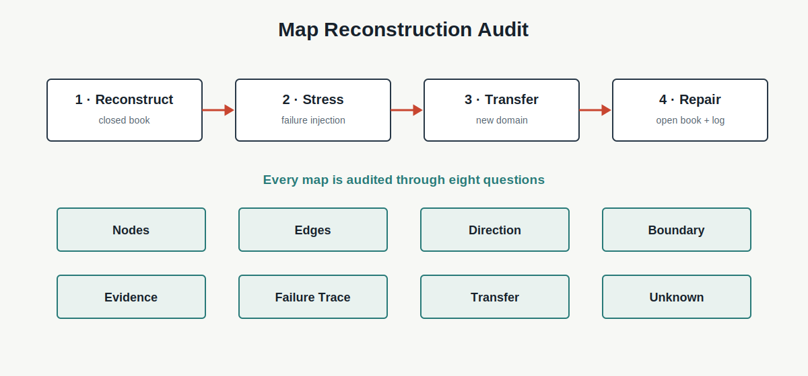

# Chapter 9 · 第一幕复盘：构建第一张 AI 思维地图

**Book:** The AI Mind · Book I · Discovering Intelligence

**Version:** Draft v1.0

**Author:** Codex

**Editorial status:** Awaiting editorial review

---

## Knowledge Graph · Dependency Card

```text
Relationship → Generation → Abstraction → Representation
                                             ↓
Research ← Generalization ← Learning ← Computation
    ↓
Map Reconstruction
```

### Need Before

- Chapter 1：理解需要 Explain、Predict、Reconstruct 与 Transfer；
- Chapters 2–6：能力来自相互依赖的结构；
- Chapters 7–8：关系必须接受边界与证据检验。

### This Chapter

```text
recall nodes
  → recover edges
  → justify direction and boundary
  → inject failure
  → trace consequences
  → transfer the structure
  → mark unknowns
```

### Need After

- Chapter 10：数学怎样精确表达、计算和检验关系；
- Part II：向量、矩阵、梯度与 Backprop 的实现机制；
- Part III：表示学习与 Transformer 的系统组合。

## Book I Question

**本章的问题：** 前八章是一串熟悉术语，还是一张能够独立重建、检验和迁移的系统地图？

**本章的回答：** 关闭原文，从节点和关系重建地图；注入错误、追踪传播、迁移到新领域，再对照原文修复并记录未知。

**下一个问题：** 当自然语言不足以精确表达关系时，我们需要什么语言来比较、计算和验证它们？

## Learning Objectives

完成本章后，读者应该能够：

1. 从空白页恢复前八章的核心节点；
2. 为每条关键 Edge 解释 Direction、Boundary 与 Evidence；
3. 区分 Node List、课程顺序与 Dependency Map；
4. 在整本书尺度执行 Explain、Predict、Reconstruct、Transfer；
5. 追踪 Representation Collision、Wrong Edge 与 Leakage 的传播；
6. 从失败症状反推可能损坏的节点或关系；
7. 将地图迁移到 Agent、医疗或投资研究；
8. 区分 Stable Principle 与暂时实现；
9. 比较两张不同但合理的地图；
10. 标记 Unknown，而不是假装地图完整。

## One Sentence

> **如果不能从关系重新构建地图，我们拥有的只是章节记忆，而不是系统理解。**

> **地图不是现实本身，而是为了某个任务建立的可检验关系模型。**

## Opening Story · 八个专家，仍然解释不了一次事故

一个线上 AI 系统突然失败。

会议室里有八位专家。数据专家知道输入，Feature 专家知道表示，模型专家知道计算，训练专家知道更新，评估专家知道分数，部署专家知道环境变化，研究员知道 Ablation，产品负责人知道目标。

每个人都能完整介绍自己的部分。白板上很快写满组件名称：

```text
data   features   model   loss   training   test   deployment   experiment
```

但没人能回答：失败从哪里开始，又怎样一路传播到最终决策？

他们有一份零件清单，没有系统地图。

团队重新画关系后发现：部署新增的压缩步骤把两个关键状态编码成同一个值。

```text
different real states
  → same representation
  → same computation
  → same prediction
```

模型仍能运行，训练日志正常，随机测试也很高。错误在入口发生，症状却在部署决策才暴露。

真实事故通常由多重原因共同造成。这个故事不寻找唯一 Root Cause，只强调：局部知识必须通过关系地图才能支持系统诊断。

## Feynman Explanation · 零件清单不是自行车

桌上摆着车轮、链条、脚踏、刹车和车把。

会说出所有名字，不等于知道自行车怎样工作。

```text
parts list     → vocabulary
assembly map   → relationships
turn pedal     → prediction
rebuild bike   → reconstruction
repair scooter → transfer
```

真正理解的人能解释：脚踏怎样带动链条，链条怎样驱动车轮，刹车改变哪里，以及一条错误连接为什么会让完整零件无法工作。

自行车不会像学习系统那样通过反馈改变内部关系。类比只用于区分 Component Knowledge 与 System Understanding。

## First Principles · Map Reconstruction Audit

| Element | 核心问题 | 缺失时的错觉 |
|---|---|---|
| Nodes | 必要概念是什么？ | 词汇缺失 |
| Edges | 哪些关系连接节点？ | 只有目录 |
| Direction | 谁约束谁，什么沿箭头传播？ | 把相关当依赖 |
| Boundary | 关系在什么条件下成立？ | 地图被过度推广 |
| Evidence | 什么观察支持这条 Edge？ | 箭头只是故事 |
| Failure Trace | 局部错误怎样传播？ | 无法诊断系统 |
| Transfer | 新领域保留什么结构？ | 只会复述原例 |
| Unknown | 哪些连接仍不确定？ | 把工作图当真相 |



重建顺序必须保持：

```text
closed-book reconstruction
  → stress test
  → open-book repair
  → revision log
```

若先打开标准图，任务会退化成识别与临摹。

## Reconstructing the First Book I Map

先合上书，写出你记得的节点。再为每条 Edge 补上关系动词。

以下不是唯一标准答案，而是一张可检验工作图：

```text
Relationship
  → local rules can Generate larger patterns
  → Abstraction preserves task-relevant relations
  → Representation makes selected relations computable
  → Computation transforms represented state
  → Learning changes future computation through feedback
  → Generalization tests relations beyond update experience
  → Research Evidence distinguishes explanations of success and failure
```

每条 Edge 都必须回答：

1. 为什么不是只把两个词并排？
2. 箭头能否反向？
3. 哪个例子会破坏这条关系？
4. 什么证据会增强或削弱它？

### 课程顺序不等于现实流水线

现实系统包含反馈：Research 可能要求修改 Representation；Generalization Failure 可能回到目标与数据；Learning 也依赖 Computation 与 Representation。

所以地图既有主路径，也有回边。章节顺序服务教学，不宣称世界只单向运行。

## From Hand-drawn Map to Mathematics

一张关系图可以写成：

\[
G=(V,E)
\]

- $V$ 是节点集合；
- $E$ 是有方向的关系集合。

\[
(u,v)\in E
\]

表示在当前任务地图中，理解 $v$ 需要 $u$ 提供关系或约束。这不是严格因果证明，也不必表示时间顺序。

路径：

\[
u\rightsquigarrow v
\]

帮助追踪变化可能跨哪些节点传播。

真正可审计的 Edge 还需要注释：

\[
e=(u,v,\text{claim},\text{boundary},\text{evidence})
\]

本章不进入 Graph Theory、Adjacency Matrix 或因果 DAG。公式只把“它们有关”升级成一个更精确的关系声明。

## Engineering Lab · Failure Injection Map

最小系统：

```text
raw input
  → representation
  → computation
  → prediction
  → loss / feedback
  → update
  → holdout evaluation
```

### Failure 1 · Representation Collision

两个重要状态进入同一编码。后续计算再准确，也无法恢复已经消失的区别。

### Failure 2 · Wrong Edge

节点都正确，但关系错误：系统把部署后的真实结果连接到报告 Dashboard，却没有连接回 Learning Update。

```text
correct nodes + wrong relationship → wrong prediction about adaptation
```

### Failure 3 · Metric Substitution

Loss 改善，但 Metric 与真实目标错位。Learning 发生了，方向却未必有用。

### Failure 4 · Leakage

Holdout 参与 Feature 或 Threshold 选择。Evaluation 节点存在，独立边界已经断裂。

### Failure 5 · Confounded Ablation

删除模块同时改变容量和优化，Research Edge 不能支持唯一机制结论。

每次注入后记录：首个损坏位置、下游症状、仍然正常的 Dashboard、竞争解释和区分实验。

配套 Notebook：[Chapter 9 · Executable Knowledge Graph](../../../notebooks/book1/chapter09_knowledge_map.ipynb)

## Reverse Debugging · 从症状反推 Broken Edge

正向预测问：“如果这里坏了，会发生什么？”

真实 Debug 常从结果开始：

```text
deployment failure
  → possible shift?
  → unstable shortcut?
  → weak holdout boundary?
  → representation loss?
  → objective mismatch?
```

反向路径不是唯一答案，而是假设树。Chapter 8 的 Research Audit 决定下一步怎样区分这些 Broken Edge。

## AI × Finance · 投资论点不是 Bullet List

一份 Memo 列出 Growth、Margin、Valuation、Management 和 Risk，看起来很完整，却可能没有可推理结构。

关系地图要求：

```text
industry structure
  → company driver representation
  → earnings expectation
  → valuation
  → position decision
  → new evidence
  → thesis update
  → out-of-sample result
```

Failure Injection：

- 价格与销量被错误连接成独立变量；
- 会计 Timing 被当作 Demand；
- Position Size 没有连接不确定性；
- Backtest 的未来信息连接到历史决策；
- 管理层解释被直接连接为 Observation；
- 新证据没有进入 Thesis Update。

真正的 Transfer 不是用 Finance 名词替换 AI 名词，而是保留表示、计算、反馈、泛化与证据之间的机制结构。

## Research Corner · 一张好地图怎样证明自己有用？

[Karpicke and Blunt (2011)](https://doi.org/10.1126/science.1199327) 比较 Retrieval Practice 与 Elaborative Concept Mapping，提醒我们：看起来结构丰富的学习活动不自动等于更强的长期重建。地图必须与独立回忆和应用证据一起评估。

[Hsu and Hsieh (2005)](https://pubmed.ncbi.nlm.nih.gov/15533089/) 的研究显示，Concept Mapping 可用于观察命题、层级与关系结构，但不同结构指标未必同步改善。

这留下四个问题：

1. 能重画节点，是否也能解释 Edge？
2. Failure Prediction 是否比“我懂了”更可靠？
3. Transfer 时哪些结构应保持，哪些必须改变？
4. 评分标准会不会奖励漂亮但无预测力的地图？

本章不主张 Concept Map 本身证明理解。它只提供一个外显、可扰动、可修订的理解模型。

## Common Illusions · 复盘最容易制造哪些错觉？

### “能说出八个概念，所以理解了系统”

更强检验：为每条关键 Edge 写关系动词与边界。

### “箭头更多，所以地图更完整”

更强检验：删除无法解释或检验的 Decorative Edge。

### “顺序正确，所以依赖正确”

更强检验：区分课程顺序、信息流、反馈与证据关系。

### “图画得漂亮，所以可以诊断”

更强检验：注入 Failure 并预测传播。

### “和标准图不同，所以一定错误”

更强检验：比较两张地图的 Claim、Boundary 与 Evidence。

### “换了领域名词，所以完成 Transfer”

更强检验：说明哪些机制关系保持、哪些必须重建。

### “地图没有问号，所以知识完整”

更强检验：建立 Unknown Register 与下一研究问题。

## Failure Modes

- **Node Dump:** 堆术语，没有关系动词；
- **Decorative Arrows:** Edge 缺少 Direction、Boundary 与 Evidence；
- **Linear-sequence Trap:** 把教学顺序当现实单向流程；
- **Canonical-map Memorization:** 临摹标准图，不能解释替代结构；
- **Failure-blind Map:** 正常流程完整，无法预测错误传播；
- **Wrong Edge:** 节点正确，关系错误；
- **Domain Word Replacement:** 迁移名词，不迁移机制；
- **False Completeness:** 不标 Unknown，把工作图当世界本身。

## Mental Model Upgrade

### Before

```text
Review = reread + remember more chapter content
```

### After

```text
Review = reconstruct nodes and edges
         + justify direction and boundary
         + predict failure propagation
         + transfer structure
         + mark uncertainty
```

升级完成的证据是：不看原文也能画出一张不必完全相同、但每条关键 Edge 都能解释和检验的地图。

## Exercises

1. 闭卷写出前八章节点，不要求顺序。
2. 为每条 Edge 补 Claim、Boundary 与 Evidence。
3. 找出三条可能的反向 Edge，并解释反馈作用。
4. 注入 Representation Collision，追踪到 Evaluation。
5. 注入 Wrong Edge，预测哪些 Dashboard 仍可能正常。
6. 比较两张不同地图，判断是冲突还是任务边界不同。
7. **反向重建：** 给定“随机测试高、部署失败”，画出至少四条 Broken Edge 假设路径，并设计区分证据。
8. 将地图迁移到 Agent、医疗或投资研究，禁止只替换节点名称。
9. 建立 Unknown Register，写出三个下一步研究问题。

## Understanding Audit

### Explain

为什么 Component Knowledge 不等于 System Understanding？

### Predict

选择一个 Broken Node 或 Wrong Edge，追踪它的下游后果与隐蔽症状。

### Reconstruct

合上正文，从空白页画出 Nodes、Edges、Direction、Boundary、Evidence 与 Unknown。

### Transfer

将地图迁移到新领域，说明保持的机制、改变的节点和失效边界。

配套 Assessment：[Chapter 9 Understanding Audit](../../../labs/book1/chapter09-understanding-audit.md)

## Capability Milestone

- **Explain:** 论证第一张 Book I 关系地图；
- **Predict:** 追踪表示、学习与证据中的故障传播；
- **Build:** 创建、Stress Test 并修复可执行知识图；
- **Read:** 识别系统主张中的 Missing Edge 与 Unsupported Arrow。

## Teach Back

不用章节标题，向一名高中生解释：一个系统如何从关系形成能力，又怎样证明和研究这种能力。让对方指出一个他不相信的箭头。

## Master Insight

> **系统理解不是拥有更多节点，而是能解释关系、预测断裂、重建结构、迁移机制，并诚实标出地图尚未覆盖的现实。**

## Bridge to Chapter 10

重建地图后，我们会发现自然语言箭头仍然含糊：

- “影响”有多大？
- “相似”如何比较？
- “变化”怎样累积？
- “证据”怎样计算？

> **当关系需要被精确表达、计算和检验时，自然语言为什么不够？**

Chapter 10：**为什么数学是智能的语言？**

---

## Reading Landmarks

- [Karpicke & Blunt (2011), *Retrieval Practice Produces More Learning than Elaborative Studying with Concept Mapping*](https://doi.org/10.1126/science.1199327)
- [Hsu & Hsieh (2005), *Developing Concept Maps from Problem-based Learning Scenario Discussions*](https://pubmed.ncbi.nlm.nih.gov/15533089/)

