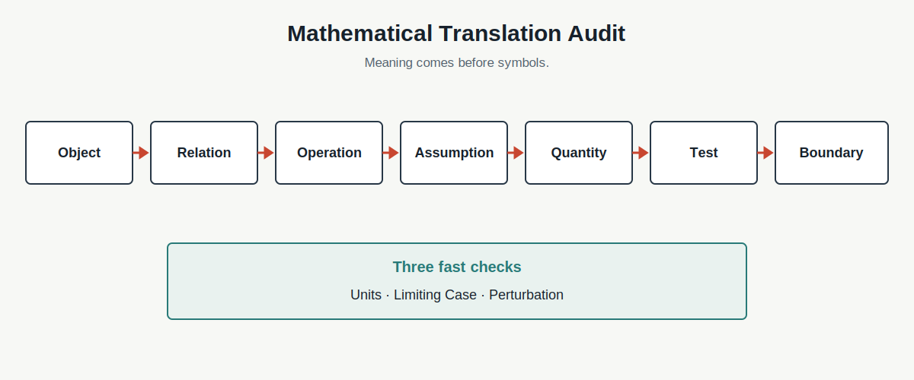

# Chapter 10 · 为什么数学是智能的语言？

**Book:** The AI Mind · Book I · Discovering Intelligence

**Version:** Canonical v1.0

**Author:** Codex

**Editorial status:** Approved and canonical; pending Book I Alpha consistency pass

---

## Knowledge Graph · Dependency Card

```text
Relationship Map
  → ambiguity becomes visible
  → Mathematical Language
      ├─ precise objects
      ├─ explicit relations
      ├─ valid operations
      ├─ checkable consequences
      └─ stated boundaries
  → Vector
```

### Need Before

- Chapter 1：理解需要预测与重建，不只是熟悉；
- Chapter 3：抽象是任务相关契约；
- Chapter 4：表示决定可见关系与合法操作；
- Chapter 9：自然语言 Edge 仍缺少数量、方向与检验规则。

### This Chapter

```text
meaning
  → objects and units
  → relation
  → symbols
  → operation
  → consequence
  → test and boundary
```

### Need After

- Chapter 11：为什么多属性对象需要 Vector；
- Chapters 12–19：Matrix、Gradient、Loss、Optimization 与 Backprop；
- 后续 Books：Probability、Attention 与系统性能分析。

## Book I Question

**本章的问题：** “相似”“影响”“增加”“误差”和“证据”含义模糊时，怎样让关系可计算、可比较、可检验？

**本章的回答：** 先定义对象、单位、关系、操作、假设和边界，再用符号压缩它们、推导后果，并让观察检验整套翻译。

**下一个问题：** 如果一个对象同时拥有多个可以独立变化、又彼此相关的属性，一个数字为什么不够？

## Learning Objectives

完成本章后，读者应该能够：

1. 解释数学为何是关系语言而不只是计算工具；
2. 使用 Mathematical Translation Audit 审计形式化；
3. 将模糊主张翻译成对象、变量、单位和关系；
4. 区分 Definition、Assumption、Derivation 与 Observation；
5. 解释公式怎样压缩一族关系；
6. 使用 Units、Limiting Case 与 Perturbation 检查表达式；
7. 追踪错误 Object 怎样经过正确计算产生错误结论；
8. 识别 Precise but Wrong、Proxy Substitution 与 Hidden Assumption；
9. 将“便宜且优质”转换成有边界的决策表示；
10. 说明为什么多属性对象自然要求 Vector。

## One Sentence

> **数学不是把世界变难，而是让关系承担明确、可计算、可反驳的含义。**

## Opening Story · “再近一点”到底是多少？

两支团队远程操控一台深海机器人。视频有延迟，机械臂正接近一条脆弱管线。

操作员说：

> “再近一点，速度慢一些。”

工程师无法安全执行。他必须追问：

- 近多少厘米？
- “速度”是末端速度还是关节转速？
- 使用哪个坐标系？
- 信号延迟多久？
- 安全距离是多少？
- 传感器误差多大？

自然语言表达了意图，却没有给机器一份可执行契约。

团队重新描述任务：机械臂末端沿管线法向移动 2 厘米，速度不超过每秒 0.5 厘米；若估计距离减去传感器误差低于 3 厘米，立即停止。

数学没有让机器人“更聪明”。它让 Object、Direction、Quantity、Unit、Error 与 Boundary 变得明确，使不同人和机器能够执行同一关系。

> **数学保证表达明确，不保证表达真实。**

如果传感器错了，或安全模型遗漏水流影响，精确指令仍会失败。

## Feynman Explanation · 食谱为什么需要单位？

一张食谱写：

> 加一些面粉，少量水，烤到差不多。

熟练厨师可能凭经验成功，新手和机器无法稳定重建。

```text
ingredient       → object
amount + gram    → quantity + unit
mix              → operation
temperature/time → condition
taste/texture    → test
oven type        → boundary
```

写成 200°C、30 分钟后，食谱更容易执行、比较和调整。但它仍不是永恒真理：烤箱、海拔、模具与目标口感都会改变结果。

数学食谱是带边界的模型，不是现实本身。

## First Principles · Mathematical Translation Audit

| Element | 核心问题 | 缺失时的失败 |
|---|---|---|
| Object | 描述什么？ | 符号无对象 |
| Relation | 对象怎样关联？ | 只有变量列表 |
| Operation | 允许怎样变换？ | 计算无语义 |
| Assumption | 哪些条件暂时成立？ | 推导边界隐藏 |
| Quantity | 怎样测量，单位是什么？ | 比较不成立 |
| Test | 什么观察支持或反驳？ | 公式免疫于证据 |
| Boundary | 何时不再适用？ | 精确地过度推广 |



顺序很重要：

```text
meaning first
  → objects and units
  → relation
  → symbols
  → operation
  → consequence
  → test and boundary
```

符号不是起点。若不知道符号代表什么，公式只是在压缩困惑。

## From a Fuzzy Claim to a Checkable Model

从一句商业语言开始：

> 广告投入增加，销售也会增加。

先不写公式，先问：

- $x$ 是广告投入，还是广告曝光？
- $y$ 是收入、订单还是新增客户？
- 单位是什么？
- 时间窗口多长？
- 哪些条件暂时固定？
- 关系在哪个投入范围内成立？

第一轮翻译：

- $x$：本季度广告投入，单位万元；
- $y$：本季度销售额，单位万元；
- 暂时假设其他重要条件固定；
- 在研究范围内使用近似线性关系。

\[
y=wx+b
\]

$w$ 表示单位投入对应的预测销售变化，$b$ 是模型中的基准项。线性是 Assumption，不是世界自动交出的事实。

模型现在承担后果：

\[
\Delta y=w\Delta x
\]

若真实观察不符，可能是参数错误、非线性、时间延迟、混杂变量、数据错误，或模型被用到边界外。

## Mathematics as Four Actions

数学在本书中首先执行四种动作，而不是四门课程。

### Represent

用变量、集合、图或向量保存任务需要的关系。

### Transform

用操作把一个状态变成另一个状态。

\[
y=f(x)
\]

### Compare

定义差异、顺序、距离或概率。

\[
\text{error}=\text{prediction}-\text{observation}
\]

### Infer

从 Assumption 与 Observation 推导 Consequence，再检查是否成立。

数学不只输出答案。它保存一条别人可以重建、质疑和修正的推理 Trace。

## Three Fast Checks Before Trusting a Formula

### Units

等式两边单位必须一致。若 $x$ 是万元、$y$ 也是万元，那么 $w$ 在这个模型中必须让 $wx$ 保持销售额单位。

Units Check 不能证明关系真实，但能暴露表达不一致。

### Limiting Case

令输入为零、极大或极小。结果是否符合模型声称的世界？若广告无限增加，线性公式预测销售无限增加，说明模型边界已经暴露。

### Perturbation

轻微改变输入，检查输出的方向和幅度。

```text
x increases slightly
  → should y rise or fall?
  → by how much?
  → under which assumption?
```

这三个检查是理解工具，不是形式证明。

## Failure Trace · 正确计算怎样产生错误结论？

一位分析师把“广告投入”定义成广告点击数，却仍把单位写成万元。

```text
wrong Object definition
  → wrong Quantity and Unit
  → relation fitted correctly to the wrong object
  → formula computed without arithmetic error
  → conclusion answers a different question
```

代码可以全部通过，数值可以非常稳定，结论仍然错误。

Chapter 9 的 Failure Trace 在这里得到新形式：错误不一定发生在 Calculation；它可能在数学翻译第一步发生，并被后续精确计算放大。

## Engineering Lab · 从模糊需求到 Executable Contract

产品需求：

> “相似用户应该得到相似推荐。”

要执行它，团队必须定义：

1. 用户 Object 包含哪些 Feature？
2. Similarity 使用什么表示、尺度和单位？
3. Recommendation Difference 怎样测量？
4. 哪些敏感属性不应造成差异？
5. 多大变化算违反 Contract？

最小接口：

```python
def user_distance(user_a, user_b):
    ...


def recommendation_gap(rec_a, rec_b):
    ...
```

Lab 改变 Feature Scale、Missing Value、Threshold 与 Representation。目标不是实现推荐系统，而是检查形式化是否忠于原问题。

配套 Notebook：[Chapter 10 · Translate, Compute, Break](../../../notebooks/book1/chapter10_mathematical_language.ipynb)

## AI × Finance · “便宜且优质”不是模型

投资者说一家公司“便宜且优质”。这句话有方向感，却不足以比较公司、复现决策或检验历史表现。

一种翻译可以定义：

- Value：Free-cash-flow Yield 或 EV/EBIT；
- Quality：ROIC、Margin Stability、Balance-sheet Risk；
- Growth：Revenue、Unit Economics、Reinvestment Runway；
- Boundary：行业、会计口径、周期阶段与 Point-in-time Data。

然后构造：

\[
\text{score}=w_vV+w_qQ+w_gG
\]

权重、标准化、缺失值处理和数据窗口都是 Assumption。

> **这个 Score 是为某项决策建立的 Representation，不是公司的 Reality Representation。**

它可能帮助筛选候选公司，却不能保存管理层质量、竞争反应、制度变化和所有未来路径。

形式化真正带来的好处，是让分歧可定位：两位分析师不同意的是 Object、数据、定义、权重、关系，还是 Boundary？

## Research Corner · 形式化什么时候会误导？

[Manheim and Garrabrant (2018)](https://arxiv.org/abs/1803.04585) 区分多种 Goodhart-style Failure：用于衡量目标的 Metric 在被强力优化后，可能不再可靠代表目标。

[D'Amour et al. (2020)](https://arxiv.org/abs/2011.03395) 讨论 Underspecification：多个模型在训练域的标准测试上表现相近，却可能在部署条件下行为明显不同。一个分数不足以唯一确定关系机制。

这留下四个问题：

1. 精确 Proxy 是否替代了真正目标？
2. 更复杂公式是否只隐藏更多 Assumption？
3. 同一自然语言概念是否存在多个合理形式化？
4. Metric 成为优化目标后，系统会怎样改变行为？

> **形式化的价值不在消除争议，而在让争议发生在可见、可检验的位置。**

## Common Illusions · 数学最容易制造哪些错觉？

### “有公式，所以有理解”

更强检验：从公式恢复 Object、Relation、Assumption 与 Boundary。

### “数字更精确，所以模型更准确”

更强检验：将预测与独立观察比较，区分 Precision 与 Accuracy。

### “单位一致，所以关系真实”

更强检验：Units 只是必要检查，不是经验验证。

### “能计算，所以值得计算”

更强检验：确认 Quantity 与真正决策目标相关。

### “模型越复杂，所以关系表达越准确”

更强检验：比较新增复杂度是否产生独立可检验预测，而不是只提高训练拟合。

### “一个 Score，所以对象只有一个维度”

更强检验：列出压缩中丢失的属性和交互。

### “数学客观，所以建模没有价值判断”

更强检验：审计 Object、Metric、Threshold 与 Error Cost 的选择者和后果。

### “形式化完成，所以问题已经被解决”

更强检验：重新审计 Object、Metric、Assumption 与 Boundary。形式化让问题可见、可检验，不保证选择正确。

## Failure Modes

- **Undefined Object:** 符号没有清楚现实对象；
- **Unit Mismatch:** 运算可执行，量纲不一致；
- **Precise but Wrong:** 表达精确，假设或数据错误；
- **Proxy Substitution:** 易测 Metric 替代真正目标；
- **Hidden Assumption:** 推导条件没有声明；
- **Operation Without Meaning:** 数学合法，现实语义不成立；
- **Single-number Collapse:** 多维对象过早压成 Score；
- **Boundary Erasure:** 局部关系被推广到所有情境。

## Mental Model Upgrade

### Before

```text
Mathematics = formulas to memorize before doing AI
```

### After

```text
Mathematics = precise objects
              + explicit relationships
              + valid operations
              + derived consequences
              + testable boundaries
```

升级完成的证据是：你既能从现实主张建立形式化，也能从公式返回现实含义、Assumption 与 Failure Boundary。

## Exercises

1. 将五句模糊主张拆成 Object、Relation、Quantity 与 Boundary。
2. 区分十个陈述中的 Definition、Assumption、Derivation 与 Observation。
3. 为 $y=wx+b$ 补完整单位、时间窗口和 Limiting Case。
4. 找出三个 Units 正确但现实关系错误的例子。
5. 运行 Notebook 前预测 Scale、Proxy 与 Boundary 改变的后果。
6. 从错误结论反向追踪 Translation Failure。
7. 为“相似用户”写 Executable Contract 与 Perturbation Test。
8. 审计 Finance Score 丢失的属性与 Point-in-time Boundary。
9. 解释为什么描述一家公司或图片时，一个数字通常不够。

## Understanding Audit

### Explain

为什么数学是一种关系语言，而不是符号和计算的集合？

### Predict

改变一个 Unit、Assumption 或 Boundary，预测公式结论怎样变化。

### Reconstruct

从自然语言重建形式化，再从公式恢复 Object、Relation 与 Test。

### Transfer

把 Mathematical Translation Audit 用于 AI、物理、医疗或 Finance，并指出不同领域边界。

配套 Assessment：[Chapter 10 Understanding Audit](../../../labs/book1/chapter10-understanding-audit.md)

## Capability Milestone

- **Explain:** 区分 Formula、Assumption、Derivation 与 Evidence；
- **Predict:** 用 Units、Limits 与 Perturbation 审计后果；
- **Build:** 把模糊主张翻译成 Executable Contract；
- **Read:** 找出模型中的 Hidden Assumption 与 Proxy Substitution。

## Teach Back

不使用“公式更精确”这句话，向一名高中生解释为什么 AI 需要数学。必须给出一个数学表达清楚但现实模型错误的例子。

## Master Insight

> **数学不是现实的替代品，而是一份可执行、可推导、可失败的关系契约；它最宝贵的地方，是让正确与错误都更容易被看见。**

## Bridge to Chapter 11

一个广告投入可以用一个数表示。但一家公司、一张图片或一个 Token 同时拥有许多可以独立变化、又彼此相关的属性。

若把所有属性压成一个 Score，许多关系会在计算前消失。

> **单个数字压缩属性，而向量保留属性之间的位置关系。**

> **当一个对象同时拥有多个属性时，我们需要怎样的数学对象来保存它们的位置、方向和关系？**

Chapter 11：**为什么向量比数字更适合描述世界？**

---

## Reading Landmarks

- [Manheim & Garrabrant (2018), *Categorizing Variants of Goodhart's Law*](https://arxiv.org/abs/1803.04585)
- [D'Amour et al. (2020), *Underspecification Presents Challenges for Credibility in Modern Machine Learning*](https://arxiv.org/abs/2011.03395)
