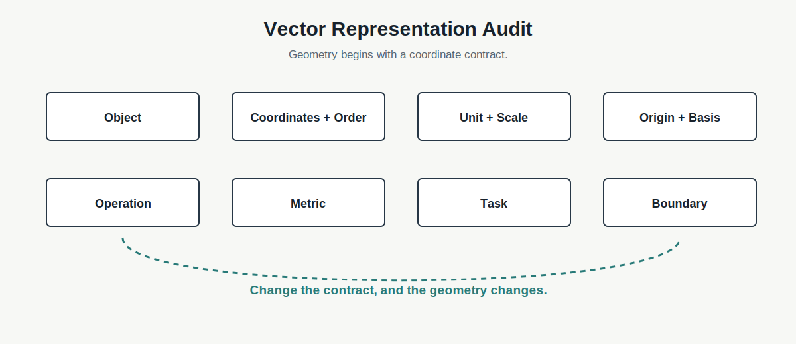

# Chapter 11 · 为什么向量比数字更适合描述世界？

**Book:** The AI Mind · Book I · Discovering Intelligence

**Version:** Draft v1.0

**Author:** Codex

**Editorial status:** Awaiting editorial review

---

## Knowledge Graph · Dependency Card

```text
Mathematical Language
  → Scalar Compression Failure
  → Vector
      ├─ coordinates
      ├─ direction
      ├─ magnitude
      ├─ distance
      └─ similarity
  → Matrix Transformation
```

### Need Before

- Chapter 3：抽象保留任务相关关系；
- Chapter 4：表示决定机器能区分什么；
- Chapter 10：数学关系必须声明 Object、Unit、Operation 与 Boundary。

### This Chapter

```text
multi-attribute object
  → ordered coordinates
  → vector position
  → geometry chosen by scale and metric
  → comparison and transformation readiness
```

### Need After

- Chapter 12：Matrix 怎样同时重组多个 Coordinate；
- Chapter 13：Linear Transformation 怎样改变方向与尺度；
- Part III：Embedding、Attention 与 Learned Representation。

## Book I Question

**本章的问题：** 一个对象拥有多个独立变化的属性时，怎样避免立刻压成一个 Score，并保留它们之间可计算的关系？

**本章的回答：** 选择有语义、有顺序、有单位的 Coordinate，把对象放进 Vector Space，再声明 Scale、Origin、Operation、Metric 与任务边界。

**下一个问题：** 如果 Vector 保存一个状态，什么数学对象能系统地把它变成另一个状态？

## Learning Objectives

完成本章后，读者应该能够：

1. 区分 Scalar、Identifier、Tuple 与 Semantic Vector；
2. 使用 Vector Representation Audit；
3. 解释 Coordinate Order、Unit、Scale、Origin 与 Basis；
4. 从现实对象建立二维和三维 Vector；
5. 解释 Addition 与 Scalar Multiplication 的现实语义；
6. 计算并解释 Magnitude、Distance、Dot Product 与 Cosine；
7. 预测 Scaling、Order 与 Metric 怎样改变 Geometry；
8. 识别 Collision、Order Drift、Metric Mismatch 与高维 Noise；
9. 建立并审计 Company Feature Vector；
10. 说明 Matrix 为何是下一步。

## One Sentence

> **向量不是一串数字，而是一个对象在选定坐标系中的位置；它让多个属性及其关系同时进入计算。**

> **Vector 不是比其他表示更真实，而是在某个任务中选择保留哪些关系的表示契约。**

## Opening Story · 同样 72 分的两家公司

一套投资筛选系统给两家公司都打了 72 分。

公司 A 增长快、Margin 低、Debt 高、Valuation 便宜。公司 B 增长慢、Margin 高、Balance Sheet 强、Valuation 贵。

```text
Company A → 72
Company B → 72
```

如果任务只是快速排序，这个 Score 可能有用。但若要判断利率上升、需求下降或竞争加剧时谁更脆弱，72 已经丢失结构。

团队暂时保留四个 Coordinate：

```text
[growth, margin, leverage, valuation]
```

两家公司不再占据同一个数字，而位于多维空间的不同位置。后续模型可以沿着不同任务方向组合它们。

这并不表示 Vector 捕获了公司全部现实。管理层、制度和竞争反应若没有进入 Coordinate，就不会凭空存在于 Vector 中。

## Scalar Compression Failure · 排名会随权重翻转

先看两个属性：Growth 与 Margin。

```text
A = [30, 5]
B = [10, 20]
```

若 Score 为：

\[
s=0.8\cdot\text{growth}+0.2\cdot\text{margin}
\]

A 排名更高。若 Margin 权重增加：

\[
s=0.2\cdot\text{growth}+0.8\cdot\text{margin}
\]

B 可能排名更高。

Scalar 不是中立总结，而是一次投影和压缩。Vector 保留 Coordinate，让任务权重可以稍后声明、比较与修订。

## Feynman Explanation · 地址为什么不只写一个数字？

朋友说他住在“25”。你无法找到他。

地址需要城市、街道、门牌、楼层和房间号。每个位置有固定含义，顺序不能交换。

```text
[city, street, building, floor, room]
```

Vector 也不是数字袋子，而是一份 Coordinate Contract。

地址类比到这里为止。地址 Coordinate 常是类别，并不天然支持加法或距离；数学 Vector 的 Operation 必须由任务语义单独说明。

## First Principles · Vector Representation Audit

| Element | 核心问题 | 缺失时的失败 |
|---|---|---|
| Object | 描述谁或什么？ | 数字失去对象 |
| Coordinates | 每一维代表什么？ | 列表无语义 |
| Order | 第 $i$ 位为何固定？ | 交换后对象改变 |
| Unit and Scale | 怎样测量和标准化？ | 某维支配 Geometry |
| Origin and Basis | 零点和方向如何选择？ | 位置含义模糊 |
| Operation | 运算是否有现实语义？ | 合法计算，无效结论 |
| Metric | 哪种差异代表任务相似？ | 最近邻误导 |
| Boundary | 哪些信息没有进入？ | Vector 被当成现实 |



## From Attributes to Notation

用三个 Coordinate 表示一家公司：

\[
\mathbf{x}=
\begin{bmatrix}
x_1\\x_2\\x_3
\end{bmatrix}
=
\begin{bmatrix}
\text{growth}\\\text{margin}\\\text{leverage}
\end{bmatrix}
\]

更一般地：

\[
\mathbf{x}\in\mathbb{R}^d
\]

表示 $mathbf{x}$ 由 $d$ 个实数 Coordinate 组成。$mathbb{R}^d$ 不自动声明语义、单位或 Metric。

## Geometry Begins with a Contract

### Position and Difference

Vector 是对象在选定 Coordinate System 中的位置。

\[
\Delta\mathbf{x}=\mathbf{b}-\mathbf{a}
\]

表示从 A 到 B 的 Coordinate Change。只有语义和单位兼容时，差值才可解释。

### Addition

\[
\mathbf{x}_{new}=\mathbf{x}+\Delta\mathbf{x}
\]

可表示一个状态加上变化，例如 Growth 与 Margin 同时改变。

### Scalar Multiplication

\[
c\mathbf{x}
\]

把所有 Coordinate 按同一 Scalar 缩放。数学合法不等于现实有意义；把公司所有属性乘二通常没有清楚语义。

### Magnitude

\[
\lVert\mathbf{x}\rVert_2
=\sqrt{\sum_{i=1}^{d}x_i^2}
\]

Magnitude 是相对于 Origin 的长度，不自动等于“对象大小”。

### Distance

\[
d(\mathbf{x},\mathbf{y})
=\lVert\mathbf{x}-\mathbf{y}\rVert_2
\]

收入以百万美元计、Margin 以百分比计时，Raw Euclidean Distance 可能几乎只看收入。

> **Distance 不是天然 Similarity。Geometry 来自 Coordinate、Unit、Scale、Metric 与任务。**

### Dot Product

\[
\mathbf{x}^{\top}\mathbf{y}
=\sum_{i=1}^{d}x_i y_i
\]

Dot Product 同时受 Magnitude 与方向影响。它可表达 Alignment，但前提是 Coordinate Geometry 有意义。

### Cosine Similarity

\[
\cos\theta=
\frac{\mathbf{x}^{\top}\mathbf{y}}
{\lVert\mathbf{x}\rVert\lVert\mathbf{y}\rVert}
\]

Cosine 更关注方向，弱化整体尺度。它不是普遍更好，只回答不同问题。

## Visualization · 同一批对象，三种 Geometry

二维平面展示同一批公司：

1. **Raw:** Revenue 数值大，几乎决定 Distance；
2. **Standardized:** Coordinate 进入可比较尺度；
3. **Task-weighted:** Credit 任务放大 Leverage，Growth 任务放大 Revenue Growth。

最近邻会改变。我们不是找到了三个现实，而是对同一对象提出了三种关系问题。

## Coding Lab · Scale Can Change Your Nearest Neighbor

```python
companies = np.array([
    [revenue, growth, margin],
    ...
])
```

运行前先预测：哪个 Coordinate 会支配 Raw Distance？然后：

1. 计算 Euclidean Distance；
2. Standardize 每一维；
3. 重新计算最近邻；
4. 比较 Cosine Similarity；
5. 加入 Task Weight；
6. 改变 Unit 与 Coordinate Order；
7. 加入无关高方差 Feature；
8. 删除一维并记录 Information Boundary。

配套 Notebook：[Chapter 11 · Build, Scale, Compare](../../../notebooks/book1/chapter11_vectors.ipynb)

## Engineering Perspective · Feature Vector 是版本化接口

生产 Feature Vector 需要 Schema：

- Feature Name 与 Position；
- Type、Unit 与 Normalization；
- Missing-value Policy；
- Timestamp 与 Point-in-time Availability；
- Data Source 与 Version。

训练时 `[growth, margin, leverage]`，推理时误传 `[margin, growth, leverage]`，Shape 完全相同，计算可以成功，语义已经错误。这是 Silent Failure。

Embedding Retrieval 也必须声明 Model Version、Normalization、Metric、Index 与 Query/Document 是否处在兼容空间。

## AI × Finance · Comparable Company 是 Geometry Claim

\[
\mathbf{x}
=
[\text{growth},\text{margin},\text{ROIC},\text{leverage},\text{valuation}]
\]

“可比”取决于任务：

- Earnings Forecast 重视 Growth 与 Margin；
- Credit Risk 重视 Leverage 与 Cash Flow；
- Long-term Quality 重视 ROIC 与 Reinvestment；
- Relative Valuation 需要 Accounting 与 Industry Boundary。

Nearest Neighbor 不是发现天然同行，而是在一套 Coordinate、Scale 与 Metric 下执行 Geometry Claim。

研究纪律：先写 Comparable-company Contract，再运行结果；不能看到喜欢的公司后反向调整 Weight。

## Research Corner · Learned Geometry 是否更真实？

[Pestov (1999)](https://arxiv.org/abs/cs/9901004) 从 Concentration of Measure 讨论高维 Similarity Search 的困难，提醒我们：低维距离直觉不能无条件搬到高维空间。

[Whitaker et al. (2019)](https://aclanthology.org/W19-2002/) 比较 Word Embedding 的多种 Geometry Property 与任务表现，显示不同评价对绝对位置、全局距离和局部邻近的依赖并不相同。

本章只保留三个问题：

1. Learned Distance 是否稳定对应目标关系？
2. 高维 Distance 是否仍有区分力？
3. 不同训练目标是否产生不同 Geometry？

不在这里提前教授 Word2Vec、Transformer 或完整高维理论。

## Common Illusions · Vector 最容易制造哪些错觉？

### “数字更多，所以表示更完整”

更强检验：列出新增 Dimension 的语义、证据和 Noise。

### “Dimension 更高，所以理解更深”

更强检验：检查下游任务、稳定性和可区分关系。

### “Distance 更近，所以现实更相似”

更强检验：声明 Coordinate、Scale、Metric 与任务。

### “Normalize 后，所以 Geometry 公平”

更强检验：标准化只改变尺度，不决定任务 Metric。

### “Cosine 高，所以语义相同”

更强检验：在目标任务与 Shift 下验证邻近关系。

### “Learned Embedding，所以发现了唯一意义空间”

更强检验：比较模型、层、目标和 Seed 下的 Geometry。

## Failure Modes

- **Coordinate Collision:** 不同对象进入同一 Vector；
- **Order Drift:** 训练与推理 Coordinate 顺序不同；
- **Unit Dominance:** 大尺度维度支配 Distance；
- **Metric Mismatch:** Geometry 不对应任务相似；
- **Redundant Dimension:** 重复 Feature 被多次加权；
- **Missingness Erasure:** 填充值隐藏缺失机制；
- **High-dimensional Noise:** 无关维度累积；
- **Semantic Overclaim:** 模型邻近被解释为现实本质。

## Mental Model Upgrade

### Before

```text
Vector = an arrow or a list of numbers
```

### After

```text
Vector = ordered coordinates
         + semantics and units
         + origin and scale
         + task-relevant operations
         + explicit information boundary
```

升级完成的证据是：你能在计算前预测 Scale、Order 或 Metric 改变后，Geometry 与结论怎样变化。

## Exercises

1. 区分 Scalar、Identifier、Tuple 与 Semantic Vector。
2. 为三个现实对象建立 Coordinate Contract。
3. 手算 Addition、Magnitude、Distance、Dot Product 与 Cosine。
4. 比较两个 Scalar Weight，解释公司排名为何翻转。
5. 运行 Notebook 前预测 Raw 与 Standardized 最近邻。
6. 交换 Coordinate Order，设计能发现 Silent Failure 的 Test。
7. 加入无关高方差 Feature，解释 Geometry 怎样改变。
8. 为 Credit 与 Growth 分别设计 Company Vector 与 Metric。
9. 从错误最近邻反推 Scale、Metric 或 Boundary Failure。

## Understanding Audit

### Explain

为什么 Number List 不自动成为 Semantic Vector？

### Predict

改变 Coordinate Order、Unit、Scale 或 Metric，预测最近邻怎样变化。

### Reconstruct

从现实对象重建 Coordinate Contract、Vector Notation 与 Geometry Operation。

### Transfer

为图像、文本、医疗或 Finance 设计 Vector，并说明未表示的信息。

配套 Assessment：[Chapter 11 Understanding Audit](../../../labs/book1/chapter11-understanding-audit.md)

## Capability Milestone

- **Explain:** 解释 Coordinate、Geometry 与 Boundary；
- **Predict:** 在计算前审计 Scaling 与 Metric；
- **Build:** 建立并测试版本化 Feature-vector Contract；
- **Read:** 识别 Embedding Similarity 的语义越界。

## Teach Back

向一名高中生解释：为什么 `[3, 5, 7]` 可能是 Vector，也可能只是数字列表。必须说明什么信息才能决定。

## Master Insight

> **Vector 的价值不是装下更多数字，而是让一个对象在明确坐标契约中拥有可计算的位置；改变坐标、尺度或距离，就改变了系统能够看见的关系。**

## Bridge to Chapter 12

Vector 保存一个位置或状态，却不会自己旋转方向、组合 Coordinate 或产生新表示。

> **如果向量保存状态，什么数学对象能够一次描述所有 Coordinate 怎样共同变化？**

Chapter 12：**为什么矩阵能够描述变化？**

---

## Reading Landmarks

- [Pestov (1999), *On the Geometry of Similarity Search*](https://arxiv.org/abs/cs/9901004)
- [Whitaker et al. (2019), *Characterizing the Impact of Geometric Properties of Word Embeddings on Task Performance*](https://aclanthology.org/W19-2002/)
