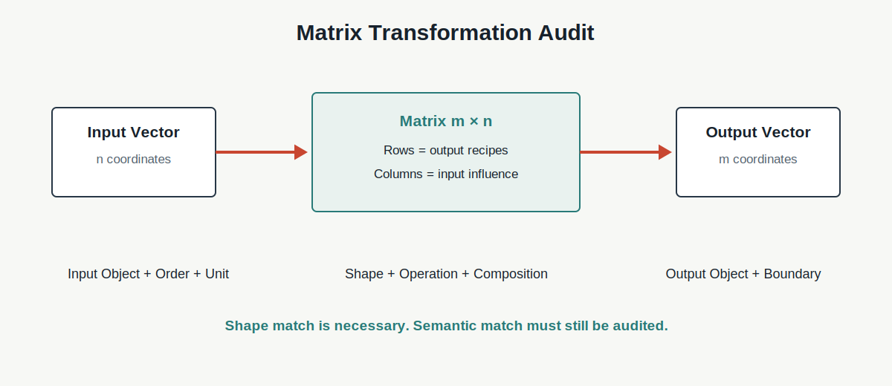

# Chapter 12 · 为什么矩阵能够描述变化？

**Book:** The AI Mind · Book I · Discovering Intelligence

**Version:** Canonical v1.0

**Author:** Codex

**Editorial status:** Approved and canonical; pending Book I Alpha consistency pass

---

## Knowledge Graph · Dependency Card

```text
Vector State
  → coordinate relationships across input and output
  → Matrix
      ├─ shape contract
      ├─ row = one output recipe
      ├─ column = one input influence
      ├─ matrix-vector product
      └─ composition order
  → Linear Transformation
```

### Need Before

- Chapter 10：数学必须声明 Object、Operation、Unit 与 Boundary；
- Chapter 11：Vector 是带 Coordinate Contract 的多属性状态；
- Vector Difference 与 Dot Product 的基本直觉。

### This Chapter

```text
input vector
  → relationship table
  → each output mixes all inputs
  → output vector
  → composed transformations
```

### Need After

- Chapter 13：什么变化是 Linear，为什么叠加结构重要；
- Chapter 14：为什么只有 Linear Transformation 不够；
- Chapter 15–19：梯度与 Backprop 怎样穿过多层变化。

## Book I Question

**本章的问题：** Vector 保存状态后，怎样用一份统一规则同时改变所有 Coordinate，并得到新的 Vector？

**本章的回答：** 用 Matrix 声明 Input Space、Output Space 与每对 Coordinate 的贡献关系；Matrix-vector Product 执行关系，Composition 组合变化。

**下一个问题：** 为什么这些变化能够叠加和缩放？Linear 假设带来什么力量，又排除了什么？

## Learning Objectives

完成本章后，读者应该能够：

1. 区分 Number Table、Dataset Table 与 Transformation Matrix；
2. 使用 Matrix Transformation Audit；
3. 解释 $m\times n$ Shape 的 Input/Output 语义；
4. 从 Output Equation 构造 Matrix；
5. 从 Row 和 Column 恢复关系；
6. 手算 $A\mathbf{x}$ 并给出双视角解释；
7. 解释 Identity、Scaling、Mixing 与 Information-dropping Map；
8. 预测 Transpose、Order Drift、Unit Mismatch 与 Shape Error；
9. 解释 $B(A\mathbf{x})$ 与 Composition Order；
10. 为 Linear Layer 或 Factor Exposure 建立 Shape Contract。

## One Sentence

> **矩阵不是数字表格，而是一份变化契约：它说明每个输入坐标怎样共同贡献到每个输出坐标。**

## Opening Story · 三支麦克风，两个扬声器

一场演出有三支麦克风：主唱、吉他和鼓。场地有左右两个扬声器。

音响工程师必须决定：每个 Speaker 接收多少 Vocal、Guitar 与 Drums。

```text
input  = [vocal, guitar, drums]
output = [left speaker, right speaker]
```

他写下两份配方：

\[
\text{left}=0.8\,\text{vocal}+0.5\,\text{guitar}+0.3\,\text{drums}
\]

\[
\text{right}=0.8\,\text{vocal}+0.4\,\text{guitar}+0.6\,\text{drums}
\]

每个 Output 都依赖同一组 Input，却使用不同权重。Matrix 把所有 Output Recipe 放进一个有 Shape、有顺序的关系对象。

它不是让音乐变成表格，而是保存“哪些输入怎样共同形成每个输出”。

真实音频还包含时间、频率、非线性失真与反馈。本例只隔离多 Input 到多 Output 的 Mixing。

## Feynman Explanation · 每一行是一张配方卡

厨房有三种原料，要制作两杯饮料。

- 配方卡 1 写第一杯如何混合三种原料；
- 配方卡 2 写第二杯如何混合三种原料。

把配方卡叠起来，就是 Matrix。

```text
row    → one output recipe
column → one ingredient's influence across outputs
A @ x  → execute every recipe on the same input
```

配方类比有边界：化学反应、饱和与阈值不一定按比例叠加。Matrix 在本章只描述可加权组合的关系。

## First Principles · Matrix Transformation Audit

| Element | 核心问题 | 缺失时的失败 |
|---|---|---|
| Input Object | $\mathbf{x}$ 描述什么？ | 输入无语义 |
| Output Object | $\mathbf{y}$ 描述什么？ | 结果无法解释 |
| Shape | $m\times n$ 对应哪些空间？ | 只为通过报错 |
| Rows | 每个 Output 怎样混合 Input？ | 公式无法恢复 |
| Columns | 一个 Input 影响哪些 Output？ | 影响路径不可追踪 |
| Units | Entry 怎样转换单位？ | 数值合法、量纲错误 |
| Operation | 为什么执行 $A\mathbf{x}$？ | 机械行列乘法 |
| Composition | 多个变化顺序是什么？ | Pipeline 语义颠倒 |
| Boundary | 哪些非线性或信息丢失未表达？ | Matrix 被当成现实 |



Audit 从 Input/Output Object 开始，不从 Matrix 里的数字开始。

## From Equations to Matrix

令 $x_1,x_2,x_3$ 分别表示三支麦克风，$y_1,y_2$ 表示左右扬声器：

\[
y_1=0.8x_1+0.5x_2+0.3x_3
\]

\[
y_2=0.8x_1+0.4x_2+0.6x_3
\]

写成：

\[
\mathbf{y}=A\mathbf{x}
\]

\[
A=
\begin{bmatrix}
0.8&0.5&0.3\\
0.8&0.4&0.6
\end{bmatrix},
\quad
\mathbf{x}\in\mathbb{R}^{3},
\quad
\mathbf{y}\in\mathbb{R}^{2}
\]

因此：

\[
A\in\mathbb{R}^{2\times3}
\]

Shape 的语义不是“2 行 3 列”，而是“三个 Input Coordinate 进入，两个 Output Coordinate 产生”。

## Two Views of Matrix-vector Multiplication

### Row View · 每个 Output 一次 Dot Product

\[
y_i=\mathbf{a}_i^{\top}\mathbf{x}
\]

第 $i$ Row 是第 $i$ 个 Output 的 Recipe。Row View 回答：“这个 Output 怎样由所有 Input 形成？”

### Column View · 每个 Input 的影响路径

\[
A\mathbf{x}
=x_1\mathbf{a}^{(1)}+x_2\mathbf{a}^{(2)}+\cdots+x_n\mathbf{a}^{(n)}
\]

第 $j$ Column 说明 Input $x_j$ 同时怎样影响全部 Output。Column View 回答：“这个 Input 的变化会流向哪里？”

行列乘法不是任意程序：它同时执行所有 Row Recipe，也累加所有 Column Influence。

## Four Transparent Matrices

### Identity

\[
I\mathbf{x}=\mathbf{x}
\]

保持状态，是比较变化与组合的基准。

### Scaling

\[
\begin{bmatrix}2&0\\0&0.5\end{bmatrix}
\begin{bmatrix}x_1\\x_2\end{bmatrix}
\]

Diagonal Entry 分别改变 Coordinate Scale。

### Mixing

Off-diagonal Entry 让一个 Output 依赖其他 Input Coordinate。它编码 Cross-coordinate Influence。

### Information-dropping Map

一个 $2\times3$ Matrix 将三维 Input 变成二维 Output。某些差异可能在 Output 中消失。

本章只建立 Information Boundary，不提前教授 Rank 或 Null Space。

## Composition · 变化为什么有顺序？

先执行 $A$，再执行 $B$：

\[
\mathbf{z}=B(A\mathbf{x})=(BA)\mathbf{x}
\]

右侧的 $A$ 先作用。通常：

\[
BA\ne AB
\]

原因不是规则任性，而是第二个变化接收第一个变化后的 Coordinate State。先按原轴缩放再混合，与先混合再按原轴缩放，结果可能不同。

本章只建立 Composition Order，不训练完整 Matrix-matrix 手算技巧。

## Visualization · Grid Before and After

二维网格依次经过：

1. Identity；
2. Axis Scaling；
3. Shear-like Mixing；
4. Information-dropping Preview。

图中同时追踪 Basis Direction 与一个 Test Vector。Matrix 通过规定 Basis Direction 去向，系统地改变所有 Vector。

这只是 Transformation Intuition；Chapter 13 才正式讨论 Linear Structure。

> **二维网格只是几何直觉，不代表所有 Matrix 都能直接可视化。**

## Coding Lab · Rows Build Outputs, Columns Trace Influence

先写显式 Equation，再使用 `A @ x`：

```python
y_manual = np.array([
    0.8*x[0] + 0.5*x[1] + 0.3*x[2],
    0.8*x[0] + 0.4*x[1] + 0.6*x[2],
])

y_matrix = A @ x
```

运行前预测：

1. 只提高 Guitar，哪些 Output 变化？
2. 交换两个 Input，但不交换 Column，会发生什么？
3. 交换 Row，Output Label 是否同步？
4. Transpose 后 Input/Output Contract 怎样变化？
5. 一个 Entry 放大 1000 倍，Units 怎样传播？
6. $BA\mathbf{x}$ 与 $AB\mathbf{x}$ 是否相同？
7. 删除一个 Output Row，什么信息不再产生？

配套 Notebook：[Chapter 12 · Mix, Trace, Compose](../../../notebooks/book1/chapter12_matrices.ipynb)

## Engineering Perspective · Shape 是接口，不是完整语义

Linear Layer 常写：

\[
\mathbf{y}=W\mathbf{x}+\mathbf{b}
\]

若 $W\in\mathbb{R}^{m\times n}$，Input Width 为 $n$，Output Width 为 $m$。

Shape Check 能发现尺寸错误，却发现不了：

- Feature Order Drift；
- Unit Mismatch；
- Wrong Model Version；
- Row Label 与 Output Label 不一致；
- Batch Axis 与 Feature Axis 语义交换，但尺寸恰好兼容。

工程 Schema 必须保存 Input/Output Name、Order、Unit、Expected Range 与 Version。

## AI × Finance · Factor Exposure Matrix 是 Scenario Contract

三家公司暴露于 Growth、Rates 与 FX：

\[
E=
\begin{bmatrix}
e_{11}&e_{12}&e_{13}\\
e_{21}&e_{22}&e_{23}\\
e_{31}&e_{32}&e_{33}
\end{bmatrix}
\]

Scenario Vector：

\[
\mathbf{s}
=[\Delta\text{growth},\Delta\text{rates},\Delta\text{FX}]^\top
\]

预测变化：

\[
\Delta\mathbf{r}=E\mathbf{s}
\]

Rows 是每家公司的 Scenario Recipe；Columns 是一个 Factor 对全部公司的 Influence Path。

这不是收益真值。Exposure Estimate、Linear Assumption、Time Horizon、Factor Interaction 与 Regime 都是 Boundary。历史 Regression Coefficient 也不自动成为永久机制。

## Research Corner · Matrix Structure 是 Inductive Bias

[Sindhwani, Sainath, and Kumar (2015)](https://arxiv.org/abs/1510.01722) 研究 Structured Transform 如何在参数量、计算效率与建模能力之间建立不同约束。Structure 不是只有压缩效果，也改变可表达关系。

[LeCun et al. (1998)](https://leon.bottou.org/papers/lecun-98h) 展示局部连接与参数共享在 Document Recognition 中的系统设计。共享关系是 Architecture Assumption，不是 Dense Matrix 自动发现的事实。

本章只保留三个问题：

1. Dense 与 Structured Matrix 分别假设什么关系？
2. Parameter Sharing 怎样减少自由度并改变 Generalization？
3. 结构压缩何时丢失任务关键方向？

不在这里提前教授 CNN、LoRA、SVD 或 Rank Theory。

## Common Illusions · Matrix 最容易制造哪些错觉？

### “矩阵是数字表格，所以任何表格都是 Transformation”

更强检验：声明 Input、Output、Operation 与 Units。

### “Shape 能乘，所以语义匹配”

更强检验：核对 Coordinate Name、Order、Unit 与 Version。

### “记住行乘列，所以理解 Matrix”

更强检验：同时给出 Row Recipe 与 Column Influence 解释。

### “更多参数，所以 Transformation 更好”

更强检验：比较独立任务证据、稳定性与结构边界。

### “找到一个 Matrix，所以找到真实机制”

更强检验：把 Matrix 当任务相关模型，设计替代关系与区分证据。

### “Transformation Contract，所以得到 Causal Mechanism”

更强检验：Matrix 描述输入输出关系；因果主张仍需要干预、替代解释与边界证据。

### “$AB$ 与 $BA$ 只是写法不同”

更强检验：追踪两个 Transformation 的输入输出语义与执行顺序。

## Failure Modes

- **Row/Column Drift:** Coordinate 顺序变化，Matrix 未同步；
- **Shape-only Validation:** 尺寸通过，语义错误；
- **Transpose Confusion:** Input/output 角色颠倒；
- **Unit Propagation Failure:** Entry 无法把 Input Unit 转成 Output Unit；
- **Composition-order Error:** Pipeline 顺序颠倒；
- **Hidden Information Loss:** 降维后假设信息可恢复；
- **Dense-by-default:** 无依据地让所有 Input 影响所有 Output；
- **Nonlinearity Blindness:** 用单个 Matrix 描述阈值、饱和或条件切换。

## Mental Model Upgrade

### Before

```text
Matrix = rectangular number table + row times column
```

### After

```text
Matrix = input-output coordinate contract
         + output recipes in rows
         + input influence paths in columns
         + shape and unit semantics
         + ordered composition
         + explicit information boundary
```

升级完成的证据是：你能从 Matrix 恢复 Equation，也能从 Equation 构造 Matrix，并预测 Row、Column 或 Composition Order 改变的后果。

## Exercises

1. 区分 Dataset Table 与 Transformation Matrix。
2. 从三条 Output Equation 构造 Matrix 与 Shape Contract。
3. 手算 $A\mathbf{x}$ 并给出 Row/Column 双视角解释。
4. 只改变一个 Input，追踪对应 Column Influence。
5. 为 Matrix Entry 补全 Unit。
6. 比较 $BA\mathbf{x}$ 与 $AB\mathbf{x}$。
7. 设计一个 Shape Match 但 Semantic Mismatch 的测试。
8. 构造 Factor Exposure Matrix，并标记 Regime Boundary。
9. 从错误 Output 反推 Row、Column、Order 或 Unit Failure。

## Understanding Audit

### Explain

为什么 Matrix-vector Product 是执行 Input-output Relationship，而不是任意行列规则？

### Predict

改变 Row、Column、Transpose 或 Composition Order，预测 Output 与语义怎样变化。

### Reconstruct

从 Equation 构造 Matrix，再从 Matrix 恢复全部 Output Equation、Shape 与 Unit。

### Transfer

为 Audio Mixing、Feature Layer、医疗 Score 或 Finance Scenario 建 Matrix Contract。

配套 Assessment：[Chapter 12 Understanding Audit](../../../labs/book1/chapter12-understanding-audit.md)

## Capability Milestone

- **Explain:** 解释 Shape、Rows、Columns 与 Composition；
- **Predict:** 追踪 Input Influence 与 Transformation Failure；
- **Build:** 建立并测试 Matrix Transformation Contract；
- **Read:** 识别 Shape Check 无法发现的语义错误。

## Teach Back

不使用“行乘列”四个字，向一名高中生解释为什么 $A\mathbf{x}$ 会产生新的 Vector。必须同时说明 Row 和 Column。

## Master Insight

> **Matrix 的力量不是把数字排成方块，而是把多输入到多输出的依赖组织成可执行契约；Rows 生成结果，Columns 追踪影响，Composition 连接变化。**

## Bridge to Chapter 13

Matrix 提供变化规则，但并非所有现实变化都能由单个 Matrix 精确表达。

> **Matrix 提供变化规则，但 Linear 假设限制了变化形式。**

> **Matrix 告诉我们怎样变化；Chapter 13 将讨论哪些变化属于 Linear。**

> **什么使一种变化成为 Linear Transformation？为什么这种限制既强大，又不足以表达全部智能？**

Chapter 13：**为什么线性变化能够解决复杂问题？**

---

## Reading Landmarks

- [Sindhwani et al. (2015), *Structured Transforms for Small-Footprint Deep Learning*](https://arxiv.org/abs/1510.01722)
- [LeCun et al. (1998), *Gradient-Based Learning Applied to Document Recognition*](https://leon.bottou.org/papers/lecun-98h)
