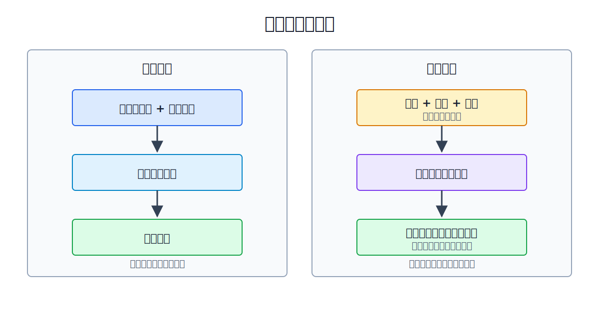
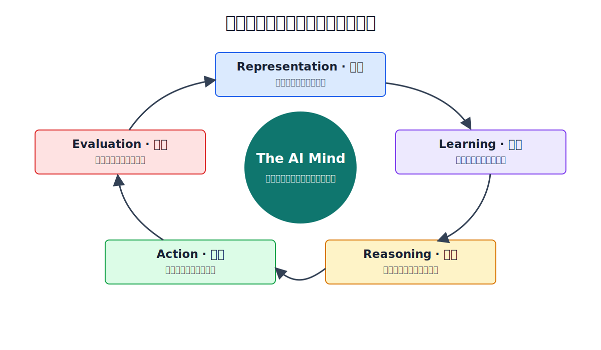

# Prelude · 为什么学习 AI 需要一张地图？

**Book:** The AI Mind · Book I · Discovering Intelligence  
**Version:** Draft v1.2
**Author:** Codex  
**Editorial status:** Awaiting Editor-in-Chief review

---

## 阅读这一篇之前

这不是 Chapter 0，也不是一堂关于某个算法的课。

它是四卷《The AI Mind》的共同入口。它只解决一个问题：在第一次写下矩阵公式、第一次调用 PyTorch、第一次实现 `micrograd` 之前，学习者应该如何看见 AI 的全貌？

读完 Prelude，读者不需要记住更多名词。真正的目标，是知道每个名词应该放到哪里，以及下一步为什么值得走。

## Learning Objectives

完成本篇后，读者应该能够：

- 画出一张从数学到 AI 应用的基础地图；
- 解释为什么直接学习 Transformer 容易产生“会看、不会造”的错觉；
- 解释数学、代码与模型之间的分工；
- 说明 Karpathy 为什么从 `micrograd` 开始，而不是从 GPT 的 API 开始；
- 为一个新知识点找到它的前置条件、所解决的问题与未来用途；
- 建立适合长期学习的“地图—探索—重画地图”循环。

## Opening Story · 两位旅行者

两位旅行者第一次来到东京。

第一位旅行者一下飞机就开始赶景点。他拍下五千张照片，记住几十家餐厅的名字，也在社交媒体上收藏了许多“东京必去清单”。每到一个地方，他都能认出眼前的建筑；但只要换一条街，他就不知道自己在哪里。

第二位旅行者第一天没有去景点。他在车站坐了一个小时，研究地铁图：哪些线路相交，哪些区域靠近，什么时候应该换乘。后来每去一个地方，他都会把它放回地图。

一个星期后，第一位旅行者拥有更多照片；第二位旅行者却更了解东京。

许多人学习 AI 时，正在扮演第一位旅行者。

他们收藏 Transformer 教程，运行微调 Notebook，调用最新模型的 API，也能复述 RAG、Agent、LoRA 和 RLHF 的定义。可是，当模型不收敛、注意力维度对不上，或者一篇新论文换了一套术语时，知识便突然散开。

问题通常不是不够努力，而是脑中只有景点，没有地图。

> **学习 AI，不是收集越来越多的名词，而是不断重画一张关系越来越清楚的地图。**

## Before We Begin · 为什么 AI 不只是另一种软件？

过去写程序，最常见的方式是人先把规则想清楚，再把规则交给计算机执行。

```text
传统计算

规则 + 数据
  ↓
程序执行
  ↓
结果
```

例如，要判断一笔报销是否超标，程序员可以写下明确规则：金额超过上限就拒绝，缺少凭证就退回。计算机的力量来自高速、稳定地执行人类已经写出的步骤。

可是，有些任务很难由人穷举规则。怎样在照片中认出一张脸？怎样判断一句话是在赞美还是讽刺？怎样从数千份财报中发现相似的经营风险？人能够完成这些任务，却很难把全部判断过程写成一串完整的 `if` 语句。

机器学习改变了规则的来源：

```text
机器学习

数据 + 目标 + 学习算法
  ↓
从反馈中调整参数
  ↓
形成可用于新数据的规则
```

这种变化不是“程序不再重要”，也不是“机器自己凭空思考”。数据怎样收集、目标怎样定义、模型怎样构造，仍然由人设计。真正改变的是：系统的一部分行为不再由工程师逐条指定，而是通过数据和反馈学得。

这就是 AI 成为重要技术范式的原因。它让计算机能够处理那些规则太多、边界模糊、环境持续变化的问题，也把新的责任带给设计者：如果数据有偏差、目标写错或反馈失真，系统会认真学会错误的东西。



## Feynman Explanation · 给十二岁孩子的一张地图

假设一个孩子想造一辆遥控车。

如果直接把一盒零件倒在桌上，他会看到电池、电机、轮子、螺丝和遥控器。每个零件都能拿起来观察，但他不知道哪个零件给能量，哪个零件产生运动，也不知道遥控信号怎样变成轮子的转动。

一张结构图会先告诉他：

```text
遥控指令
  ↓
控制器
  ↓
电机
  ↓
轮子
  ↓
小车移动
```

地图没有替他造车。它只是让每个零件有了位置。

AI 也一样。矩阵、梯度、损失函数、Transformer 和 Agent 不是五门互不相干的知识。它们处在同一条因果链的不同位置：

```text
现实世界
  ↓  表示
数据与向量
  ↓  变换
模型与神经网络
  ↓  比较
损失函数
  ↓  求责
梯度与反向传播
  ↓  更新
学到更好的参数
  ↓  组合与扩展
Transformer / LLM / Agent
```

地图的作用不是缩短路程，而是让每一步都有方向。

## 为什么不直接学习 Transformer？

Transformer 当然重要。问题在于，“能够运行 Transformer 代码”和“理解 Transformer”是两件不同的事。

一段最简化的注意力代码可能只有几行：

```python
scores = q @ k.transpose(-2, -1)
weights = scores.softmax(dim=-1)
output = weights @ v
```

只看语法，这几行并不难。真正的问题藏在语法下面：

- 为什么输入必须先变成向量？
- 为什么用矩阵乘法比较 Query 和 Key？
- 为什么点积能够表示相关性？
- 为什么需要 Softmax？
- 为什么参数可以通过损失函数学出来？
- 为什么 `loss.backward()` 能为前面每个矩阵生成梯度？

如果这些问题没有答案，Transformer 就像一座透明电梯：看得见它在上升，却不知道电机、配重和控制系统如何协作。一旦代码形状改变，理解也随之消失。

因此，本课程不会拒绝 Transformer，而是为抵达 Transformer 修路。

## 为什么 Karpathy 从 micrograd 开始？

Karpathy 的 Zero to Hero 路线没有从大型语言模型的产品界面开始，也没有先堆叠数百行 Transformer 代码。他先让学习者造一个很小的自动求导引擎。

这个顺序揭示了一条重要原则：

> 要理解一个会学习的复杂系统，先理解“学习信号如何流动”。

更紧凑地说：

> **Learning = Computation + Feedback。**

只有 Computation，系统能够根据当前参数算出答案，却不会因为犯错而改变；只有 Feedback，系统知道结果不好，却不知道应该把责任分配给哪一步计算。学习发生在二者闭环之时：前向计算产生预测，损失把预测变成反馈，反向传播把反馈送回产生预测的每个参数。

`micrograd` 让学习者亲眼看见：

```text
数值
  ↓
运算
  ↓
计算图
  ↓
局部导数
  ↓
链式法则
  ↓
反向传播
  ↓
参数更新
```

GPT 很大，但它并没有摆脱这条链。数十亿参数改变的是规模，没有改变学习的基本逻辑。

这也是为什么本书会在讨论现代模型之前，认真学习向量、矩阵、损失、梯度和反向传播。不是因为旧知识更高贵，而是因为它们仍在现代系统内部工作。

## 为什么需要数学？

数学在这套课程中不是筛选学习者的门槛，也不是为了把简单想法写得神秘。

数学承担三个具体任务。

### 1. 压缩

“把每个输入特征乘以一个权重，再把结果相加”可以写成一句：

\[
y = \mathbf{w}^{\mathsf T}\mathbf{x}
\]

公式把一段重复结构压缩成可操作的语言。

### 2. 检查

直觉可能含糊，数学迫使假设变得明确。一个声称“模型越来越好”的说法，必须说明好坏由什么目标衡量、参数如何变化，以及变化是否真的降低了目标。

### 3. 迁移

当同一个结构出现在图像、文本和金融数据中，数学让我们看见它们的共同部分。矩阵乘法不会因为输入是词向量还是公司因子而改变定义。

所以数学不是目的地。它是一种高密度、可验证、可迁移的思考工具。

Book II 会把这套工具展开成四条相互连接的主线：

| 数学主线 | 它让 AI 能做什么 | 未来出现的位置 |
|---|---|---|
| Linear Algebra · 线性代数 | 表示对象，并在表示空间中进行变换 | Embedding、神经网络、Attention、LoRA |
| Calculus · 微积分 | 测量局部变化，把误差变成学习信号 | Gradient、Chain Rule、Backpropagation |
| Probability · 概率 | 表达不确定性，连接数据、假设与证据 | Likelihood、生成模型、预测校准、贝叶斯方法 |
| Optimization · 优化 | 在巨大参数空间中寻找更好的解 | SGD、Adam、模型训练、对齐 |

可以把它们记成四个动词：

```text
线性代数：表示
微积分：反馈
概率：判断不确定性
优化：搜索
```

这四条主线不会彼此独立。模型用线性代数完成计算，用概率描述预测，用微积分获得梯度，再由优化算法更新参数。数学地图的价值，正是让这些课程不再像四座孤岛。

> **数学不是学习 AI 的门槛，而是描述智能的语言。**

## 为什么需要 MIT 18.06？

神经网络不断把一种表示变成另一种表示，而线性代数研究的正是向量、空间与变换。

MIT 18.06 的价值不在于覆盖很多矩阵技巧，而在于训练一种几何视角：

- 向量不只是数字列表，也是空间中的位置与方向；
- 矩阵不只是表格，也是改变空间的规则；
- 投影不只是公式，也是保留某些信息、丢弃另一些信息；
- 特征向量与奇异值不只是考试题，也揭示变换中稳定和重要的结构。

未来看到 Embedding、Attention、PCA 或 LoRA 时，这些概念会再次出现。线性代数不是 Transformer 之前必须缴纳的“学费”，而是看见 Transformer 内部结构的一副镜片。

## 为什么不从 PyTorch 开始？

PyTorch 是极好的工程工具。它把张量运算、自动求导、GPU 加速和模型组织变得方便可靠。

但框架的优点也会成为初学时的风险：它能在理解缺席时照样运行。

例如：

```python
loss.backward()
optimizer.step()
```

两行代码可以完成一次参数更新，却隐藏了计算图、链式法则、梯度累积与优化器状态。如果学习者从未打开过这个黑箱，调试时只能不断更换学习率、优化器或模型结构。

本课程采用两次实现：

1. 先用手算、Python 或 NumPy 看清核心结构；
2. 再用 PyTorch 获得工程效率。

目的不是拒绝框架，而是让框架从魔法变成工具。

## The AI Mind 的学习地图

AI 并不是一座只有五层的整齐大楼。真实领域会交叉、回流，也会不断产生新分支。但在第一次进入时，一张简化地图仍然有用：

```text
数学与编程
  ↓
表示数据
  ↓
机器学习
  ↓
深度学习
  ↓
Transformer 与大语言模型
  ↓
训练、推理与 AI 系统
  ↓
Agent 与真实应用
  ↓
评估、研究与创造
```

这张图不是学科排名。箭头表示依赖关系：上层问题通常借用下层工具，而真实项目又会反过来暴露基础知识中的缺口。

## The Philosophy of The AI Mind

“The AI Mind”并不是在暗示机器拥有与人类相同的意识，也不是把 AI 描绘成一个神秘的大脑。

这里的 Mind 指向一组可以被研究、实现和检验的问题：

- 机器怎样把现实转换成内部表示？
- 它怎样从误差与反馈中改变这些表示？
- 它怎样组合已有信息，形成预测或推理步骤？
- 它怎样把输出变成行动，并从行动结果中继续学习？

因此，这套课程研究的不是一张模型清单，而是一条能力形成链：

```text
Representation
  ↓
Learning
  ↓
Reasoning
  ↓
Action
  ↓
Evaluation and new feedback
```

项目名称中的 Mind，是这条链形成的系统能力；课程的任务，是逐层打开它，而不是把它当作一个不可解释的整体。

这也决定了《The AI Mind》的教学顺序：先让思想变得可见，再让数学变得精确；先亲手实现核心机制，再使用成熟框架；最后把局部机制放回工程系统、金融问题与研究前沿中检验。

它的独特之处不在于收录更多主题，而在于始终追踪同一个闭环：一个能力为什么必要，怎样从局部机制中形成，如何被代码实现，又会在真实世界的约束下怎样失败。读者最终带走的应该不是“我学过哪些模型”，而是“面对一个陌生系统，我知道如何把它打开”。



四卷课程分别承担不同任务：

| 卷 | 核心问题 | 学习者的变化 |
|---|---|---|
| Book I · Discovering Intelligence | 智能、表示与学习为何可能？ | 从名词记忆走向系统直觉 |
| Book II · Learning to Learn | 数学、概率、优化与经典 ML 如何支撑学习？ | 从直觉走向推导与判断 |
| Book III · Learning to Build | 如何从 `micrograd` 一路实现 GPT 与 AI 系统？ | 从理解走向独立构建 |
| Book IV · Learning to Create | 如何评估论文、设计实验并创造新方法？ | 从复现走向研究与创新 |

Prelude 是这四卷书共同的入口。它给出第一版地图；后续每一章都会修改这张地图。

## 一种更可靠的学习循环

长期掌握 AI，不依赖一次看懂，而依赖一个可重复的循环。

### 第一步：定位

遇到新概念时，先问：它在地图哪里？它依赖什么？它解决什么问题？

### 第二步：建立直觉

尝试画图、举小例子，并用自己的话解释。此时允许不精确，但不能假装理解。

### 第三步：追求精确

用数学写清假设、变量和关系。检查直觉在哪些条件下成立，在哪些条件下失效。

### 第四步：亲手实现

先实现最小版本，再使用框架。代码是对理解的压力测试：模糊之处会在形状、边界条件和错误输出中暴露。

### 第五步：迁移

把同一思想放到新问题中。例如，把“表示”从词语迁移到公司，把“优化目标”从分类误差迁移到风险调整后的投资目标。

### 第六步：Teach Back

不看资料，向别人讲清楚。如果解释必须依赖原文措辞，知识还没有真正属于自己。

然后，重画地图。

```text
定位 → 直觉 → 精确 → 实现 → 迁移 → Teach Back
  ↑                                      ↓
  └────────────── 重画地图 ──────────────┘
```

## AI × Finance · 从新闻列表到产业地图

投资研究同样容易陷入“景点收藏”。一家新公司推出 Agent，一家芯片公司发布加速器，一篇论文宣布训练成本下降。孤立看，每条新闻都很重要；放进系统后，才知道价值落在哪里。

研究一家 AI 公司时，可以沿着地图追问：

- 它处在算力、模型、工具链还是应用层？
- 它依赖哪些上游能力？
- 性能提升来自算法、数据、硬件还是工程优化？
- 它优化的指标是否等于客户真正愿意付费的结果？
- 如果底层模型能力商品化，它的护城河还剩什么？

这与学习 AI 是同一种能力：不满足于知道发生了什么，而是理解各部分怎样相互作用。

更进一步，投资研究本身也可以被看成一个学习系统：

```text
公告、财报、电话会与市场数据
  ↓  选择与清洗
可计算的公司表示
  ↓  模型与研究框架
盈利、风险与估值预测
  ↓  与后续事实比较
预测误差
  ↓  归因与更新
新的假设、参数与仓位判断
```

这不是说投资可以被简化成一次机器学习训练。市场参与者会反应，制度会变化，目标也不止一个数字。但二者共享一种纪律：必须说明使用了什么信息、怎样形成判断、误差来自哪里，以及下一次要更新什么。

AI 能帮助研究流程扩大信息覆盖、保持证据链和重复执行分析；投资者仍需负责目标函数、因果判断、风险约束与反共识决策。真正有价值的 AI × Finance，不是让模型替代责任，而是让学习闭环更快、更清楚、更可审计。

如果把类比再推进一步，机器学习与投资研究可以在四个操作层面建立对应关系：

| 学习系统 | 投资研究系统 | 关键问题 |
|---|---|---|
| Objective Function · 目标函数 | 风险调整后收益、回撤约束或研究任务目标 | 系统究竟在优化什么？代理指标会不会诱导错误行为？ |
| Representation Learning · 表示学习 | 把财报、产业链、管理层表述与价格行为转成公司表示 | 哪些信息被保留，哪些信息在压缩中丢失？ |
| Alpha Generation · 信号生成 | 从预期差、结构变化或错误定价中形成可检验预测 | 信号来自可持续机制，还是样本内巧合？ |
| Portfolio Optimization · 组合优化 | 在收益、风险、相关性、容量和交易成本之间分配仓位 | 单个预测怎样转化为组合决策？ |
| Online Learning · 在线学习 | 新财报、价格与政策出现后持续更新信念 | 环境变化时，应该更新参数、表示，还是整个假设？ |

这些对应关系也揭示了边界。金融中的“标签”往往延迟、含噪且会被市场行为反身影响；目标函数也可能随资金期限和风险预算变化。因此，AI × Finance 的重点不是把市场伪装成一个干净数据集，而是利用学习系统的语言，把研究假设、证据、误差和更新规则写得更明确。

## Failure Modes · 地图也会骗人

地图很重要，但地图不是世界。

### 把学习路线当成铁轨

依赖关系不意味着所有人必须以完全相同的顺序学习。真实学习会回访、跳转和补洞。地图提供方向，不剥夺探索。

### 把类比当成证明

“梯度像下山”能建立直觉，却不能替代偏导数与链式法则。类比负责打开门，数学负责检查房间是否真实存在。

### 不断规划，却从不动手

精美的课程表不能生成能力。地图只有在行走、迷路和修正后才有价值。

### 只学基础，永远不造东西

基础不是开始项目之前必须全部完成的清单。正确节奏是基础与项目交替：项目暴露问题，基础解决问题，再回到项目验证。

### 追逐最新名词

工具和模型更新很快。如果地图只记录产品名，它会迅速过期。稳定的地图应该围绕表示、学习、优化、计算、评估与系统约束等长期问题组织。

## Research Corner · AI 研究正在追问什么？

地图不仅用于学习已有知识，也应该让读者看见尚未解决的问题。现代 AI 的许多研究方向，都在追问同一个更大的问题：当计算、数据和反馈不断扩大时，能力究竟如何形成，又怎样保持可理解、可控制和对人有益？

### Scaling Laws · 扩大规模会带来什么？

模型、数据和计算量增加时，性能常呈现可预测的趋势。但趋势不是机制解释：规模为什么能产生新能力？什么时候收益递减？数据质量与推理时计算应如何分配？这些问题决定下一代系统是继续变大，还是需要不同结构。

### Representation Learning · 模型学到了什么表示？

深度学习的核心能力之一，是从任务和数据中学习内部表示。可这些表示是否稳定、可迁移、具有因果意义？模型为什么会把某些概念组织在一起，却在简单分布变化下失败？理解表示，是理解智能如何形成的入口。

### The Bitter Lesson · 应该编码知识，还是扩大搜索与学习？

AI 历史反复显示，能够利用更多计算的一般方法，长期常胜过依赖大量人工规则的专门方法。但这不是“领域知识无用”的口号。开放问题是：人类应该把知识写进结构、数据、目标、工具，还是评估系统？不同位置会产生完全不同的泛化与风险。

### Interpretability · 能力形成后，我们能看懂它吗？

一个模型给出正确答案，不等于我们理解它为什么正确。研究者正在寻找神经网络内部的特征、回路和因果机制。解释不仅为了满足好奇心，也与调试、安全、科学发现和责任归属有关。

### AI Alignment · 学会的目标等于人类真正想要的吗？

训练目标通常只是人类意图的近似。模型可能降低损失，却利用指标漏洞；可能服从当前指令，却在新环境中产生意外行为。Alignment 研究关心如何表达偏好、评估复杂行为，并让能力更强的系统仍与人的长期目标一致。

这些方向不是五条互不相干的新闻线索。它们形成了一条相互制约的研究链：

```text
Scaling Laws
  ↓  更多计算与数据带来更强能力
Representation Learning
  ↓  能力被组织进内部表示
Interpretability
  ↓  尝试解释这些表示与计算机制
AI Alignment
  ↓  检查强大能力是否服务于期望目标
The Bitter Lesson
  ↺  追问人类知识应放在规则、数据、目标还是评估中
```

规模扩大使“模型学到了什么”变得更重要；表示越复杂，解释与控制越困难；对齐又依赖我们能否定义并观测真正想要的行为。The Bitter Lesson 横跨整条链，提醒研究者不要把暂时有效的人工技巧误当作长期答案，同时也迫使我们重新思考：人类判断最应该进入系统的哪个位置。

这些问题会在后续课程中反复返回。Book I 用表示、学习与反馈建立直觉；Book II 给出概率与优化语言；Book III 在训练 GPT、评估系统和工程约束时观察它们；Book IV 则把可解释性、对齐与实验设计变成研究任务。

建议把下面三项经典工作视为未来阅读路标，而不是本篇的先修要求：

- Richard Sutton, *The Bitter Lesson* (2019)：为什么可扩展的一般方法长期占优；
- Kaplan et al., *Scaling Laws for Neural Language Models* (2020)：性能如何随模型、数据与计算变化；
- Bengio, Courville, and Vincent, *Representation Learning: A Review and New Perspectives* (2013)：表示学习为何成为深度学习的核心问题。

这些方向提醒我们：AI 研究不是在一张完成的地图上赶路。研究者也在测量边界、修正坐标，甚至质疑地图采用的维度。

课程设计本身同样是一个尚未完全解决的问题：

- 初学者应该多早接触完整系统，才能既获得动力又不形成黑箱依赖？
- 直觉类比怎样帮助迁移，什么时候又会制造错误概念？
- AI 助手可以降低解释成本，但会不会同时增加“看懂幻觉”？
- 如何用可观察的证据区分“记住”“理解”“实现”和“创造”？
- 一条课程路线如何适应不同数学背景，同时保持统一的毕业标准？

《The AI Mind》对这些问题的暂定回答是：以能力证据而不是内容消费作为进度标准。解释、推导、实现、评估和创造，必须留下可检查的产物。

## Exercises

配套学习工件：[Prelude Learning Map Workbook](../../../labs/book1/prelude-learning-map-workbook.md)。建议先独立完成，再与本节问题对照。

### Level 1 · 画出第一版地图

合上本篇，画出从数学与编程到 Agent 的学习地图。允许与正文不同，但每一条箭头都要能回答“为什么存在”。

### Level 2 · 给名词找位置

从下面选择三个概念：Embedding、RAG、LoRA、GPU、Cross Entropy、RLHF。

对每个概念回答：

1. 它解决什么问题？
2. 它依赖哪些前置知识？
3. 它会被哪些上层系统使用？
4. 如果移除它，可以用什么替代？

### Level 3 · 打开一行代码

观察：

```python
loss.backward()
```

写出你认为这行代码背后至少隐藏的五个概念。现在不要求答案完整；在 Chapter 19 学完反向传播后，再回来重写一次。

### Level 4 · 设计自己的路线

为“从零实现一个字符级语言模型”设计一条最短学习路线。每一步必须写出可验收产物，例如“能手算一个计算图的梯度”，而不是“看完一段视频”。

## Teach Back

分别向三类听众解释“为什么学习 AI 需要一张地图”：

- 向一位十二岁孩子解释，不使用任何 AI 术语；
- 向一位软件工程师解释，必须提到抽象层与调试；
- 向一位基金经理解释，必须提到产业链、依赖关系和护城河。

每次解释限时三分钟。

## Master Insight

> **地图不能替你走路，但它让每一步经验都能回到一个位置；当知识之间开始连接，学习才从收藏变成理解。**

## Bridge to Chapter 1

现在已经有了第一张地图，但地图仍然可能只是另一张需要背诵的图片。

下一章将处理更深的一层问题：

> 为什么“我看懂了”经常只是一种感觉？真正的理解与记忆、熟悉感和复述能力有什么不同？

这将带我们进入 Chapter 1：**为什么理解比记忆重要？**

在那里，“地图”第一次接受检验：熟悉一张图不等于理解图中的关系。读者将学习如何识别“看懂幻觉”，并用解释、预测和迁移证明知识已经真正属于自己。
